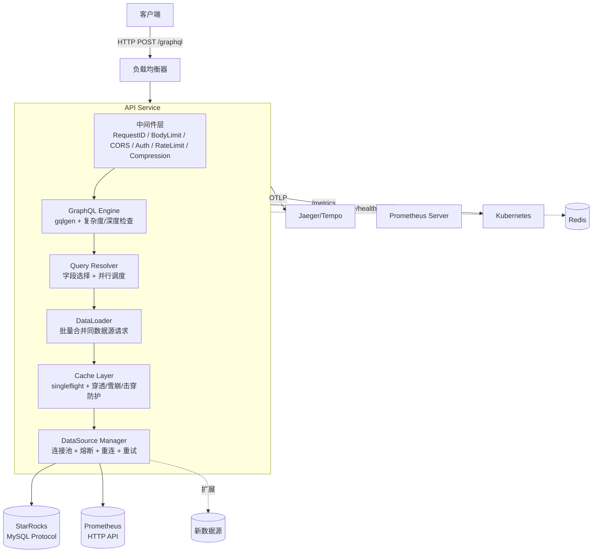
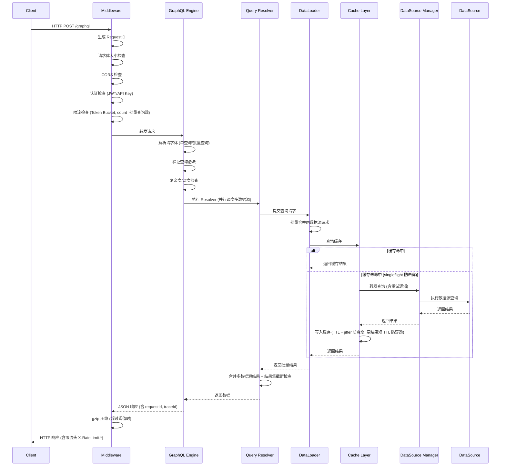
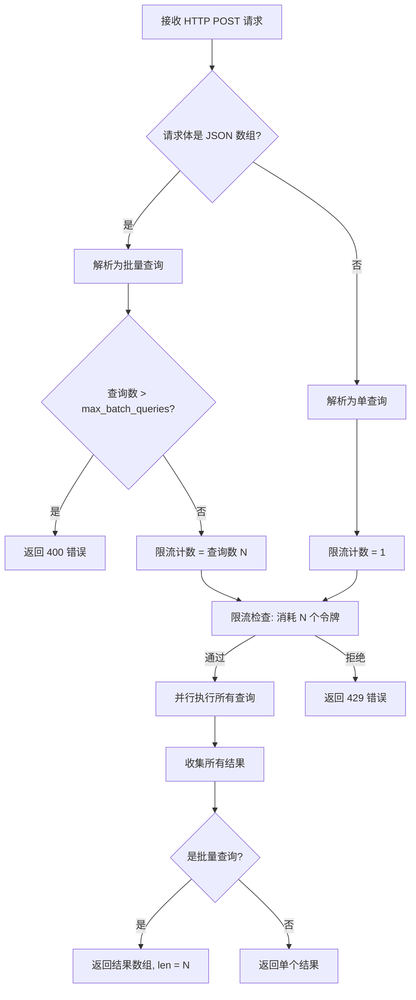
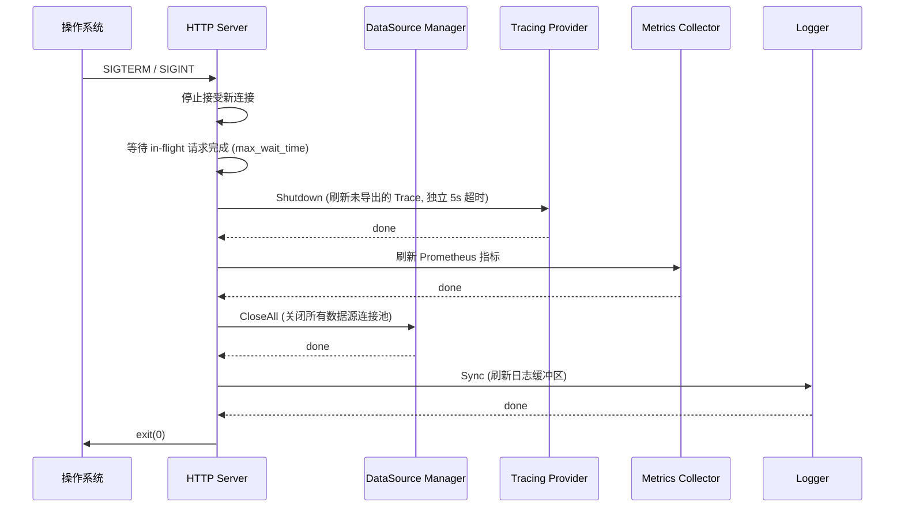
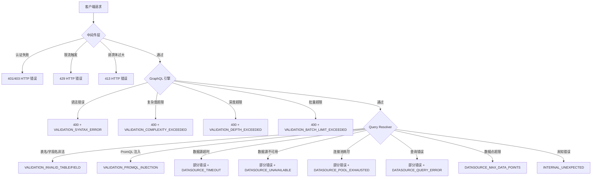

# 技术设计文档

## 概述

本设计文档描述一个基于 Go 语言和 gqlgen 框架的高性能 GraphQL API 服务的技术架构。该服务作为只读查询网关，统一接入 StarRocks（OLAP 分析型数据库，通过 MySQL 协议）和 Prometheus（时序数据库，通过 HTTP API）等多种数据源，通过 GraphQL 协议向客户端提供灵活的数据查询能力。

核心设计目标：
- 可扩展的数据源适配器架构（接口 + 注册表模式）
- 跨数据源并行查询与结果合并
- 生产级安全认证（JWT / API Key）、请求限流（令牌桶）、查询缓存（内存 / Redis）
- 全面的可观测性（Prometheus 指标、OpenTelemetry 链路追踪、结构化日志）
- Kubernetes 原生部署支持

TLS/HTTPS 策略：
- 本服务不直接处理 TLS 终止，TLS 由前置的负载均衡器（如 Nginx Ingress、AWS ALB、Envoy）负责
- 服务仅监听 HTTP 端口，通过 Kubernetes Service 暴露
- 如需服务间 mTLS（如 Istio Service Mesh），由 Sidecar Proxy 透明处理，应用层无需感知
- 部署文档中应明确标注 TLS 终止点，避免实现时遗漏加密需求

技术栈选型：
| 组件 | 技术选型 | 理由 |
| --- | --- | --- |
| GraphQL 框架 | gqlgen | Go 生态最成熟的 Schema-first GraphQL 框架，编译时代码生成 |
| HTTP 框架 | chi | 轻量级、兼容 net/http、中间件生态丰富 |
| 配置管理 | Viper | 支持 YAML + 环境变量覆盖 + 热更新（fsnotify） |
| 日志 | zap | 高性能结构化日志 |
| JWT 认证 | golang-jwt/jwt/v5 | Go 生态最流行的 JWT 库，支持多种签名算法 |
| StarRocks 连接 | database/sql + go-sql-driver/mysql | StarRocks 兼容 MySQL 协议 |
| Prometheus 查询客户端 | prometheus/client_golang + net/http | 通过 HTTP API 查询 Prometheus 数据源 |
| Prometheus 指标暴露 | prometheus/client_golang | 官方 Go 客户端，暴露 /metrics 端点 |
| OpenTelemetry | go.opentelemetry.io/otel | 官方 Go SDK |
| 内存缓存 | hashicorp/golang-lru/v2 | 标准 LRU 淘汰策略，API 简洁 |
| 缓存 Key 哈希 | cespare/xxhash/v2 | 非密码学高性能哈希，缓存 key 生成无需密码学安全性 |
| 并发回源控制 | golang.org/x/sync/singleflight | 标准库扩展，防止缓存击穿 |
| 缓存序列化 | encoding/gob | 比 JSON 序列化/反序列化快 2-5 倍，适合内部缓存存储 |

## 架构

### 整体架构



> **层级说明：** Cache Layer 位于 DataLoader 之后、DataSource Manager 之前。DataLoader 先将同一数据源的多个 resolver 请求批量合并，合并后的请求再经过 Cache Layer 查询缓存，未命中时才到达 DataSource Manager 执行实际查询。这样缓存粒度在数据源查询级别，避免了 resolver 级别的重复缓存。

> **DataLoader 与 Cache Layer 交互机制：** DataLoader 将同一请求中针对同一数据源的多个 resolver 调用批量合并为一个 `QueryRequest`。合并后的每个 `QueryRequest` 独立经过 Cache Layer 进行缓存查找——即每个合并后的查询作为一个独立的缓存 key，而非整个批次共享一个 key。这样设计的好处是：不同请求中包含相同查询参数的子查询可以命中缓存，最大化缓存复用率。DataLoader 的批量窗口为 1ms（可配置），最大批量大小为 100（可配置）。

> **totalCount 缓存策略：** 当 `NeedCount=true` 时，数据查询和 COUNT 查询的结果绑定为同一个缓存条目（`QueryResult` 包含 `Data` 和 `TotalCount`），确保两者 TTL 同步过期，避免 totalCount 与实际返回行数不一致。

> **DataLoader 生命周期：** DataLoader 实例必须是 per-request 的（每个 HTTP 请求创建独立的 DataLoader 实例）。禁止跨请求共享 DataLoader，否则会导致数据泄漏——请求 A 的缓存结果可能被请求 B 读取。实现时应在中间件层为每个请求创建 DataLoader 并注入 context，Resolver 通过 context 获取当前请求的 DataLoader 实例。

> **请求超时与查询超时组合机制：** 外层使用 `context.WithTimeout(ctx, request_timeout)` 创建请求级超时 context 作为所有操作的父 context。每个数据源查询使用 `context.WithTimeout(parentCtx, min(query_timeout, parentCtx.Deadline()-time.Now()))` 创建子 context，确保单个数据源查询不会超过其自身的 `query_timeout`，同时也不会超过请求级总超时。当父 context 超时取消时，所有子 context 自动取消。

### 请求处理流程



### 批量查询处理流程



### 优雅关闭流程



> **DataLoader 与优雅关闭：** 当 HTTP Server 停止接受新连接后，in-flight 请求继续处理。每个 in-flight 请求的 DataLoader 实例会在请求处理完成时自然销毁（per-request 生命周期）。如果 max_wait_time 到达时仍有 DataLoader 批量窗口未触发（极端情况：请求刚提交到 DataLoader 但 1ms 窗口未到期），HTTP Server 的 context 取消会传播到 DataLoader，DataLoader 应立即 flush 当前批次中的所有待处理请求并返回 context.Canceled 错误。

### 项目目录结构

```
cmd/
  server/
    main.go                    # 入口程序
internal/
  config/
    config.go                  # 配置结构定义与加载 (Viper)
    validation.go              # 配置校验
    hotreload.go               # 配置热更新 (fsnotify)
  server/
    server.go                  # HTTP 服务器启动、路由注册、优雅关闭
    batch.go                   # 批量查询解析与调度
  middleware/
    auth.go                    # JWT / API Key 认证中间件
    authz.go                   # 授权检查（数据源权限）
    auth_failure_limiter.go    # 认证失败暴力破解防护
    csrf.go                    # CSRF 防护中间件（GET 查询限制）
    ratelimit.go               # 令牌桶限流中间件
    cors.go                    # CORS 中间件
    compression.go             # gzip 压缩中间件
    requestid.go               # 请求 ID 生成中间件
    bodylimit.go               # 请求体大小限制中间件
  graphql/
    schema/
      base.graphql             # 基础类型定义 (分页、排序、过滤、自定义标量)
      starrocks.graphql        # StarRocks 数据源 Schema
      prometheus.graphql       # Prometheus 数据源 Schema
      mutation.graphql         # Mutation 定义 (缓存管理)
    generated/
      generated.go             # gqlgen 生成代码
      models_gen.go            # gqlgen 生成模型
    resolver/
      resolver.go              # Resolver 根结构
      query.go                 # Query Resolver 实现
      mutation.go              # Mutation Resolver 实现
    dataloader/
      dataloader.go            # DataLoader 实现
    scalar/
      datetime.go              # DateTime 自定义标量序列化/反序列化
      json.go                  # JSON 自定义标量序列化/反序列化
  datasource/
    interface.go               # DataSource 接口定义
    manager.go                 # DataSource Manager 实现
    registry.go                # Adapter Registry 实现
    reconnect.go               # 后台重连 goroutine 管理
    circuit_breaker.go         # 熔断器状态管理
    mock.go                    # MockDataSource 测试辅助
  adapter/
    starrocks/
      adapter.go               # StarRocks 适配器实现
      query_builder.go         # SQL 查询构建器 (参数化)
      type_mapper.go           # 类型映射
      whitelist.go             # 表名/字段名白名单校验
    prometheus/
      adapter.go               # Prometheus 适配器实现
      query_builder.go         # PromQL 查询构建器
      type_mapper.go           # 类型映射
      validator.go             # PromQL 输入校验
  cache/
    cache.go                   # Cache 接口定义
    memory.go                  # 内存缓存 (hashicorp/golang-lru)
    redis.go                   # Redis 缓存
    layer.go                   # Cache Layer (singleflight + 穿透/雪崩/击穿防护)
    key.go                     # 缓存 key 生成 (xxhash64 + 查询规范化)
    normalize.go               # GraphQL 查询规范化
  ratelimit/
    ratelimit.go               # RateLimiter 接口定义
    local.go                   # 本地限流 (KeyedRateLimiter + x/time/rate)
    distributed.go             # 分布式限流 (Redis + Lua)
    fallback.go                # 分布式→本地降级逻辑
  health/
    health.go                  # 健康检查与就绪探针
  observability/
    metrics.go                 # Prometheus 指标注册与记录
    tracing.go                 # OpenTelemetry 初始化与 Span 管理
    logging.go                 # 结构化日志 (zap) 初始化
  context/
    keys.go                    # Context key 定义 (AuthIdentity, RequestID, TraceSpan)
  audit/
    audit.go                   # 审计日志
  sanitize/
    sanitize.go                # 敏感信息脱敏
  errors/
    errors.go                  # 统一错误码定义
    types.go                   # 错误类型 (AuthError, ValidationError, etc.)
pkg/
  retry/
    retry.go                   # 通用重试逻辑 (指数退避)
    classifier.go              # 错误分类 (瞬时 vs 业务)
deploy/
  Dockerfile                   # 多阶段构建
  k8s/
    deployment.yaml            # 含 startupProbe + livenessProbe + readinessProbe
    service.yaml
    configmap.yaml
    hpa.yaml                   # 基于自定义指标的 HPA
  docker-compose.yaml          # 集成测试环境
gqlgen.yml                     # gqlgen 配置 (含自定义标量映射)
go.mod
go.sum
```

### Kubernetes 部署要点

**Startup Probe（启动探针）：** 服务启动时需要建立多个数据源连接，启动时间可能较长。Kubernetes Deployment 应配置 `startupProbe`（指向 `/ready`），避免启动期间被 kubelet 误杀。建议 `failureThreshold: 30, periodSeconds: 2`（最长等待 60 秒启动）。

**HPA 扩缩容指标：** HorizontalPodAutoscaler 应基于自定义 Prometheus 指标而非仅依赖 CPU：
- 主要指标：`graphql_requests_in_flight`（当前并发请求数），目标值根据单 Pod 承载能力设定
- 辅助指标：`graphql_request_duration_seconds` 的 P95 延迟，超过阈值时触发扩容
- 使用 Prometheus Adapter 将自定义指标暴露为 Kubernetes custom metrics API

**连接池与 Pod 数量：** HPA 扩缩容时需注意数据源连接总数。参见组件与接口章节的"连接池大小规划指南"。

### APQ（Automatic Persisted Queries）

作为可选功能，API 服务支持 gqlgen 的 APQ 扩展。启用后：
- 客户端首次发送完整查询文本 + SHA256 哈希，服务端缓存查询文本
- 后续请求客户端仅发送哈希值，服务端从缓存中查找对应查询文本
- 显著减少网络传输量，尤其适合大型查询
- 通过配置 `graphql.apq_enabled` 启用/禁用（默认禁用）

APQ 存储后端策略：
- APQ 查询文本缓存复用 Cache Layer 的后端配置（`cache.backend`）
- `memory` 后端：每个实例独立维护 APQ 缓存，新实例启动时有冷启动惩罚（首次请求需发送完整查询文本），适用于单实例或查询种类有限的场景
- `redis` 后端：所有实例共享 APQ 缓存，无冷启动问题，推荐多实例部署使用
- APQ 缓存条目无 TTL（持久化），通过 LRU 淘汰策略管理容量
- APQ 缓存 key 格式：`apq:{sha256_hash}`

> **clearCache 与 APQ 缓存的关系：** `clearCache` Mutation 仅清除查询结果缓存（key 前缀 `cache:`），不影响 APQ 缓存（key 前缀 `apq:`）。APQ 缓存存储的是查询文本而非查询结果，清除 APQ 缓存会迫使客户端重新发送完整查询文本，通常不需要主动清除。APQ 缓存通过 LRU 淘汰策略自动管理容量。


## 组件与接口

### 1. DataSource 接口

所有数据源适配器必须实现的核心接口：

```go
// DataSource 定义数据源适配器的统一接口
type DataSource interface {
    // Name 返回数据源名称（配置中的 name 字段）
    Name() string
    
    // Type 返回数据源类型标识（如 "starrocks", "prometheus"）
    Type() string
    
    // Connect 建立与数据源的连接，幂等操作（已连接时不做操作）
    Connect(ctx context.Context) error
    
    // IsAvailable 返回数据源当前是否可用（连接是否健康）
    IsAvailable() bool
    
    // Execute 执行查询并返回结果
    Execute(ctx context.Context, query QueryRequest) (*QueryResult, error)
    
    // HealthCheck 检查数据源连接健康状态
    HealthCheck(ctx context.Context) error
    
    // SchemaFiles 返回该适配器提供的 .graphql Schema 文件路径列表
    SchemaFiles() []string
    
    // Close 关闭连接并释放资源
    Close(ctx context.Context) error
}

// AdapterFactory 适配器工厂函数类型
type AdapterFactory func(name string, config DataSourceConfig) (DataSource, error)

// FilterCondition 过滤条件（类型安全）
type FilterCondition struct {
    Field    string         // 字段名
    Operator FilterOperator // 操作符 (EQ, NEQ, GT, GTE, LT, LTE, LIKE, IN, NOT_IN, IS_NULL, IS_NOT_NULL)
    Value    interface{}    // 过滤值
}

// OrderByClause 排序条件
type OrderByClause struct {
    Field     string        // 排序字段
    Direction SortDirection // ASC 或 DESC
}

// PaginationParams 分页参数
type PaginationParams struct {
    First  *int    // Relay: 前 N 条
    After  *string // Relay: 游标之后
    Offset *int    // 传统: 偏移量
    Limit  *int    // 传统: 限制数
}

// QueryRequest 统一查询请求结构
type QueryRequest struct {
    Fields     []string               // 请求的字段列表（字段选择优化）
    Filters    []FilterCondition      // 过滤条件（类型安全）
    OrderBy    []OrderByClause        // 排序条件
    Pagination *PaginationParams      // 分页参数
    NeedCount  bool                   // 是否需要 totalCount
    Options    map[string]interface{} // 数据源特有参数（如 Prometheus 的 query, startTime, endTime, step）
}

// QueryResult 统一查询结果结构
type QueryResult struct {
    Data       []map[string]interface{} // 结果数据行
    TotalCount *int64                   // 总记录数（可选，NeedCount=true 时填充）
    Warnings   []string                 // 警告信息（如特殊值转换、结果截断）
}
```

### 2. Adapter Registry

```go
// AdapterRegistry 管理数据源适配器的注册与发现
type AdapterRegistry struct {
    mu       sync.RWMutex
    adapters map[string]AdapterFactory
}

// Register 注册适配器工厂函数，类型名称重复时返回错误
func (r *AdapterRegistry) Register(typeName string, factory AdapterFactory) error

// Get 根据类型名称获取适配器工厂函数
func (r *AdapterRegistry) Get(typeName string) (AdapterFactory, bool)

// List 返回所有已注册的适配器类型名称
func (r *AdapterRegistry) List() []string
```

### 3. DataSource Manager

```go
// DataSourceManager 管理所有数据源的生命周期
type DataSourceManager struct {
    registry    *AdapterRegistry
    datasources map[string]DataSource
    status      map[string]*DataSourceStatus // 每个数据源的状态跟踪
    config      []DataSourceConfig
    retryConfig RetryConfig
    mu          sync.RWMutex
    stopCh      chan struct{} // 用于停止后台重连 goroutine
}

// DataSourceStatus 数据源状态跟踪
type DataSourceStatus struct {
    Available       bool
    LastError       error
    ReconnectCount  int
    NextReconnectAt time.Time
    // 熔断器状态
    CircuitState    CircuitState // CLOSED（正常）/ OPEN（熔断）/ HALF_OPEN（探测）
    FailureCount    int          // 连续失败次数
    LastFailureAt   time.Time    // 最近一次失败时间
}

// CircuitState 熔断器状态枚举
type CircuitState int

const (
    CircuitClosed   CircuitState = iota // 正常状态，允许请求通过
    CircuitOpen                         // 熔断状态，直接返回 DATASOURCE_UNAVAILABLE 错误
    CircuitHalfOpen                     // 半开状态，允许单个探测请求通过
)

// 熔断器参数（通过配置文件设置）:
// - failure_threshold: 连续失败次数阈值（默认 5），超过后进入 OPEN 状态
// - open_duration: OPEN 状态持续时间（默认 30s），到期后进入 HALF_OPEN 状态
// - half_open_max_requests: HALF_OPEN 状态允许的最大探测请求数（默认 1）
// - success_threshold: HALF_OPEN 状态下连续成功次数阈值（默认 2），超过后恢复 CLOSED 状态
//
// 状态转换:
// CLOSED → OPEN: 连续失败次数 ≥ failure_threshold
// OPEN → HALF_OPEN: 经过 open_duration 时间后自动转换
// HALF_OPEN → CLOSED: 连续成功次数 ≥ success_threshold
// HALF_OPEN → OPEN: 任一探测请求失败
//
// 熔断器线程安全：
// ExecuteWithRetry 中对 CircuitState 的检查和 FailureCount 的更新必须在同一把锁内完成
// （使用 DataSourceManager.mu 或每个数据源独立的 sync.Mutex），避免以下竞态：
// - goroutine A 检查 CircuitState=CLOSED，goroutine B 同时将 FailureCount 递增至阈值
// - goroutine A 未感知到状态已变为 OPEN，继续发起查询
// HALF_OPEN 状态下的探测请求计数同样需要原子操作保护。

// Init 从配置初始化所有数据源，失败的数据源标记为不可用并启动后台重连
func (m *DataSourceManager) Init(ctx context.Context) error

// Get 根据名称获取数据源实例，返回错误如果数据源不可用
func (m *DataSourceManager) Get(name string) (DataSource, error)

// ExecuteWithRetry 执行查询，先检查熔断器状态，对瞬时错误自动重试（指数退避）
// 1. 检查 CircuitState: OPEN → 直接返回 DATASOURCE_UNAVAILABLE
// 2. CLOSED/HALF_OPEN → 执行查询
// 3. 成功 → 重置 FailureCount，HALF_OPEN 下累计成功次数达标则恢复 CLOSED
// 4. 失败 → 累加 FailureCount，达到阈值则切换为 OPEN
func (m *DataSourceManager) ExecuteWithRetry(ctx context.Context, dsName string, query QueryRequest) (*QueryResult, error)

// HealthCheckAll 检查所有数据源健康状态
func (m *DataSourceManager) HealthCheckAll(ctx context.Context) map[string]error

// CloseAll 停止后台重连并关闭所有数据源连接
func (m *DataSourceManager) CloseAll(ctx context.Context) error

// startReconnectLoop 后台 goroutine：对不可用数据源执行指数退避重连
// 重连间隔: min(reconnect_interval × 2^(attempt-1), max_reconnect_interval)
func (m *DataSourceManager) startReconnectLoop(dsName string)
```

### 4. Cache Layer

```go
// Cache 缓存后端接口
type Cache interface {
    Get(ctx context.Context, key string) ([]byte, bool, error)
    Set(ctx context.Context, key string, value []byte, ttl time.Duration) error
    Delete(ctx context.Context, key string) error
    DeleteByPrefix(ctx context.Context, prefix string) error // 按前缀删除（支持按数据源清除）
    Clear(ctx context.Context) error
}

// DeleteByPrefix 实现说明：
// - 内存缓存 (LRU): 遍历所有 key 匹配前缀后删除，时间复杂度 O(N)，N 为缓存条目数
// - Redis 缓存: 使用 SCAN + DEL 迭代删除（禁止使用 KEYS 命令，避免阻塞 Redis）
//   SCAN 每次迭代 COUNT=100，分批删除。大 key 空间下可能耗时较长，
//   clearCache Mutation 应异步执行并立即返回 true，后台完成实际清除。
//   如需精确确认清除完成，可通过日志或指标观察。

// CacheKeyGenerator 缓存 key 生成器
// 格式: "cache:{datasource}:{xxhash64(normalized_query+sorted_variables)}"
// - 使用 xxhash64 替代 SHA256，非密码学场景下性能提升 10 倍以上
// - datasource 前缀确保 clearCache(datasource) 可以按前缀清除
// - 查询文本在哈希前进行规范化处理（见 NormalizeQuery）
type CacheKeyGenerator struct{}

// Generate 生成缓存 key
// 1. 调用 NormalizeQuery 规范化查询文本
// 2. 对 variables map 按 key 字典序排序后序列化
// 3. 拼接 normalized_query + sorted_variables 计算 xxhash64
func (g *CacheKeyGenerator) Generate(datasource, query string, variables map[string]interface{}) string

// NormalizeQuery 规范化 GraphQL 查询文本以提高缓存命中率
// - 去除多余空格和换行符，压缩为单行
// - 去除注释
// - 统一大小写（关键字小写）
// 注意：不对字段顺序排序，因为字段顺序可能影响语义（如 fragment spread 位置）
func NormalizeQuery(query string) string

// CacheLayer 带防护策略的缓存层
type CacheLayer struct {
    backend     Cache
    sfGroup     singleflight.Group  // 击穿防护：同一 key 并发回源只执行一次
    ttlConfig   map[string]time.Duration // 每个数据源独立 TTL
    defaultTTL  time.Duration
    jitterPct   int                 // 雪崩防护：TTL 抖动百分比 (默认 10)
    emptyTTL    time.Duration       // 穿透防护：空结果缓存 TTL (默认 30s)
    keyGen      *CacheKeyGenerator
    metrics     *CacheMetrics
}

// GetOrLoad 查询缓存，未命中时通过 loader 回源并缓存结果
// 1. 检查缓存命中 → 命中则直接返回，记录 cache_hit 指标
// 2. 未命中 → 通过 singleflight 确保同一 key 只有一个 goroutine 回源
// 3. 回源结果为空 → 缓存空值标记（短 TTL = emptyTTL）
// 4. 回源结果非空 → 缓存结果（TTL = 配置 TTL ± jitter）
// 5. 记录 cache_miss 指标
func (cl *CacheLayer) GetOrLoad(ctx context.Context, key string, datasource string, loader func() ([]byte, error)) ([]byte, error)

// ClearByDatasource 清除指定数据源的所有缓存
func (cl *CacheLayer) ClearByDatasource(ctx context.Context, datasource string) error

// ClearAll 清除所有缓存
func (cl *CacheLayer) ClearAll(ctx context.Context) error
```

> **Singleflight 错误处理：** 当 singleflight 中的首个请求因瞬时错误失败时，所有等待的请求都会收到相同的错误。这是可接受的行为——客户端可以重试，下一次请求会触发新的回源。不在 singleflight 内部做重试，避免放大延迟。

> **缓存序列化格式：** 缓存条目使用 `encoding/gob` 格式序列化存储（内存缓存和 Redis 缓存均适用）。相比 JSON，gob 序列化/反序列化性能提升 2-5 倍，且原生支持 Go 类型。Redis 缓存后端存储的是 gob 编码后的 `[]byte`。

> **Gob 反序列化失败处理：** 当缓存条目的 gob 反序列化失败时（如数据损坏、Schema 变更导致类型不兼容），Cache Layer 应：1) 删除该损坏的缓存条目；2) 回源查询数据源获取最新数据；3) 记录 WARN 日志（包含缓存 key 和错误信息）。不应因单个缓存条目损坏导致请求失败。

> **内存缓存容量控制：** 除 `max_entries`（最大条目数）外，内存缓存还支持 `max_memory_size`（最大内存占用，默认 256MB）配置。当任一限制达到上限时触发 LRU 淘汰。内存占用通过 gob 编码后的 `[]byte` 长度累加估算（不含 Go 对象开销），提供近似但低开销的内存控制。

> **Singleflight 多实例限制：** 当前 singleflight 仅在单实例内生效。多实例部署时，同一缓存 key 的并发未命中请求仍可能从多个实例同时回源。对于使用 Redis 缓存后端的场景，可通过 Redis 分布式锁（`SET NX EX`）实现跨实例的 singleflight，但会增加一次 Redis 往返延迟。当前版本接受此限制，后续可按需扩展。

### 5. Auth Middleware（认证与授权分离）

```go
// Authenticator 认证器接口（验证凭据，返回身份信息或 401 错误）
type Authenticator interface {
    Authenticate(r *http.Request) (*AuthIdentity, error)
}

// Authorizer 授权器接口（检查权限，返回 403 错误）
type Authorizer interface {
    Authorize(identity *AuthIdentity, datasource string, operation string) error
}

// AuthIdentity 认证主体信息（存入 context）
type AuthIdentity struct {
    Subject     string   // JWT sub 或 API Key ID
    Method      string   // "jwt" 或 "apikey"
    Datasources []string // 允许访问的数据源列表
    Operations  []string // 允许的操作类型 (query, mutation)
}

// AuthError 认证错误类型（区分 401 和 403）
type AuthError struct {
    Code       string // AUTH_MISSING, AUTH_TOKEN_EXPIRED, AUTH_TOKEN_INVALID, AUTH_INSUFFICIENT_PERMISSION
    StatusCode int    // 401 或 403
    Message    string
}

// JWTAuthenticator JWT 认证实现
// - 从 Authorization: Bearer <token> 头提取 Token
// - 验证签名（使用 golang-jwt/jwt/v5）、过期时间（exp）、签发者（iss）
// - 过期返回 AUTH_TOKEN_EXPIRED，签名无效返回 AUTH_TOKEN_INVALID
// - 支持对称签名（HMAC-SHA256）和非对称签名（RS256/ES256）
// - 非对称签名模式下，API 服务仅需配置公钥即可验证 Token，私钥留在认证服务
// - 推荐生产环境使用非对称签名，便于密钥轮换且降低密钥泄露风险
type JWTAuthenticator struct {
    algorithm string          // "HS256" | "RS256" | "ES256"
    secret    []byte          // HMAC 对称密钥（algorithm=HS256 时使用）
    publicKey crypto.PublicKey // RSA/ECDSA 公钥（algorithm=RS256/ES256 时使用）
    issuer    string
}

// APIKeyAuthenticator API Key 认证实现
// - 从 X-API-Key 头提取 API Key
// - 使用 constant-time comparison 防止 timing attack
// - 检查 expires_at 是否已过期
// - 返回关联的权限范围
type APIKeyAuthenticator struct {
    keys map[string]*APIKeyEntry // key hash → entry
}

// APIKeyEntry API Key 配置条目
type APIKeyEntry struct {
    ID          string
    KeyHash     []byte    // bcrypt 哈希存储（禁止使用 SHA256 等快速哈希，防止暴力破解）
    ExpiresAt   *time.Time
    Datasources []string
    Operations  []string
}

// API Key 配置与运行时转换流程：
// 1. YAML 配置文件中 `key` 字段存储 bcrypt 哈希值（非明文），通过环境变量注入
//    示例: key: "${GRAPHQL_APIKEY_CLIENT_A}" 其中环境变量值为 bcrypt 哈希字符串
//    如: GRAPHQL_APIKEY_CLIENT_A="$2a$10$N9qo8uLOickgx2ZMRZoMye..."
// 2. 运营人员使用 CLI 工具预生成 bcrypt 哈希: `htpasswd -nbBC 10 "" "raw-api-key" | cut -d: -f2`
// 3. 启动时 APIKeyAuthenticator 从配置读取哈希字符串，转为 []byte 存入 APIKeyEntry.KeyHash
// 4. 认证时使用 bcrypt.CompareHashAndPassword(keyHash, clientProvidedKey) 进行比对
// 禁止在配置文件中存储明文 API Key，即使通过环境变量注入也应注入哈希值。

// AuthFailureLimiter 认证失败暴力破解防护
// 独立于正常请求限流，专门针对认证失败场景
// 同一 IP 在 auth_failure_window 内认证失败超过 auth_failure_threshold 次，
// 封禁该 IP auth_ban_duration 时间
//
// 代理/NAT 环境下的 IP 提取策略：
// - 配置 trusted_proxies 列表（CIDR 格式，如 ["10.0.0.0/8", "172.16.0.0/12"]）
// - 当请求来自 trusted_proxies 时，从 X-Forwarded-For 头提取真实客户端 IP（取最右侧非信任 IP）
// - 当请求不来自 trusted_proxies 时，直接使用 RemoteAddr
// - 未配置 trusted_proxies 时，始终使用 RemoteAddr（安全默认值）
// - IP 提取逻辑同时应用于 AuthFailureLimiter 和 RateLimiter
type AuthFailureLimiter struct {
    mu             sync.RWMutex
    failures       map[string]*failureRecord // IP → 失败记录
    threshold      int                       // 失败次数阈值（默认 10）
    window         time.Duration             // 统计窗口（默认 5 分钟）
    banDur         time.Duration             // 封禁时长（默认 15 分钟）
    trustedProxies []*net.IPNet              // 可信代理 CIDR 列表
    stopCh         chan struct{}
}

type failureRecord struct {
    count    int
    firstAt  time.Time
    bannedAt *time.Time
}

// Check 检查 IP 是否被封禁，返回 true 表示允许通过
func (afl *AuthFailureLimiter) Check(ip string) bool

// RecordFailure 记录一次认证失败
func (afl *AuthFailureLimiter) RecordFailure(ip string)

// startCleanup 后台 goroutine：定期清理过期的失败记录和封禁记录
func (afl *AuthFailureLimiter) startCleanup()
```

### 5a. CSRF 防护

HTTP GET 查询端点天然容易受 CSRF 攻击（浏览器可通过 `` 或 `<script>` 标签发起 GET 请求）。防护策略：

- 生产模式下，GET 查询端点默认禁用（仅允许 POST），通过配置 `server.allow_get_queries: false`（默认）控制
- 开发模式下，GET 查询端点默认启用（方便 Playground 和调试）
- 即使启用 GET 查询，Auth 中间件仍要求有效认证凭据，未认证的 GET 请求返回 401
- POST 请求要求 `Content-Type: application/json`，浏览器简单表单提交（`application/x-www-form-urlencoded`）无法触发，提供天然 CSRF 防护
- 可选：支持配置自定义请求头检查（如 `X-Requested-With`），作为额外的 CSRF 防护层

### 6. Rate Limiter（本地 + 分布式双模式）

```go
// RateLimiter 限流器接口
type RateLimiter interface {
    // Allow 检查是否允许请求通过
    // key: 限流维度标识（IP 地址或 API Key ID）
    // count: 消耗的令牌数（批量查询时 = 查询数 N）
    // 返回值始终包含限流状态信息（无论是否被限流）
    Allow(ctx context.Context, key string, count int) (*RateLimitResult, error)
}

// 限流 Key 选择优先级：
// 1. 如果请求通过 API Key 认证成功，使用 API Key ID 作为限流 key（格式: "apikey:{id}"）
// 2. 如果请求通过 JWT 认证成功，使用 JWT sub claim 作为限流 key（格式: "jwt:{sub}"）
// 3. 以上均不适用时（如公共端点豁免认证），使用客户端 IP 作为限流 key（格式: "ip:{addr}"）
// 优先使用认证身份而非 IP 的原因：同一 API Key 可能从多个 IP 发起请求（分布式客户端），
// 按 API Key 限流更准确地反映单个客户端的请求频率。
// IP 提取逻辑复用 AuthFailureLimiter 的 trusted_proxies + X-Forwarded-For 策略。

// RateLimitResult 限流检查结果
type RateLimitResult struct {
    Allowed   bool      // 是否允许通过
    Limit     int       // 限流上限 (requests_per_window)
    Remaining int       // 剩余可用请求数
    ResetAt   time.Time // 限流重置时间 (Unix 时间戳)
}

// === 本地限流模式 ===

// KeyedRateLimiter 按 key 维度的本地限流器
// 内部为每个 key 维护独立的 rate.Limiter 实例
// 参数转换: rate = requests_per_window / window_size_seconds, burst = requests_per_window
type KeyedRateLimiter struct {
    mu              sync.RWMutex
    limiters        map[string]*limiterEntry
    ratePerSec      rate.Limit  // 令牌填充速率 (tokens/sec)
    burst           int         // 桶容量 (= requests_per_window)
    maxEntries      int         // 最大 key 数量（默认 100000），防止 DDoS 下内存无限增长
    cleanupInterval time.Duration
    stopCh          chan struct{}
}

// maxEntries 防护机制：
// 当 limiters map 的 key 数量达到 maxEntries 时，拒绝为新 key 创建 limiter，
// 直接返回 Allow=false（限流）。这是一种保守策略——宁可误限新 key，也不允许内存无限增长。
// 配合 startCleanup 定期清理过期 key，正常流量下不会触发此限制。
// DDoS 场景下（大量伪造 IP），此限制确保内存占用可控。

type limiterEntry struct {
    limiter  *rate.Limiter
    lastSeen time.Time
}

// Allow 使用 rate.Limiter.AllowN(time.Now(), count) 消耗 count 个令牌
func (krl *KeyedRateLimiter) Allow(ctx context.Context, key string, count int) (*RateLimitResult, error)

// startCleanup 后台 goroutine：定期清理超过 2×window_size 未访问的 limiter 实例，防止内存泄漏
func (krl *KeyedRateLimiter) startCleanup()

// === 分布式限流模式 ===

// DistributedRateLimiter 基于 Redis + Lua 脚本的分布式限流
// Redis key 格式: "ratelimit:{key}"
// Redis 存储: HASH { tokens: float, last_refill: float(unix_seconds) }
type DistributedRateLimiter struct {
    client     *redis.Client
    script     *redis.Script // 预加载的 Lua 脚本
    maxTokens  int           // 桶容量
    refillRate float64       // 令牌填充速率 (tokens/sec)
    windowSize time.Duration
}

// Lua 脚本伪代码:
// 1. HMGET key tokens last_refill
// 2. 计算 elapsed = now - last_refill
// 3. 补充令牌: tokens = min(max_tokens, tokens + elapsed * refill_rate)
// 4. 检查 tokens >= requested
// 5. 扣减: tokens -= requested
// 6. HMSET key tokens last_refill; EXPIRE key ttl
// 7. 返回 [allowed, remaining, reset_seconds]
func (drl *DistributedRateLimiter) Allow(ctx context.Context, key string, count int) (*RateLimitResult, error)

// === 降级包装器 ===

// FallbackRateLimiter 分布式限流的降级包装器
// 正常时使用 DistributedRateLimiter，Redis 不可用时自动降级为 KeyedRateLimiter
// 降级后启动后台恢复探测，定期检查 Redis 可用性并自动恢复
type FallbackRateLimiter struct {
    primary       *DistributedRateLimiter
    fallback      *KeyedRateLimiter
    useFallback   atomic.Bool
    probeInterval time.Duration // Redis 恢复探测间隔（默认 30s）
    stopCh        chan struct{}
}

func (frl *FallbackRateLimiter) Allow(ctx context.Context, key string, count int) (*RateLimitResult, error)

// startRecoveryProbe 后台 goroutine：降级后定期探测 Redis 可用性
// 每 probeInterval 执行一次 PING 命令：
// - 成功 → 切回 primary（useFallback = false），记录 INFO 日志
// - 失败 → 保持 fallback，记录 WARN 日志
// 恢复后停止探测 goroutine，下次降级时重新启动
func (frl *FallbackRateLimiter) startRecoveryProbe()
```

> **多实例部署行为：**
> - `local` 模式：每个实例独立限流。N 个实例 × 100 req/min = 全局最多 N×100 req/min。适用于单实例部署或对限流精度要求不高的场景。
> - `distributed` 模式：所有实例共享 Redis 中的令牌桶。全局精确限流 100 req/min，无论实例数量。Redis 不可用时自动降级为 local 模式。

### 7. Health Checker

```go
// HealthChecker 健康检查组件
type HealthChecker struct {
    dsManager *DataSourceManager
    version   string
    buildTime string
}

// LivenessCheck /health 端点处理
// 所有核心组件正常 → 200 + 组件状态详情 JSON
// 任一核心组件异常 → 503
func (hc *HealthChecker) LivenessCheck(w http.ResponseWriter, r *http.Request)

// ReadinessCheck /ready 端点处理
// 至少一个数据源可用 → 200 + 各数据源连接状态
// 所有数据源不可用 → 503
func (hc *HealthChecker) ReadinessCheck(w http.ResponseWriter, r *http.Request)
```

### 8. Observability 组件

```go
// MetricsCollector Prometheus 指标收集器
type MetricsCollector struct {
    // 请求级指标
    requestDuration    *prometheus.HistogramVec   // graphql_request_duration_seconds
    requestsTotal      *prometheus.CounterVec     // graphql_requests_total
    requestsInFlight   prometheus.Gauge           // graphql_requests_in_flight
    // 数据源级指标
    dsQueryDuration    *prometheus.HistogramVec   // graphql_datasource_query_duration_seconds
    dsPoolActive       *prometheus.GaugeVec       // graphql_datasource_connection_pool_active
    dsPoolIdle         *prometheus.GaugeVec       // graphql_datasource_connection_pool_idle
    dsPoolWaiting      *prometheus.GaugeVec       // graphql_datasource_connection_pool_waiting
    // 错误指标
    errorsTotal        *prometheus.CounterVec     // graphql_errors_total
    // 缓存指标
    cacheHitsTotal     *prometheus.CounterVec     // graphql_cache_hits_total
    cacheMissesTotal   *prometheus.CounterVec     // graphql_cache_misses_total
    // 自定义标签
    customLabels       prometheus.Labels          // 从配置加载的自定义标签
}

// Histogram 桶边界配置：
// 默认 Prometheus 桶边界（.005, .01, .025, .05, .1, .25, .5, 1, 2.5, 5, 10）
// 不适合本服务的延迟分布。自定义桶边界对齐需求 8 的延迟目标：
// - requestDuration: {0.01, 0.025, 0.05, 0.1, 0.2, 0.5, 1, 2.5, 5, 10} 秒
//   覆盖 P95=200ms（单数据源）和 P95=500ms（混合查询）的目标
// - dsQueryDuration: {0.005, 0.01, 0.025, 0.05, 0.1, 0.25, 0.5, 1, 2.5, 5} 秒
//   更细粒度，便于定位数据源级别的延迟瓶颈

// 连接池指标采集说明:
// - StarRocks (database/sql): 通过 db.Stats() 获取 InUse/Idle/WaitCount
// - Prometheus (HTTP 客户端): 使用自定义 InstrumentedTransport 包装 http.Transport，
//   通过 RoundTrip 方法拦截请求，维护 atomic 计数器跟踪活跃/空闲连接数：
//   - 请求发起时 activeConns.Add(1)
//   - 请求完成时 activeConns.Add(-1)
//   - 空闲连接数通过 MaxIdleConnsPerHost - activeConns 估算
//   - 等待连接数通过 channel 长度或 atomic 计数器跟踪
//   InstrumentedTransport 同时为每个 HTTP 请求创建 OpenTelemetry Span（见下方 Redis Span 说明）

// TracingProvider OpenTelemetry 追踪初始化
type TracingProvider struct {
    provider *sdktrace.TracerProvider
    tracer   trace.Tracer
}

// Init 初始化 TracerProvider
// enabled=true: 配置 OTLP exporter (gRPC/HTTP) + 采样率
// enabled=false: 使用 NoopTracerProvider（零开销）
func (tp *TracingProvider) Init(cfg TracingConfig) error

// Shutdown 刷新所有未导出的 Trace 数据并关闭 exporter
// Shutdown 内部使用独立的 context.WithTimeout（默认 5s），避免 OTLP exporter
// 不可达时阻塞整体优雅关闭流程。超时后放弃未导出的 Trace 数据并记录 WARN 日志。
func (tp *TracingProvider) Shutdown(ctx context.Context) error
```

> **Redis 操作 Span：** 当使用 Redis 作为缓存后端或分布式限流存储时，每个 Redis 操作（GET/SET/DELETE/EVAL 等）应创建独立的 OpenTelemetry Span，避免链路追踪中出现"黑洞"。Span 名称格式为 `Redis {command}`，属性包含 `db.system`（值为 redis）、`db.operation`（如 GET、SET、EVAL）、`net.peer.name`（Redis 地址）。实现方式：使用 go-redis 的 Hook 机制（`redis.Client.AddHook`）注入 tracing hook，在 `ProcessHook` 中创建和关闭 Span。

### 9. Context 传播

```go
// context/keys.go - 定义 context key，用于在中间件和 resolver 之间传递数据

type contextKey string

const (
    // CtxKeyRequestID 请求 ID (string)
    CtxKeyRequestID contextKey = "requestId"
    // CtxKeyAuthIdentity 认证主体信息 (*AuthIdentity)
    CtxKeyAuthIdentity contextKey = "authIdentity"
    // CtxKeyTraceID 当前 trace ID (string)
    CtxKeyTraceID contextKey = "traceId"
)

// 中间件注入顺序:
// 1. RequestID 中间件: ctx = context.WithValue(ctx, CtxKeyRequestID, uuid)
// 2. Auth 中间件: ctx = context.WithValue(ctx, CtxKeyAuthIdentity, identity)
// 3. Tracing 中间件: ctx = context.WithValue(ctx, CtxKeyTraceID, span.SpanContext().TraceID().String())
// 4. Resolver 通过 ctx 获取上述信息用于日志、审计、权限检查
```

### 10. StarRocks Adapter 内部组件

```go
// SQLQueryBuilder 将 GraphQL 查询参数转换为参数化 SQL
type SQLQueryBuilder struct {
    allowedTables map[string]map[string]bool // table → allowed columns 白名单
}

// 白名单配置来源：
// StarRocks 适配器在初始化时从 DataSourceConfig.Options 中读取 `allowed_tables` 配置，
// 构建 allowedTables 映射。配置格式示例（YAML）：
//
//   options:
//     allowed_tables:
//       orders:
//         columns: [order_id, user_id, amount, status, created_at]
//       users:
//         columns: [user_id, username, email, created_at]
//
// 适配器工厂函数解析 Options["allowed_tables"] 并构建 map[string]map[string]bool。
// 如果 allowed_tables 未配置或为空，适配器初始化应返回错误（安全默认：拒绝所有查询）。

// Build 构建 SELECT 查询，返回 SQL 语句和参数列表
// 1. 校验 table 名在白名单中
// 2. 校验 Fields 中的字段名在该表的允许列中
// 3. 字段名/表名使用反引号包裹: `table`.`column`
// 4. 过滤值使用 ? 参数化占位符
func (b *SQLQueryBuilder) Build(req QueryRequest, table string) (string, []interface{}, error)

// BuildCount 构建 COUNT 查询
func (b *SQLQueryBuilder) BuildCount(req QueryRequest, table string) (string, []interface{}, error)

// ValidateIdentifier 校验标识符只包含合法字符 [a-zA-Z0-9_]
func ValidateIdentifier(name string) error

// TypeMapper StarRocks SQL 类型到 GraphQL 类型的映射
// INT/BIGINT → Int, FLOAT/DOUBLE → Float, VARCHAR/STRING → String,
// BOOLEAN → Boolean, DECIMAL → String (保留精度),
// DATETIME/DATE → DateTime (自定义标量), JSON → JSON (自定义标量)
// 不支持的类型 → String (记录警告日志)
type TypeMapper struct{}
```

### 11. Prometheus Adapter 内部组件

```go
// PromQLQueryBuilder 将 GraphQL 查询参数转换为 PromQL
type PromQLQueryBuilder struct{}

// Prometheus 适配器连接与健康检查实现：
// - Connect(ctx): 发送 GET /api/v1/status/buildinfo 验证 Prometheus 端点可达
//   成功返回 nil，失败返回连接错误（触发后台重连）
// - IsAvailable(): 返回最近一次 HealthCheck 的结果（内存缓存，避免频繁 HTTP 请求）
// - HealthCheck(ctx): 发送 GET /api/v1/status/buildinfo，超时时间使用 query_timeout 的 1/3
//   （健康检查应比实际查询更快失败）

// BuildInstant 构建即时查询
func (b *PromQLQueryBuilder) BuildInstant(req QueryRequest) (string, url.Values, error)

// BuildRange 构建范围查询
func (b *PromQLQueryBuilder) BuildRange(req QueryRequest) (string, url.Values, error)

// ValidateLabelValue 校验标签值，拒绝 PromQL 注入字符 (} { | ~ ")
func (b *PromQLQueryBuilder) ValidateLabelValue(value string) error

// ValidateQueryExpression 校验 PromQL 表达式的基本安全性
// - 拒绝包含子查询嵌套超过 2 层的表达式
// - 拒绝包含 `group_left`/`group_right` 的高开销操作（可配置）
func (b *PromQLQueryBuilder) ValidateQueryExpression(query string) error
```

### 12. 配置热更新

```go
// HotReloader 配置热更新管理器
type HotReloader struct {
    viper      *viper.Viper
    callbacks  map[string]func(interface{}) // 配置路径 → 回调函数
    mu         sync.RWMutex
}

// 支持热更新的配置项（变更后自动生效，无需重启）:
// - logging.level → 更新 zap 的 AtomicLevel
// - rate_limit.requests_per_window, rate_limit.window_size → 重建 RateLimiter
// - cache.default_ttl, cache.per_datasource.*.ttl → 更新 CacheLayer TTL 配置
//
// 不支持热更新的配置项（变更后需重启服务）:
// - server.port, datasources.*.connection, auth.*, tracing.otlp.*
//
// 热更新线程安全: 使用 atomic.Value 或 sync.RWMutex 保护运行时配置读取
// 热更新失败: 保留旧配置，记录 ERROR 日志，不影响服务运行
//
// 热更新具体线程安全策略:
// - logging.level: 使用 zap.AtomicLevel.SetLevel()，原子操作，无需额外同步
// - rate_limit.*: 构建新的 RateLimiter 实例，通过 atomic.Value.Store() 原子替换引用，
//   旧实例在无引用后由 GC 回收，替换期间无请求丢失
// - cache.*.ttl: 使用 sync.RWMutex 保护 ttlConfig map 的读写
//
// Kubernetes ConfigMap 更新兼容:
// Kubernetes 更新 ConfigMap 时使用符号链接原子替换（..data → ..data_tmp → rename），
// 但 fsnotify 可能在替换过程中收到多个事件（REMOVE + CREATE + CHMOD）。
// HotReloader 应使用 debounce 机制（默认 500ms），在最后一个文件事件后等待 500ms
// 再执行配置重载，避免读取到中间状态的配置文件。
// 如果 debounce 窗口内配置文件不可读，跳过本次重载并记录 WARN 日志。
```

### 12a. 配置校验规则

启动时配置校验（`validation.go`）除基础校验（需求 3.10）外，还需覆盖以下新增字段：

```go
// ValidateConfig 启动时完整配置校验，任一规则失败则拒绝启动
//
// === 认证配置校验 ===
// - auth.method: 必须为 "jwt" 或 "apikey"
// - auth.jwt.algorithm: 必须为 "HS256"、"RS256" 或 "ES256"（默认 "HS256"）
// - auth.jwt.secret: algorithm=HS256 时必填，长度 ≥ 32 字节
// - auth.jwt.public_key_file: algorithm=RS256/ES256 时必填，文件必须存在且为有效 PEM 格式
// - auth.jwt.secret 与 auth.jwt.public_key_file 互斥：HS256 时不应配置 public_key_file，
//   RS256/ES256 时不应配置 secret
// - auth.trusted_proxies[]: 每个条目必须为有效 CIDR 格式（如 "10.0.0.0/8"），
//   使用 net.ParseCIDR 校验
//
// === 缓存配置校验 ===
// - cache.memory.max_memory_size: 必须为有效的大小字符串（如 "256MB"、"1GB"），
//   支持 KB/MB/GB 单位，解析后值必须 > 0
//
// === 服务配置校验 ===
// - server.allow_get_queries: 布尔值，无需特殊校验
//   （但如果 mode=production 且 allow_get_queries=true，记录 WARN 日志提示 CSRF 风险）
//
// === 数据源配置校验 ===
// - datasources[].name: 不允许重复（同名数据源会导致路由冲突）
// - datasources[type=starrocks].options.allowed_tables: 必填且非空，
//   每个表至少定义一个 column，column 名称必须匹配 [a-zA-Z0-9_]
func ValidateConfig(cfg *Config) error
```

### 13. 请求日志分级策略

```
日志级别与记录内容：

DEBUG: 完整查询文本 + variables + 完整响应体 + 数据源原始返回
       （仅开发/调试环境启用，生产环境禁用以避免日志量过大和敏感数据泄露）

INFO:  操作名 + 操作类型 + 数据源名称 + 延迟(ms) + 状态(success/error) + requestId + traceId
       示例: {"level":"info","op":"GetMetrics","type":"query","ds":"monitoring","latency_ms":42,"status":"success","requestId":"req-xxx","traceId":"abc-123"}

WARN:  慢查询告警（延迟超过配置阈值，默认 1s）+ 结果集截断 + 特殊值转换 + 降级事件
       示例: {"level":"warn","msg":"slow query","op":"GetReport","ds":"analytics_db","latency_ms":2350,"threshold_ms":1000}

ERROR: 查询失败 + 数据源连接错误 + 认证失败 + 熔断器状态变更 + 配置热更新失败
```

### 14. 连接池大小规划指南

```
连接池大小计算公式：
  单 Pod 连接池大小 = 数据源最大连接数 / 预期最大 Pod 数 × 安全系数(0.8)

示例：
  StarRocks max_connections = 200
  HPA 最大 Pod 数 = 10
  单 Pod pool_size = 200 / 10 × 0.8 = 16

建议：
  - 开发环境: pool_size = 5
  - 生产环境（单实例）: pool_size = 20
  - 生产环境（多实例 HPA）: 按上述公式计算，预留 20% 余量
  - Prometheus HTTP 客户端: MaxIdleConnsPerHost = pool_size（复用 HTTP 连接）
  - 监控 graphql_datasource_connection_pool_waiting 指标，持续 > 0 说明连接池偏小
```


## 数据模型

### GraphQL Schema 核心类型

```graphql
# ===== 自定义标量类型 =====

"""ISO 8601 日期时间格式，如 2024-01-15T10:30:00Z"""
scalar DateTime

"""任意 JSON 值，用于动态字段和元数据"""
scalar JSON

# gqlgen.yml 中的标量映射配置:
# models:
#   DateTime:
#     model: github.com/example/graphql-api/internal/graphql/scalar.DateTime
#   JSON:
#     model: github.com/example/graphql-api/internal/graphql/scalar.JSON

# ===== 基础类型 =====

enum SortDirection {
  ASC
  DESC
}

enum FilterOperator {
  EQ
  NEQ
  GT
  GTE
  LT
  LTE
  LIKE
  IN
  NOT_IN
  IS_NULL
  IS_NOT_NULL
}

# 分页信息 (Relay Connection 规范)
type PageInfo {
  hasNextPage: Boolean!
  hasPreviousPage: Boolean!
  startCursor: String
  endCursor: String
}

# ===== StarRocks 数据源类型 =====

"""
StarRocks 查询结果行。
由于 StarRocks 是 OLAP 数据库，不同表结构不同，
使用 JSON 标量类型作为动态字段容器。
客户端通过 GraphQL 的字段选择机制指定需要的列，
适配器根据请求的字段生成对应的 SQL SELECT 子句。
"""
type StarRocksRow {
  """动态字段数据，key 为列名，value 为列值"""
  data: JSON!
}

type StarRocksEdge {
  node: StarRocksRow!
  cursor: String!
}

type StarRocksConnection {
  edges: [StarRocksEdge!]!
  nodes: [StarRocksRow!]!
  pageInfo: PageInfo!
  totalCount: Int!
}

input StarRocksFilter {
  field: String!
  operator: FilterOperator!
  value: String!
}

input StarRocksOrderBy {
  field: String!
  direction: SortDirection!
}

# ===== Prometheus 数据源类型 =====

type PrometheusMetricLabel {
  name: String!
  value: String!
}

type PrometheusDataPoint {
  timestamp: Float!
  value: Float
}

type PrometheusVector {
  metric: [PrometheusMetricLabel!]!
  value: PrometheusDataPoint
}

type PrometheusMatrix {
  metric: [PrometheusMetricLabel!]!
  values: [PrometheusDataPoint!]!
}

type PrometheusInstantResult {
  resultType: String!
  vectors: [PrometheusVector!]!
}

type PrometheusRangeResult {
  resultType: String!
  matrices: [PrometheusMatrix!]!
}

input PrometheusLabelFilter {
  name: String!
  value: String!
  matchType: LabelMatchType!
}

enum LabelMatchType {
  EXACT       # =
  NOT_EQUAL   # !=
  REGEX       # =~
  NOT_REGEX   # !~
}

# ===== Query 根类型 =====

type Query {
  """
  StarRocks OLAP 数据查询。
  table 参数必须在服务端白名单中，非法表名将返回验证错误。
  返回的 StarRocksRow.data 为 JSON 对象，包含请求的字段。
  """
  starrocks(
    table: String!
    fields: [String!]
    filters: [StarRocksFilter!]
    orderBy: [StarRocksOrderBy!]
    first: Int
    after: String
    offset: Int
    limit: Int
  ): StarRocksConnection!

  """Prometheus 即时查询"""
  prometheusInstant(
    query: String!
    time: DateTime
    filters: [PrometheusLabelFilter!]
  ): PrometheusInstantResult!

  """Prometheus 范围查询"""
  prometheusRange(
    query: String!
    startTime: DateTime!
    endTime: DateTime!
    step: String!
    filters: [PrometheusLabelFilter!]
  ): PrometheusRangeResult!
}

# ===== Mutation 根类型 =====

"""
本服务仅支持管理类 Mutation 操作，不支持数据写入。
所有数据获取均通过 Query 完成。
Mutation 操作需要认证主体具有 "mutation" 操作权限（AuthIdentity.Operations 包含 "mutation"）。
"""
type Mutation {
  """
  清除缓存。指定 datasource 清除特定数据源缓存，不指定则清除全部缓存。
  需要认证主体具有 "mutation" 操作权限，否则返回 AUTH_INSUFFICIENT_PERMISSION 错误。
  """
  clearCache(datasource: String): Boolean!
}
```

> **Cursor 编码方案：** StarRocks 分页的 cursor 使用 base64 编码的 offset 值。例如 offset=20 编码为 `base64("offset:20")` = `b2Zmc2V0OjIw`。解码 `after` 参数时提取 offset 值，用于 SQL 的 OFFSET 子句。这种方案简单且与 offset/limit 分页兼容。
>
> **已知限制：** 基于 offset 的游标在数据变更（插入/删除行）时可能导致分页不一致（跳过或重复数据）。由于本服务定位为 OLAP 只读查询网关，StarRocks 中的数据变更频率极低（通常为批量 ETL 导入），此方案在实际场景中可接受。如果未来需要强一致性分页，可改为基于排序键的 keyset pagination。

### 配置数据结构

```go
// Config 应用程序完整配置
type Config struct {
    Server       ServerConfig       `mapstructure:"server"`
    GraphQL      GraphQLConfig      `mapstructure:"graphql"`
    Datasources  []DataSourceConfig `mapstructure:"datasources"`
    Auth         AuthConfig         `mapstructure:"auth"`
    RateLimit    RateLimitConfig    `mapstructure:"rate_limit"`
    Cache        CacheConfig        `mapstructure:"cache"`
    CORS         CORSConfig         `mapstructure:"cors"`
    Compression  CompressionConfig  `mapstructure:"compression"`
    Logging      LoggingConfig      `mapstructure:"logging"`
    Sanitization SanitizationConfig `mapstructure:"sanitization"`
    Metrics      MetricsConfig      `mapstructure:"metrics"`
    Tracing      TracingConfig      `mapstructure:"tracing"`
    Retry        RetryConfig        `mapstructure:"retry"`
    Shutdown     ShutdownConfig     `mapstructure:"shutdown"`
}

// DataSourceConfig 数据源配置
type DataSourceConfig struct {
    Name       string                 `mapstructure:"name"`
    Type       string                 `mapstructure:"type"`
    Enabled    bool                   `mapstructure:"enabled"`
    Connection map[string]interface{} `mapstructure:"connection"`
    Options    map[string]interface{} `mapstructure:"options"`
}

// AuthConfig 认证配置
type AuthConfig struct {
    Method         string           `mapstructure:"method"` // "jwt" | "apikey"
    JWT            JWTConfig        `mapstructure:"jwt"`
    APIKey         APIKeyConfig     `mapstructure:"apikey"`
    TrustedProxies []string         `mapstructure:"trusted_proxies"` // 可信代理 CIDR 列表，如 ["10.0.0.0/8"]
}

// JWTConfig JWT 认证配置
type JWTConfig struct {
    Algorithm     string `mapstructure:"algorithm"`       // "HS256" | "RS256" | "ES256"（默认 "HS256"）
    Secret        string `mapstructure:"secret"`           // HMAC 对称密钥（algorithm=HS256 时必填）
    PublicKeyFile string `mapstructure:"public_key_file"`  // RSA/ECDSA 公钥 PEM 文件路径（algorithm=RS256/ES256 时必填）
    Issuer        string `mapstructure:"issuer"`           // JWT 签发者（iss claim 校验）
}

// APIKeyConfig API Key 认证配置
type APIKeyConfig struct {
    Keys []APIKeyConfigEntry `mapstructure:"keys"`
}

// APIKeyConfigEntry 单个 API Key 配置条目
type APIKeyConfigEntry struct {
    ID          string   `mapstructure:"id"`          // API Key 标识
    Key         string   `mapstructure:"key"`         // bcrypt 哈希值（非明文，通过环境变量注入哈希）
    ExpiresAt   string   `mapstructure:"expires_at"`  // 过期时间（ISO 8601 格式，可选）
    Permissions struct {
        Datasources []string `mapstructure:"datasources"` // 允许访问的数据源列表
        Operations  []string `mapstructure:"operations"`  // 允许的操作类型 (query, mutation)
    } `mapstructure:"permissions"`
}

// CacheConfig 缓存配置
type CacheConfig struct {
    Enabled          bool                              `mapstructure:"enabled"`
    Backend          string                            `mapstructure:"backend"` // "memory" | "redis"
    DefaultTTL       time.Duration                     `mapstructure:"default_ttl"`
    EmptyResultTTL   time.Duration                     `mapstructure:"empty_result_ttl"`
    TTLJitterPercent int                               `mapstructure:"ttl_jitter_percent"`
    Memory           MemoryCacheConfig                 `mapstructure:"memory"`
    Redis            RedisCacheConfig                  `mapstructure:"redis"`
    PerDatasource    map[string]DatasourceCacheConfig   `mapstructure:"per_datasource"`
}

// MemoryCacheConfig 内存缓存配置
type MemoryCacheConfig struct {
    MaxEntries    int    `mapstructure:"max_entries"`     // 最大条目数（默认 10000）
    MaxMemorySize string `mapstructure:"max_memory_size"` // 最大内存占用（默认 "256MB"），任一限制达到上限时触发 LRU 淘汰
}

// RateLimitConfig 限流配置
type RateLimitConfig struct {
    Mode              string        `mapstructure:"mode"` // "local" | "distributed"
    RequestsPerWindow int           `mapstructure:"requests_per_window"`
    WindowSize        time.Duration `mapstructure:"window_size"`
    Redis             RedisConfig   `mapstructure:"redis"` // 分布式模式使用
}

// TracingConfig OpenTelemetry 追踪配置
type TracingConfig struct {
    Enabled      bool        `mapstructure:"enabled"`
    SamplingRate float64     `mapstructure:"sampling_rate"` // 0.0 ~ 1.0, 默认 1.0
    OTLP         OTLPConfig  `mapstructure:"otlp"`
}

// OTLPConfig OTLP 导出配置
type OTLPConfig struct {
    Endpoint string `mapstructure:"endpoint"` // 如 "tempo:4317"
    Protocol string `mapstructure:"protocol"` // "grpc" | "http"
}

// ServerConfig 服务基础配置
type ServerConfig struct {
    Port               int           `mapstructure:"port"`
    Mode               string        `mapstructure:"mode"` // "production" | "development"
    MaxRequestBodySize string        `mapstructure:"max_request_body_size"`
    RequestTimeout     time.Duration `mapstructure:"request_timeout"`
    MaxBatchQueries    int           `mapstructure:"max_batch_queries"`
    AllowGetQueries    bool          `mapstructure:"allow_get_queries"` // 是否允许 GET 查询（默认 false，开发模式下默认 true）
}

// GraphQLConfig GraphQL 引擎配置
type GraphQLConfig struct {
    IntrospectionEnabled bool `mapstructure:"introspection_enabled"`
    MaxQueryComplexity   int  `mapstructure:"max_query_complexity"`
    MaxQueryDepth        int  `mapstructure:"max_query_depth"`
    MaxResultRows        int  `mapstructure:"max_result_rows"`
    APQEnabled           bool `mapstructure:"apq_enabled"` // Automatic Persisted Queries（可选）
}

// ShutdownConfig 优雅关闭配置
type ShutdownConfig struct {
    MaxWaitTime time.Duration `mapstructure:"max_wait_time"` // 默认 30s
}

// CompressionConfig 响应压缩配置
type CompressionConfig struct {
    Enabled bool   `mapstructure:"enabled"`
    MinSize string `mapstructure:"min_size"` // 最小压缩阈值，如 "1KB"
}

// CORSConfig CORS 配置
type CORSConfig struct {
    Enabled        bool     `mapstructure:"enabled"`
    AllowedOrigins []string `mapstructure:"allowed_origins"`
    AllowedMethods []string `mapstructure:"allowed_methods"`
    AllowedHeaders []string `mapstructure:"allowed_headers"`
}

// LoggingConfig 日志配置
type LoggingConfig struct {
    Level  string      `mapstructure:"level"` // "debug" | "info" | "warn" | "error"
    Format string      `mapstructure:"format"` // "json"
    Audit  AuditConfig `mapstructure:"audit"`
}

// RetryConfig 重试配置
type RetryConfig struct {
    MaxRetries    int           `mapstructure:"max_retries"`
    RetryInterval time.Duration `mapstructure:"retry_interval"`
    Backoff       string        `mapstructure:"backoff"` // "exponential"
}

// CircuitBreakerConfig 熔断器配置
type CircuitBreakerConfig struct {
    FailureThreshold    int           `mapstructure:"failure_threshold"`     // 默认 5
    OpenDuration        time.Duration `mapstructure:"open_duration"`         // 默认 30s
    HalfOpenMaxRequests int           `mapstructure:"half_open_max_requests"` // 默认 1
    SuccessThreshold    int           `mapstructure:"success_threshold"`     // 默认 2
}

// AuthFailureConfig 认证失败暴力破解防护配置
type AuthFailureConfig struct {
    Enabled   bool          `mapstructure:"enabled"`
    Threshold int           `mapstructure:"threshold"` // 默认 10
    Window    time.Duration `mapstructure:"window"`    // 默认 5m
    BanDuration time.Duration `mapstructure:"ban_duration"` // 默认 15m
}

// RedisCacheConfig Redis 缓存后端配置
type RedisCacheConfig struct {
    Addr     string `mapstructure:"addr"`     // Redis 地址，如 "redis:6379"
    Password string `mapstructure:"password"` // Redis 密码（通过环境变量注入）
    DB       int    `mapstructure:"db"`       // Redis 数据库编号（默认 0）
}

// RedisConfig Redis 通用连接配置（限流等非缓存场景复用）
type RedisConfig struct {
    Addr     string `mapstructure:"addr"`     // Redis 地址
    Password string `mapstructure:"password"` // Redis 密码
}

// DatasourceCacheConfig 单个数据源的缓存配置覆盖
type DatasourceCacheConfig struct {
    TTL time.Duration `mapstructure:"ttl"` // 该数据源的缓存 TTL（覆盖 default_ttl）
}

// AuditConfig 审计日志配置
type AuditConfig struct {
    Enabled  bool   `mapstructure:"enabled"`
    Output   string `mapstructure:"output"`    // "stdout" | "file"
    FilePath string `mapstructure:"file_path"` // Output=file 时的日志文件路径
}

// SanitizationConfig 敏感信息脱敏配置
type SanitizationConfig struct {
    Enabled bool                   `mapstructure:"enabled"`
    Rules   []SanitizationRule     `mapstructure:"rules"`
}

// SanitizationRule 单条脱敏规则
type SanitizationRule struct {
    Pattern     string `mapstructure:"pattern"`     // 正则表达式
    Replacement string `mapstructure:"replacement"` // 替换文本
}

// MetricsConfig Prometheus 指标配置
type MetricsConfig struct {
    CustomLabels map[string]string `mapstructure:"custom_labels"` // 自定义标签（如 env, cluster, instance）
}
```

### 统一错误码

```go
// 错误码常量定义
const (
    // AUTH 认证授权错误
    ErrAuthTokenExpired           = "AUTH_TOKEN_EXPIRED"
    ErrAuthTokenInvalid           = "AUTH_TOKEN_INVALID"
    ErrAuthInsufficientPermission = "AUTH_INSUFFICIENT_PERMISSION"
    ErrAuthMissing                = "AUTH_MISSING"
    ErrAuthKeyExpired             = "AUTH_KEY_EXPIRED"
    ErrAuthBruteForceBlocked      = "AUTH_BRUTE_FORCE_BLOCKED"  // IP 因认证失败过多被封禁

    // VALIDATION 请求验证错误
    ErrValidationSyntaxError        = "VALIDATION_SYNTAX_ERROR"
    ErrValidationComplexityExceeded = "VALIDATION_COMPLEXITY_EXCEEDED"
    ErrValidationDepthExceeded      = "VALIDATION_DEPTH_EXCEEDED"
    ErrValidationPayloadTooLarge    = "VALIDATION_PAYLOAD_TOO_LARGE"
    ErrValidationBatchLimitExceeded = "VALIDATION_BATCH_LIMIT_EXCEEDED"
    ErrValidationInvalidTable       = "VALIDATION_INVALID_TABLE"       // 表名不在白名单
    ErrValidationInvalidField       = "VALIDATION_INVALID_FIELD"       // 字段名不在白名单
    ErrValidationPromQLInjection    = "VALIDATION_PROMQL_INJECTION"    // PromQL 注入检测

    // DATASOURCE 数据源错误
    ErrDatasourceTimeout       = "DATASOURCE_TIMEOUT"
    ErrDatasourceUnavailable   = "DATASOURCE_UNAVAILABLE"
    ErrDatasourceCircuitOpen   = "DATASOURCE_CIRCUIT_OPEN"     // 熔断器处于 OPEN 状态
    ErrDatasourcePoolExhausted = "DATASOURCE_POOL_EXHAUSTED"
    ErrDatasourceQueryError    = "DATASOURCE_QUERY_ERROR"
    ErrDatasourceMaxDataPoints = "DATASOURCE_MAX_DATA_POINTS"  // Prometheus 数据点超限

    // RATELIMIT 限流错误
    ErrRateLimitExceeded = "RATELIMIT_EXCEEDED"

    // INTERNAL 内部错误
    ErrInternalUnexpected = "INTERNAL_UNEXPECTED"
)
```

### 关键设计决策

| 决策 | 选择 | 理由 |
|------|------|------|
| Schema 模式 | Schema-first (gqlgen) | 编译时类型安全，Schema 即文档 |
| StarRocks 动态字段 | JSON scalar 容器 (`data: JSON!`) | 适配不同表结构，避免为每张表定义固定 GraphQL 类型 |
| 分页模式 | Relay Connection + offset/limit | 兼顾游标分页和传统分页需求 |
| Cursor 编码 | base64("offset:{n}") | 简单，与 offset/limit 兼容；OLAP 场景数据变更频率低，offset 漂移可接受 |
| 缓存 key 格式 | `cache:{datasource}:{xxhash64}` | 支持按数据源前缀清除 |
| 缓存 key 哈希 | xxhash64(normalized_query + sorted_variables) | 非密码学高性能哈希，比 SHA256 快 10 倍以上 |
| 查询规范化 | 去除多余空格/换行/注释 | 提高缓存命中率，避免格式差异导致缓存未命中 |
| 缓存序列化 | encoding/gob | 比 JSON 快 2-5 倍，原生支持 Go 类型 |
| 内存缓存 | hashicorp/golang-lru/v2 | 原生 LRU 淘汰策略支持 |
| 限流算法 | 令牌桶 (Token Bucket) | 允许突发流量，平滑限流 |
| 本地限流 | golang.org/x/time/rate + KeyedRateLimiter | 标准库 + 按 key 管理 |
| 分布式限流 | Redis + Lua 原子脚本 | 多实例全局精确限流 |
| 认证/授权 | Authenticator + Authorizer 分离 | 职责清晰，401/403 错误码准确 |
| API Key 存储 | bcrypt 哈希（禁止 SHA256） | 慢哈希防暴力破解，constant-time comparison 防 timing attack |
| 暴力破解防护 | AuthFailureLimiter（IP 维度） | 独立于正常限流，防止认证失败攻击 |
| 弹性策略 | 重试 + 熔断器 + 指数退避重连 | 重试处理瞬时错误，熔断器防止级联故障，重连恢复长期断连 |
| 重连策略 | 指数退避 (5s → 60s) | 避免重连风暴 |
| 配置管理 | Viper + 环境变量覆盖 | 12-Factor App 兼容 |
| 日志库 | zap | 高性能，结构化 JSON 输出 |
| HTTP 路由 | chi | 轻量，兼容 net/http 标准接口 |
| 批量查询限流 | 按实际查询数计数 | 防止通过批量查询绕过限流 |
| 空结果缓存 | 短 TTL 空值标记 (30s) | 防止缓存穿透 |
| TTL 抖动 | ±10% 随机 jitter | 防止缓存雪崩 |
| 并发回源 | singleflight（单实例） | 防止缓存击穿；多实例场景接受有限的并发回源 |
| SQL 安全 | 参数化查询 + 标识符白名单 + 反引号包裹 | 防止 SQL 注入（值注入 + 标识符注入） |
| APQ | gqlgen APQ 扩展（可选） | 减少网络传输量，客户端只发送查询哈希 |
| JWT 签名算法 | 支持 HS256/RS256/ES256 | 生产环境推荐非对称签名（RS256/ES256），API 服务仅需公钥，密钥轮换更安全 |
| DataLoader 生命周期 | Per-request 实例 | 防止跨请求数据泄漏，每个请求独立的批量合并窗口 |
| CSRF 防护 | 生产模式禁用 GET 查询 | GET 请求易受 CSRF 攻击，POST + JSON Content-Type 提供天然防护 |
| clearCache 授权 | 需要 mutation 操作权限 | 防止未授权客户端清空缓存导致雪崩 |
| 内存缓存容量 | 条目数 + 内存大小双重限制 | 防止大结果集缓存导致 OOM |
| 客户端 IP 提取 | trusted_proxies + X-Forwarded-For | 代理/NAT 环境下准确识别真实客户端 IP |
| TLS 终止 | 负载均衡器/Sidecar 处理 | 应用层无需处理 TLS，简化实现，符合云原生最佳实践 |
| Redis 操作追踪 | go-redis Hook 注入 Span | 避免链路追踪中 Redis 操作成为"黑洞" |
| 配置热更新防抖 | 500ms debounce | 兼容 K8s ConfigMap 符号链接原子替换机制 |
| 限流 Key 优先级 | API Key ID > JWT sub > IP | 认证身份比 IP 更准确反映单个客户端，分布式客户端可能使用多个 IP |
| 跨数据源并发管理 | sync.WaitGroup + 独立结果收集（非 errgroup.WithContext） | errgroup.WithContext 首个错误取消所有 goroutine，与部分失败处理冲突 |
| StarRocks 白名单 | 安全默认：未配置则拒绝启动 | 防止遗漏白名单配置导致任意表/字段可查询 |
| JWT 配置互斥 | HS256 用 secret，RS256/ES256 用 public_key_file | 防止配置歧义，启动时校验互斥约束 |
| Histogram 桶边界 | 自定义桶对齐延迟目标（10ms-10s） | 默认 Prometheus 桶不适合本服务延迟分布 |
| Redis DeleteByPrefix | SCAN + DEL 分批迭代（禁止 KEYS） | 避免阻塞 Redis，大 key 空间下异步执行 |
| clearCache 范围 | 仅清除结果缓存，不影响 APQ 缓存 | APQ 存储查询文本非结果，清除会迫使客户端重传 |
| KeyedRateLimiter 容量 | maxEntries=100000，超限直接限流 | DDoS 下防止伪造 IP 导致内存无限增长 |
| TracingProvider 关闭 | 独立 5s 超时 | 防止 OTLP exporter 不可达时阻塞整体关闭 |
| API Key 存储格式 | 配置文件存储 bcrypt 哈希（非明文） | 即使配置泄露也无法还原原始 Key |
| 熔断器状态操作 | 检查 + 更新在同一把锁内 | 防止并发竞态导致状态不一致 |


## 正确性属性

*属性（Property）是指在系统所有有效执行中都应保持为真的特征或行为——本质上是对系统应做什么的形式化陈述。属性是人类可读规范与机器可验证正确性保证之间的桥梁。*

### Property 1: 有效 GraphQL 查询返回规范响应

*For any* 有效的 GraphQL 查询请求（包含合法的 query 字段、合法的 variables），API 服务返回的 HTTP 响应状态码应为 200，响应体应为合法 JSON，且包含 `data` 字段。

**Validates: Requirements 1.2**

### Property 2: 无效请求体返回 400

*For any* 不符合 GraphQL 规范的请求体（如非 JSON 格式、缺少 query 字段、JSON 语法错误），API 服务应返回 HTTP 状态码 400，响应体包含 `errors` 数组。

**Validates: Requirements 1.3**

### Property 3: 超大请求体返回 413

*For any* 请求体大小超过配置的 `max_request_body_size` 的 HTTP 请求，API 服务应返回 HTTP 状态码 413。

**Validates: Requirements 1.8**

### Property 4: HTTP GET 查询支持

*For any* 通过 HTTP GET 方法发送的请求（`allow_get_queries` 启用时），其 URL 查询字符串中包含有效的 `query` 参数时，API 服务应返回与等价 POST 请求相同的 GraphQL 响应。

**Validates: Requirements 1.6**

### Property 5: Playground 开发/生产模式切换

*For any* 运行在 development 模式的 API 服务，`/playground` 端点应返回 HTTP 200 和 GraphiQL 页面；*For any* 运行在 production 模式的 API 服务，`/playground` 端点应返回 HTTP 404。

**Validates: Requirements 1.7**

### Property 6: 批量查询结果数组长度一致

*For any* 包含 N 个有效查询的批量查询请求（N ≤ 配置上限），API 服务返回的结果数组长度应等于 N。

**Validates: Requirements 1.9**

### Property 7: 超限批量查询返回 400

*For any* 包含查询数超过配置的 `max_batch_queries` 的批量查询请求，API 服务应返回 HTTP 状态码 400。

**Validates: Requirements 1.10**

### Property 8: 批量查询按实际查询数限流

*For any* 包含 N 个查询的批量请求，限流器应消耗 N 个令牌（而非 1 个）。

**Validates: Requirements 1.11**

### Property 9: Introspection 启用/禁用

*For any* `graphql.introspection_enabled` 为 true 的配置，Introspection 查询应返回 Schema 信息；*For any* 该配置为 false 时，Introspection 查询应返回错误响应。

**Validates: Requirements 2.6, 2.8**

### Property 10: 不支持的操作类型被拒绝

*For any* 未定义的 Mutation 操作名称或任意 Subscription 操作，GraphQL 引擎应返回验证错误。

**Validates: Requirements 2.11, 2.12**

### Property 11: 配置校验拒绝无效值

*For any* 包含无效值的配置（如负数的连接池大小、空的连接地址、不支持的数据源类型），API 服务应拒绝启动并输出明确的错误信息。

**Validates: Requirements 3.10**

### Property 12: 指数退避重连间隔

*For any* 不可用数据源的连续重连尝试序列，第 N 次重连间隔应等于 min(initial_interval × 2^(N-1), max_interval)。

**Validates: Requirements 3.4**

### Property 13: 连接池耗尽超时

*For any* 数据源连接池中所有连接均被占用时的新查询请求，如果在 `pool_acquire_timeout` 内未获得连接，应返回连接池耗尽错误（DATASOURCE_POOL_EXHAUSTED）。

**Validates: Requirements 3.6**

### Property 14: 适配器发现与实例化

*For any* 配置文件中声明的数据源类型，如果该类型已在 Adapter_Registry 中注册，DataSource_Manager 应成功实例化对应适配器；如果未注册，应跳过该数据源并记录错误日志。

**Validates: Requirements 3.8, 3.9**

### Property 15: StarRocks SQL 查询构建

*For any* 有效的 GraphQL 查询请求（包含字段选择、过滤条件、排序条件和分页参数），StarRocks 适配器生成的 SQL 应满足：SELECT 子句仅包含请求的字段（反引号包裹），WHERE 子句正确反映过滤条件（参数化占位符），ORDER BY 子句正确反映排序条件，LIMIT/OFFSET 子句正确反映分页参数。

**Validates: Requirements 4.2, 4.3, 4.4, 4.5, 7.2**

### Property 16: StarRocks 参数化查询防注入

*For any* 包含 SQL 特殊字符（如 `'`、`"`、`;`、`--`）的过滤值，StarRocks 适配器生成的 SQL 应使用参数化占位符（`?`），过滤值不应直接拼接到 SQL 语句中。

**Validates: Requirements 4.7**

### Property 17: StarRocks 标识符白名单校验

*For any* 客户端传入的表名或字段名，如果不在配置的白名单中，StarRocks 适配器应返回 VALIDATION_INVALID_TABLE 或 VALIDATION_INVALID_FIELD 错误。*For any* 包含非法字符（非 `[a-zA-Z0-9_]`）的标识符，应被拒绝。

**Validates: Requirements 4.7（标识符注入防护）**

### Property 18: StarRocks 类型映射

*For any* StarRocks SQL 数据类型，类型映射器应返回正确的 GraphQL 类型（INT/BIGINT→Int, FLOAT/DOUBLE→Float, VARCHAR/STRING→String, BOOLEAN→Boolean, DECIMAL→String, DATETIME/DATE→DateTime, JSON→JSON）；对于不支持的类型，应映射为 String 并记录警告日志。

**Validates: Requirements 4.8, 4.9**

### Property 19: Prometheus PromQL 查询构建

*For any* 有效的 Prometheus 查询请求（包含查询表达式、时间范围参数和标签过滤条件），Prometheus 适配器生成的 PromQL 应正确包含标签匹配器，时间参数应正确转换。

**Validates: Requirements 5.2, 5.4, 5.5, 7.3**

### Property 20: PromQL 注入防护

*For any* 包含 PromQL 特殊字符（`}`、`{`、`|`、`~`、`"`）的标签过滤值，Prometheus 适配器应拒绝该输入并返回 VALIDATION_PROMQL_INJECTION 错误。

**Validates: Requirements 5.7**

### Property 21: Prometheus 类型映射

*For any* Prometheus 数据类型（scalar, string, vector, matrix），类型映射器应返回正确的 GraphQL 类型。

**Validates: Requirements 5.8**

### Property 22: Prometheus 特殊值转换

*For any* Prometheus 返回值中包含 NaN 或 ±Inf 的数据点，适配器应将其转换为 GraphQL null，并在 extensions.warnings 中记录转换信息。

**Validates: Requirements 5.9**

### Property 23: Prometheus 数据点超限保护

*For any* Prometheus 查询返回的数据点数超过配置的 `max_data_points` 时，适配器应返回 DATASOURCE_MAX_DATA_POINTS 错误。

**Validates: Requirements 5.6**

### Property 24: 跨数据源并行查询与结果合并

*For any* 涉及多个数据源的 GraphQL 查询，Query_Resolver 应并行查询各数据源，等待所有查询完成后将结果合并为统一响应，响应中应包含所有数据源的数据。

**Validates: Requirements 6.1, 6.2**

### Property 25: 混合查询部分失败处理

*For any* 跨数据源查询中某个数据源查询失败的情况，响应的 `errors` 字段应包含失败数据源的错误信息，`data` 字段应包含其他成功数据源的结果（非 null）。

**Validates: Requirements 6.3**

### Property 26: 单数据源查询超时取消

*For any* 单个数据源查询超过配置的查询超时时间（`query_timeout`），Query_Resolver 应取消该查询并返回 DATASOURCE_TIMEOUT 错误。

**Validates: Requirements 8.5**

### Property 27: 总请求超时取消

*For any* HTTP 请求处理时间超过配置的总超时时间（`request_timeout`），所有进行中的数据源查询应被取消并返回超时错误。

**Validates: Requirements 8.6**

### Property 28: 查询复杂度限制

*For any* 查询复杂度超过配置的 `max_query_complexity` 阈值的 GraphQL 查询，API 服务应拒绝执行并返回 VALIDATION_COMPLEXITY_EXCEEDED 错误。

**Validates: Requirements 8.7**

### Property 29: 查询深度限制

*For any* 查询深度超过配置的 `max_query_depth` 阈值的嵌套查询，API 服务应拒绝执行并返回 VALIDATION_DEPTH_EXCEEDED 错误。

**Validates: Requirements 8.8**

### Property 30: 结果集截断

*For any* 数据源返回的结果集行数超过配置的 `max_result_rows`，API 服务应截断结果至配置上限，并在 extensions.warnings 中包含截断提示。

**Validates: Requirements 8.9**

### Property 31: 错误响应结构

*For any* API 服务返回的错误响应，`errors` 数组中的每个错误对象应包含 `message`、`path` 字段，以及 `extensions` 对象中的 `code`（符合 `{CATEGORY}_{ERROR_NAME}` 格式）和 `classification` 字段。

**Validates: Requirements 9.1, 9.8, 9.9**

### Property 32: 结构化日志格式

*For any* API 服务输出的日志记录，应为合法 JSON 格式，包含 `level`、`timestamp`、`message` 字段。

**Validates: Requirements 9.2**

### Property 33: 请求 ID 唯一性与传播

*For any* 两个不同的请求，API 服务生成的请求 ID 应不同，且请求 ID 应同时出现在响应头（`X-Request-ID`）和日志中。

**Validates: Requirements 9.3**

### Property 34: 语法错误位置信息

*For any* 包含语法错误的 GraphQL 查询，错误响应应包含错误的行号和列号位置信息。

**Validates: Requirements 9.4**

### Property 35: 日志级别配置

*For any* 配置的日志级别（DEBUG/INFO/WARN/ERROR），低于该级别的日志不应被输出。

**Validates: Requirements 9.5**

### Property 36: 重试策略区分瞬时与业务错误

*For any* 数据源查询的瞬时错误（连接超时、网络中断），DataSource_Manager 应按指数退避策略重试至 max_retries 次；*For any* 业务错误（SQL 语法错误、PromQL 语法错误），应立即返回错误不重试。

**Validates: Requirements 9.6, 9.7**

### Property 37: 适配器注册表操作

*For any* 适配器类型名称和工厂函数，注册后应能通过相同类型名称查找到该工厂函数（round-trip）；*For any* 已注册的类型名称，重复注册应返回错误。

**Validates: Requirements 10.3, 10.4, 10.5**

### Property 38: 数据源启用/禁用

*For any* 配置中 `enabled` 字段为 false 的数据源，DataSource_Manager 应跳过其初始化。

**Validates: Requirements 10.11**

### Property 39: Prometheus 指标注册完整性

*For any* 需求定义的指标名称（graphql_request_duration_seconds, graphql_requests_total, graphql_requests_in_flight, graphql_datasource_query_duration_seconds, graphql_datasource_connection_pool_active/idle/waiting, graphql_errors_total, graphql_cache_hits_total, graphql_cache_misses_total），该指标应在 /metrics 端点输出中存在，且标签集符合需求定义。

**Validates: Requirements 11.3-11.10**

### Property 40: 指标命名规范

*For any* API 服务注册的 Prometheus 指标，名称应使用小写字母和下划线分隔，Counter 类型以 `_total` 结尾，Histogram 类型包含计量单位后缀。

**Validates: Requirements 11.11**

### Property 41: 自定义标签附加

*For any* 配置文件中定义的自定义标签，所有注册的 Prometheus 指标应包含该标签。

**Validates: Requirements 11.12**

### Property 42: Root Span 创建与属性

*For any* GraphQL 请求（tracing 启用时），应创建 Root Span，名称格式为 `GraphQL {operation_type} {operation_name}`，包含 `graphql.operation.name`、`graphql.operation.type`、`http.method`、`http.url` 属性。

**Validates: Requirements 12.3, 12.4**

### Property 43: Resolver Span 创建与属性

*For any* Resolver 执行，应在 Root Span 下创建子 Span，名称格式为 `Resolver {field_name}`，包含 `graphql.field.name`、`graphql.field.type`、`graphql.datasource` 属性。

**Validates: Requirements 12.5**

### Property 44: 数据源查询 Span 创建与属性

*For any* 数据源查询，应在 Resolver Span 下创建子 Span（StarRocks: `StarRocks Query`，Prometheus: `Prometheus Query`），包含 `db.system`、`db.statement`、`db.datasource` 属性。

**Validates: Requirements 12.6, 12.7**

### Property 45: W3C Trace Context 传播

*For any* 包含 `traceparent` 头的入站请求，Root Span 应使用该头中的 trace context 作为父上下文；*For any* 出站数据源请求，应注入当前 trace context 到 `traceparent` 头。

**Validates: Requirements 12.8, 12.9**

### Property 46: 错误 Span 状态

*For any* 数据源查询错误或未捕获异常，对应的 Span 状态应设置为 Error，并通过 Span Event 记录错误信息。

**Validates: Requirements 12.14, 12.15**

### Property 47: Trace ID 关联

*For any* 启用 tracing 的请求，trace_id 应同时出现在结构化日志字段和 GraphQL 响应的 `extensions.traceId` 中。

**Validates: Requirements 12.16, 12.17**

### Property 48: 缺失认证凭据返回 401

*For any* 未包含认证凭据（无 Authorization 头且无 X-API-Key 头）的非公共端点请求，API 服务应返回 HTTP 状态码 401。

**Validates: Requirements 13.3**

### Property 49: 权限不足返回 403

*For any* 认证凭据有效但权限不足（如 API Key 不允许访问目标数据源）的请求，API 服务应返回 HTTP 状态码 403 和 AUTH_INSUFFICIENT_PERMISSION 错误码。

**Validates: Requirements 13.4**

### Property 50: 公共端点豁免认证和限流

*For any* 公共端点（/health, /ready, /metrics, /playground），无论是否携带认证凭据，均应正常响应且不受限流约束。

**Validates: Requirements 13.6, 14.6**

### Property 51: JWT 过期 Token 返回 401 + token_expired

*For any* 包含已过期 JWT Token 的请求，API 服务应返回 HTTP 状态码 401，响应体包含 AUTH_TOKEN_EXPIRED 错误码。

**Validates: Requirements 13.8**

### Property 52: API Key 权限隔离

*For any* API Key，其允许访问的数据源和操作类型应严格匹配配置中定义的权限范围。

**Validates: Requirements 13.10**

### Property 53: API Key 过期失效

*For any* 已超过 `expires_at` 时间的 API Key，认证应失败并返回 AUTH_KEY_EXPIRED 错误码。

**Validates: Requirements 13.11**

### Property 54: 审计日志完整性

*For any* 经过认证的请求，审计日志应包含认证主体标识、操作时间、操作类型、目标数据源和请求结果。

**Validates: Requirements 13.12**

### Property 55: 敏感信息脱敏

*For any* 记录到日志或 Trace Span 中的 SQL 查询语句，字符串字面量和数值参数应被掩码处理。

**Validates: Requirements 13.13**

### Property 56: 令牌桶限流

*For any* 客户端（按 IP 或 API Key 维度），在一个时间窗口内的请求数超过配置的 `requests_per_window` 时，后续请求应返回 HTTP 状态码 429，且响应头包含 X-RateLimit-Limit、X-RateLimit-Remaining 和 X-RateLimit-Reset。

**Validates: Requirements 14.1, 14.2, 14.3, 14.4**

### Property 57: 限流响应头始终存在

*For any* 非公共端点的请求（无论是否被限流），响应头应包含 X-RateLimit-Limit、X-RateLimit-Remaining 和 X-RateLimit-Reset。

**Validates: Requirements 14.4**

### Property 58: 分布式限流 Redis 降级

*For any* 分布式限流模式下 Redis 连接不可用的情况，Rate_Limiter 应自动降级为本地限流模式并记录警告日志。

**Validates: Requirements 14.9**

### Property 59: 健康检查状态码

*For any* 服务健康状态组合，/health 端点在所有核心组件正常时返回 200，任一异常时返回 503；/ready 端点在至少一个数据源可用时返回 200，全部不可用时返回 503。

**Validates: Requirements 15.3, 15.4**

### Property 60: 优雅关闭 - 停止接受新请求

*For any* 收到 SIGTERM/SIGINT 信号后，API 服务应立即停止接受新连接，已建立的连接继续处理直到完成或超时。

**Validates: Requirements 15.5, 15.6**

### Property 61: 优雅关闭 - 资源清理顺序

*For any* 优雅关闭流程，应按以下顺序执行：等待 in-flight 请求完成 → 刷新 Trace 数据 → 刷新 Metrics → 关闭数据源连接池 → 刷新日志。

**Validates: Requirements 15.7, 15.8**

### Property 62: CORS 配置

*For any* `cors.enabled` 为 true 的配置，跨域请求应按配置的 Origin/Methods/Headers 策略处理；*For any* `cors.enabled` 为 false 的配置，不应添加 CORS 响应头。

**Validates: Requirements 15.9, 15.10**

### Property 63: gzip 压缩条件

*For any* 包含 `Accept-Encoding: gzip` 头且响应体大小超过配置的最小压缩阈值的请求，响应应使用 gzip 压缩并设置 `Content-Encoding: gzip` 头。

**Validates: Requirements 15.11, 15.12**

### Property 64: 缓存 Key 确定性

*For any* 两个具有相同 query、variables 和 datasource 的查询请求，生成的缓存 key 应相同；*For any* 两个 query、variables 或 datasource 不同的请求，缓存 key 应不同。

**Validates: Requirements 16.3**

### Property 65: 客户端绕过缓存

*For any* 请求中 `extensions.cache` 为 false 的查询，Cache_Layer 应跳过缓存直接查询数据源。

**Validates: Requirements 16.5**

### Property 66: 仅缓存 Query 操作

*For any* Mutation 类型的操作，Cache_Layer 应始终跳过缓存直接执行。

**Validates: Requirements 16.7**

### Property 67: LRU 缓存淘汰

*For any* 已达到 `max_entries` 上限的内存缓存，添加新条目应淘汰最近最少使用的条目，且缓存条目数不超过上限。

**Validates: Requirements 16.8**

### Property 68: 缓存清除操作

*For any* `clearCache(datasource: "X")` 调用，数据源 X 的所有缓存条目应被清除，其他数据源的缓存不受影响；*For any* `clearCache()` 调用（无参数），所有缓存条目应被清除。

**Validates: Requirements 16.9**

### Property 69: 缓存穿透防护

*For any* 数据源返回空结果的查询，Cache_Layer 应缓存一个短 TTL 的空值标记，后续相同查询在该 TTL 内应命中缓存而非穿透到数据源。

**Validates: Requirements 16.10**

### Property 70: 缓存雪崩防护 - TTL 抖动

*For any* 缓存条目的实际 TTL，应在配置 TTL 的 ±jitter_percent 范围内（默认 ±10%）。

**Validates: Requirements 16.11**

### Property 71: 缓存击穿防护 - Singleflight

*For any* 同一缓存 key 的 N 个并发缓存未命中请求，应仅触发 1 次实际数据源查询，其他 N-1 个请求等待并共享结果。

**Validates: Requirements 16.12**

### Property 72: 环境变量覆盖配置

*For any* YAML 配置项，设置对应的 `GRAPHQL_` 前缀环境变量应覆盖 YAML 中的值（如 `GRAPHQL_SERVER_PORT` 覆盖 `server.port`）。

**Validates: Requirements 17.8**

### Property 73: 配置热更新

*For any* 对日志级别、限流参数或缓存 TTL 的配置文件变更，API 服务应在不重启的情况下自动加载新值。

**Validates: Requirements 17.9**

### Property 74: 熔断器状态转换

*For any* 数据源的连续查询失败次数达到 `failure_threshold`，熔断器应从 CLOSED 切换为 OPEN；OPEN 状态持续 `open_duration` 后应自动切换为 HALF_OPEN；HALF_OPEN 状态下连续成功次数达到 `success_threshold` 应恢复 CLOSED；HALF_OPEN 状态下任一请求失败应切回 OPEN。

**Validates: Design - 熔断器弹性设计**

### Property 75: 熔断器 OPEN 状态快速失败

*For any* 熔断器处于 OPEN 状态的数据源查询请求，DataSource_Manager 应立即返回 DATASOURCE_CIRCUIT_OPEN 错误，不执行实际查询。

**Validates: Design - 熔断器弹性设计**

### Property 76: 认证失败暴力破解防护

*For any* 同一 IP 在 `auth_failure_window` 内认证失败次数超过 `auth_failure_threshold`，后续来自该 IP 的请求应返回 AUTH_BRUTE_FORCE_BLOCKED 错误，持续 `auth_ban_duration` 时间。

**Validates: Design - 安全加固**

### Property 77: 缓存 Key 查询规范化

*For any* 两个语义相同但格式不同的 GraphQL 查询（仅空格、换行、注释不同），经过规范化后生成的缓存 key 应相同。

**Validates: Design - 缓存命中率优化**

### Property 78: 分布式限流降级恢复

*For any* 分布式限流降级为本地模式后，当 Redis 恢复可用时，FallbackRateLimiter 应在 `probeInterval` 内自动切回分布式模式。

**Validates: Design - 降级恢复机制**

### Property 79: totalCount 与数据结果缓存一致性

*For any* `NeedCount=true` 的查询，数据结果和 totalCount 应作为同一个缓存条目存储和过期，不应出现 totalCount 与实际返回行数不一致的情况。

**Validates: Design - 缓存一致性**

### Property 80: HTTP 层错误结构化响应

*For any* HTTP 层错误（401/403/413/429），响应体应为合法 JSON，包含 `error.code`、`error.message` 和 `requestId` 字段。

**Validates: Design - 统一错误响应格式**

### Property 81: JWT 非对称签名验证

*For any* 使用 RS256 或 ES256 算法签发的 JWT Token，JWTAuthenticator 应使用配置的公钥验证签名；使用错误私钥签发的 Token 应返回 AUTH_TOKEN_INVALID 错误。

**Validates: Design - JWT 非对称签名支持**

### Property 82: DataLoader Per-Request 隔离

*For any* 两个并发的 HTTP 请求，各自的 DataLoader 实例应完全独立，请求 A 通过 DataLoader 加载的数据不应被请求 B 的 DataLoader 返回。

**Validates: Design - DataLoader 生命周期**

### Property 83: CSRF 防护 - GET 查询生产模式禁用

*For any* 运行在 production 模式且 `allow_get_queries` 为 false（默认）的 API 服务，HTTP GET 请求到 `/graphql` 端点应返回 HTTP 405（Method Not Allowed）。

**Validates: Design - CSRF 防护**

### Property 84: clearCache Mutation 授权

*For any* 认证主体的 `Operations` 不包含 "mutation" 的请求，调用 `clearCache` Mutation 应返回 AUTH_INSUFFICIENT_PERMISSION 错误。

**Validates: Design - Mutation 授权控制**

### Property 85: 内存缓存内存大小限制

*For any* 内存缓存的总内存占用达到 `max_memory_size` 配置上限时，添加新条目应触发 LRU 淘汰，使内存占用降至上限以下。

**Validates: Design - 内存缓存容量控制**

### Property 86: 缓存 Gob 反序列化失败恢复

*For any* 缓存条目 gob 反序列化失败的情况，Cache Layer 应删除损坏条目并回源查询数据源，不应返回错误给客户端。

**Validates: Design - 缓存容错**

### Property 87: 可信代理 IP 提取

*For any* 来自 trusted_proxies 范围内 IP 的请求，AuthFailureLimiter 和 RateLimiter 应从 X-Forwarded-For 头提取真实客户端 IP；*For any* 来自非信任 IP 的请求，应使用 RemoteAddr。

**Validates: Design - 代理环境 IP 提取**

### Property 88: 请求超时与查询超时组合

*For any* 数据源查询，其实际超时时间应为 min(query_timeout, request_timeout 剩余时间)，确保单个查询不会超过请求级总超时。

**Validates: Design - 超时组合机制**

### Property 89: Redis 操作 Span 创建

*For any* Redis 缓存或分布式限流操作（tracing 启用时），应创建独立的 Span，名称格式为 `Redis {command}`，包含 `db.system`（redis）和 `db.operation` 属性。

**Validates: Design - Redis 可观测性**

### Property 90: 配置热更新 Debounce

*For any* 配置文件在 500ms 内的多次变更事件，HotReloader 应仅触发一次配置重载，避免读取到中间状态的配置。

**Validates: Design - ConfigMap 兼容性**

### Property 91: StarRocks 白名单必填校验

*For any* type=starrocks 的数据源配置，如果 `options.allowed_tables` 未配置或为空，API 服务应拒绝启动并输出明确的错误信息。

**Validates: Design - StarRocks 白名单安全默认**

### Property 92: 跨数据源查询不因单个失败取消其他查询

*For any* 涉及 N 个数据源的混合查询，如果第 1 个数据源查询失败，其余 N-1 个数据源查询应继续执行直到完成或超时，不应被提前取消。

**Validates: Design - 跨数据源错误隔离（errgroup 修正）**

### Property 93: 限流 Key 优先级

*For any* 通过 API Key 认证的请求，限流器应使用 API Key ID 作为限流 key；*For any* 通过 JWT 认证的请求，应使用 JWT sub 作为限流 key；仅当无认证身份时使用客户端 IP。

**Validates: Design - 限流 Key 选择策略**

### Property 94: JWT 配置互斥校验

*For any* auth.jwt.algorithm=HS256 的配置，secret 必填且 public_key_file 不应配置；*For any* algorithm=RS256/ES256 的配置，public_key_file 必填且 secret 不应配置。违反互斥约束时 API 服务应拒绝启动。

**Validates: Design - 配置校验规则**

### Property 95: 数据源名称唯一性

*For any* 配置文件中的 datasources 列表，不允许存在两个相同 name 的数据源条目，否则 API 服务应拒绝启动。

**Validates: Design - 配置校验规则**

### Property 96: KeyedRateLimiter 最大 Key 数量限制

*For any* KeyedRateLimiter 的 limiters map 中 key 数量达到 `maxEntries` 上限时，新 key 的请求应被直接限流（Allow=false），不应创建新的 limiter 实例。

**Validates: Design - DDoS 内存防护**


## 错误处理

### 错误分层策略



### HTTP 层错误

HTTP 层错误（中间件拦截）统一使用结构化 JSON 响应格式：

```json
{
  "error": {
    "code": "RATELIMIT_EXCEEDED",
    "message": "请求频率超过限制，请稍后重试",
    "classification": "RATELIMIT"
  },
  "requestId": "req-abc-123"
}
```

| 场景 | HTTP 状态码 | 错误码 | 说明 |
|------|------------|--------|------|
| 认证缺失 | 401 | AUTH_MISSING | 请求未携带认证凭据 |
| Token 过期 | 401 | AUTH_TOKEN_EXPIRED | JWT Token 已过期 |
| Token 无效 | 401 | AUTH_TOKEN_INVALID | JWT 签名验证失败 |
| API Key 过期 | 401 | AUTH_KEY_EXPIRED | API Key 已超过 expires_at |
| 暴力破解封禁 | 401 | AUTH_BRUTE_FORCE_BLOCKED | IP 因认证失败过多被封禁 |
| 权限不足 | 403 | AUTH_INSUFFICIENT_PERMISSION | 无权访问目标数据源 |
| 请求体过大 | 413 | VALIDATION_PAYLOAD_TOO_LARGE | 超过 max_request_body_size |
| 限流触发 | 429 | RATELIMIT_EXCEEDED | 超过请求频率限制 |

### GraphQL 层错误

GraphQL 层错误通过响应体的 `errors` 数组返回，HTTP 状态码始终为 200（符合 GraphQL 规范），除非是请求格式错误（400）：

```json
{
  "errors": [
    {
      "message": "数据源查询超时",
      "path": ["starrocks"],
      "extensions": {
        "code": "DATASOURCE_TIMEOUT",
        "classification": "DATASOURCE",
        "datasource": "analytics_db",
        "requestId": "req-abc-123"
      }
    }
  ],
  "data": {
    "starrocks": null,
    "prometheusInstant": { "resultType": "vector", "vectors": [...] }
  }
}
```

### 重试策略

```go
// 瞬时错误（可重试）— 由 pkg/retry/classifier.go 判定
// - 连接超时 (net.Error with Timeout())
// - 连接被拒绝 (syscall.ECONNREFUSED)
// - 连接重置 (syscall.ECONNRESET)
// - 网络中断 (io.EOF, io.ErrUnexpectedEOF)

// 业务错误（不可重试）
// - SQL 语法错误 (MySQL error code 1064)
// - PromQL 语法错误 (Prometheus HTTP 400)
// - 权限错误 (MySQL error code 1045)
// - 数据源返回的业务逻辑错误
```

重试采用指数退避策略：`interval × 2^(attempt-1)`，最大重试次数和初始间隔通过配置文件设置。

### 跨数据源错误隔离

混合查询中，各数据源的错误相互隔离：
- 每个数据源查询在独立的 goroutine 中执行
- 使用 `sync.WaitGroup` + 独立 result/error channel 管理并发（而非 `errgroup.WithContext`），确保单个数据源失败不会通过 context 取消其他正在执行的数据源查询
- 每个 goroutine 将结果或错误写入对应的 channel/slot，主 goroutine 等待所有查询完成后统一收集
- 失败的数据源在 `errors` 中报告，成功的数据源在 `data` 中返回
- 所有数据源都失败时，`data` 中对应字段为 null

> **为什么不使用 `errgroup.WithContext`：** `errgroup.WithContext` 在首个 goroutine 返回错误时会取消共享的 context，导致其他数据源查询被提前终止。这与 Property 25（混合查询部分失败处理）的要求冲突——我们需要所有数据源查询都执行完毕，即使部分失败。替代方案是使用不带 context 的 `errgroup.Group`（不调用 `WithContext`），或直接使用 `sync.WaitGroup` + 结果收集模式。

### 优雅降级

| 组件 | 降级策略 |
|------|---------|
| 数据源连接 | 标记不可用，后台 goroutine 指数退避重连 |
| 数据源查询 | 熔断器 OPEN 时直接返回 DATASOURCE_CIRCUIT_OPEN，避免无效重试 |
| Redis 缓存 | 降级为内存缓存或跳过缓存（记录警告日志） |
| 分布式限流 Redis | 自动降级为本地限流（FallbackRateLimiter），后台探测恢复 |
| OpenTelemetry 导出 | 丢弃 Trace 数据，不影响请求处理 |
| 单个数据源查询 | 返回部分结果 + 错误信息 |
| 配置热更新失败 | 保留旧配置，记录 ERROR 日志 |


## 测试策略

### 双轨测试方法

本项目采用单元测试与属性测试（Property-Based Testing）相结合的双轨测试策略：

- **单元测试**：验证具体示例、边界条件和错误场景
- **属性测试**：验证跨所有输入的通用属性

两者互补，共同提供全面的测试覆盖。

### 属性测试配置

- **属性测试库**：[rapid](https://github.com/flyingmutant/rapid)（Go 语言属性测试库）
- **每个属性测试最少运行 100 次迭代**
- **每个属性测试必须通过注释引用设计文档中的属性编号**
- **标签格式**：`Feature: graphql-multi-datasource-api, Property {number}: {property_text}`
- **每个正确性属性由一个属性测试实现**

### 单元测试范围

单元测试聚焦于：
- 具体示例验证（如 Schema 结构、端点存在性）
- 集成点测试（如中间件链顺序）
- 边界条件和错误场景
- 配置加载与验证
- Context 传播正确性

避免编写过多单元测试——属性测试已覆盖大量输入组合。

### 属性测试范围

属性测试覆盖设计文档中定义的所有 96 个正确性属性，重点包括：

| 测试类别 | 覆盖属性 | 测试策略 |
|---------|---------|---------|
| HTTP 端点行为 | Property 1-5 | 生成随机请求，验证响应状态码和格式 |
| 批量查询 | Property 6-8 | 生成随机批量查询，验证结果数组和限流计数 |
| SQL 查询构建 | Property 15-17 | 生成随机 QueryRequest，验证 SQL 输出和白名单校验 |
| PromQL 查询构建 | Property 19-20 | 生成随机查询参数，验证 PromQL 输出和注入防护 |
| 类型映射 | Property 18, 21, 22 | 遍历所有类型组合，验证映射正确性 |
| 缓存行为 | Property 64-71, 77, 79 | 生成随机查询和缓存状态，验证缓存逻辑、规范化和一致性 |
| 认证授权 | Property 48-53, 76 | 生成随机凭据组合，验证认证结果和暴力破解防护 |
| 限流 | Property 56-58, 78 | 模拟随机请求序列，验证令牌桶行为和降级恢复 |
| 熔断器 | Property 74-75 | 模拟连续失败/恢复序列，验证状态转换和快速失败 |
| 错误处理 | Property 31, 34, 36, 80 | 生成随机错误场景，验证错误响应结构（含 HTTP 层） |
| 配置管理 | Property 11, 72, 73 | 生成随机配置值，验证加载和覆盖行为 |
| 可观测性 | Property 39-47 | 验证指标注册、Span 层级和属性 |
| 运维能力 | Property 59-63 | 验证健康检查、优雅关闭、CORS、压缩 |
| 安全加固 | Property 81-84, 87 | 验证 JWT 非对称签名、DataLoader 隔离、CSRF 防护、Mutation 授权、IP 提取 |
| 缓存容错 | Property 85-86 | 验证内存大小限制、gob 反序列化失败恢复 |
| 超时与可观测性 | Property 88-90 | 验证超时组合、Redis Span、热更新防抖 |
| 配置校验与错误隔离 | Property 91-95 | 验证白名单必填、跨数据源不取消、限流 Key 优先级、JWT 互斥、数据源名称唯一 |
| DDoS 防护 | Property 96 | 验证 KeyedRateLimiter 最大 key 数量限制 |

### 集成测试

使用 Docker Compose 编排真实依赖服务：

```yaml
# docker-compose.test.yaml
services:
  starrocks-fe:
    image: starrocks/fe-ubuntu:latest
  starrocks-be:
    image: starrocks/be-ubuntu:latest
  prometheus:
    image: prom/prometheus:latest
  redis:
    image: redis:7-alpine
```

集成测试验证：
- StarRocks 适配器与真实 StarRocks 的交互
- Prometheus 适配器与真实 Prometheus 的交互
- Redis 缓存后端和分布式限流
- 端到端 GraphQL 查询流程

### 性能基准测试

使用 Go 标准 `testing.B` 基准测试框架：
- 单数据源简单查询延迟
- 跨数据源混合查询延迟
- 并发查询吞吐量
- 缓存命中/未命中场景对比

### 混沌测试

验证弹性机制在真实故障场景下的表现，使用集成测试环境（Docker Compose）模拟故障：

| 故障场景 | 模拟方式 | 验证目标 |
|---------|---------|---------|
| 数据源连接断开 | `docker pause starrocks-fe` | 熔断器 CLOSED→OPEN 转换，后台重连恢复 |
| 数据源响应延迟 | toxiproxy 注入延迟 | 查询超时取消，熔断器触发 |
| Redis 不可用 | `docker stop redis` | 分布式限流降级为本地模式，缓存降级 |
| Redis 恢复 | `docker start redis` | FallbackRateLimiter 自动恢复分布式模式 |
| 配置文件损坏 | 写入非法 YAML | 热更新失败保留旧配置，服务不受影响 |
| 高并发缓存击穿 | 并发请求同一未缓存 key | singleflight 确保仅 1 次回源 |
| 部分数据源故障 | 停止单个数据源 | 混合查询返回部分结果 + 错误信息 |

混沌测试不要求在 CI 中自动运行，作为发布前的手动验证步骤。

### 测试覆盖率目标

- 单元测试覆盖率 ≥ 70%
- 核心组件（datasource, cache, middleware, ratelimit）覆盖率 ≥ 80%
- 使用 `go test -coverprofile` 生成覆盖率报告
