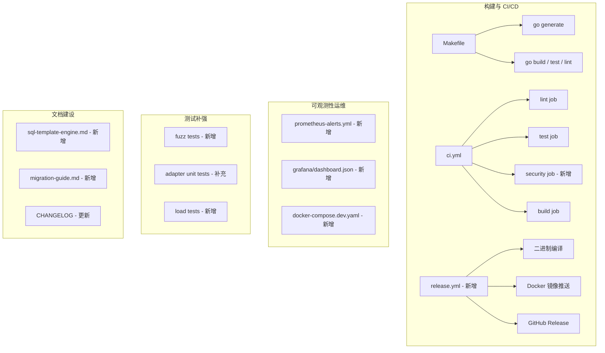

# 设计文档：项目补强 (Project Hardening)

## 概述 (Overview)

本设计文档描述 mountainKing GraphQL 多数据源 API 服务的系统性补强方案。补强范围涵盖 18 项需求，按 P0/P1/P2 三个优先级分批实施，包括：死代码清理、构建系统标准化、代码生成入口、文档建设、代码现代化、CI/CD 增强、可观测性运维、测试覆盖率提升、安全测试补充以及开发环境优化。

本项目为工程基础设施补强，不涉及新的业务架构设计。设计重点在于：文件位置与命名规范、Makefile 结构、CI 流水线修改、文档大纲、Grafana 面板布局、Prometheus 告警规则、Fuzz 测试策略、测试覆盖率提升方案以及负载测试方案。

## 架构 (Architecture)

本补强不改变现有系统架构。所有变更均为工程基础设施层面的增强，作用于以下层面：



## 组件与接口 (Components and Interfaces)

### 1. 新增文件清单

| 文件路径 | 需求 | 说明 |
|---------|------|------|
| `Makefile` | 2 | 项目根目录，标准构建入口 |
| `official_document/sql-template-engine.md` | 4 | SQL 模板引擎专题文档 |
| `.env.example` | 6 | 环境变量示例 |
| `.github/dependabot.yml` | 7 | Dependabot 配置 |
| `deploy/grafana/dashboard.json` | 10 | Grafana 面板 JSON |
| `deploy/prometheus-alerts.yml` | 11 | Prometheus 告警规则 |
| `internal/template/funcmap_fuzz_test.go` | 12 | safeString fuzz 测试 |
| `internal/template/sanitizer_fuzz_test.go` | 12 | sanitizeSQL fuzz 测试 |
| `internal/sanitize/sanitize_fuzz_test.go` | 12 | 脱敏函数 fuzz 测试 |
| `internal/adapter/starrocks/adapter_test.go` | 13 | StarRocks adapter 单元测试 |
| `internal/adapter/prometheus/adapter_test.go` | 13 | Prometheus adapter 单元测试 |
| `internal/datasource/manager_test.go` | 13 | DataSourceManager 单元测试 |
| `tests/load/k6-graphql.js` | 15 | k6 负载测试脚本 |
| `tests/load/README.md` | 15 | 负载测试使用说明 |
| `.github/workflows/release.yml` | 16 | Release 自动化流水线 |
| `official_document/migration-guide.md` | 17 | 迁移指南 |
| `deploy/docker-compose.dev.yaml` | 18 | 轻量级开发环境 |

### 2. 修改文件清单

| 文件路径 | 需求 | 变更内容 |
|---------|------|---------|
| `internal/server/server.go` | 1 | 删除 `placeholderHandler` 函数 |
| `internal/graphql/resolver/resolver.go` | 3 | 添加 `//go:generate` 指令 |
| `*.go`（手写文件） | 5 | `interface{}` → `any` |
| `.github/workflows/ci.yml` | 8 | 添加 `security` job |
| `CHANGELOG.md` | 9 | 更新 `[Unreleased]` 部分 |
| 10+ 个 `.gitkeep` 文件 | 14 | 删除非空目录中的 `.gitkeep` |

### 3. Makefile 结构设计 (需求 2)

```makefile
# 项目变量
APP_NAME    := mountainKing
BIN_DIR     := bin
BINARY      := $(BIN_DIR)/server
COVER_FILE  := coverage.out
FUZZ_TIME   := 30s
DOCKER_TAG  := $(APP_NAME):latest

.DEFAULT_GOAL := help

.PHONY: build test lint vet generate docker run fuzz clean help coverage

build:           ## 编译项目
	go build -o $(BINARY) ./cmd/server/

test:            ## 运行测试（竞态检测 + 覆盖率）
	go test -race -coverprofile=$(COVER_FILE) ./...

lint:            ## 运行 golangci-lint
	golangci-lint run ./...

vet:             ## 运行 go vet
	go vet ./...

generate:        ## 运行 go generate（gqlgen 代码生成）
	go generate ./...

docker:          ## 构建 Docker 镜像
	docker build -t $(DOCKER_TAG) -f deploy/Dockerfile .

run:             ## 本地运行服务
	go run cmd/server/main.go

fuzz:            ## 运行 fuzz 测试（默认 30s，逐个运行）
	go test -fuzz=FuzzSafeString -fuzztime=$(FUZZ_TIME) ./internal/template/
	go test -fuzz=FuzzSanitizeSQL -fuzztime=$(FUZZ_TIME) ./internal/template/
	go test -fuzz=FuzzSanitize -fuzztime=$(FUZZ_TIME) ./internal/sanitize/

clean:           ## 清理构建产物
	rm -rf $(BIN_DIR) $(COVER_FILE)

coverage: test   ## 生成覆盖率报告并输出总覆盖率
	go tool cover -func=$(COVER_FILE) | tail -1

help:            ## 列出所有可用目标
	@grep -E '^[a-zA-Z_-]+:.*?## .*$$' $(MAKEFILE_LIST) | \
		awk 'BEGIN {FS = ":.*?## "}; {printf "  \033[36m%-15s\033[0m %s\n", $$1, $$2}'
```

### 4. go:generate 指令 (需求 3)

在 `internal/graphql/resolver/resolver.go` 文件 `package resolver` 声明之后添加：

```go
//go:generate go run github.com/99designs/gqlgen generate
```

### 5. CI 安全扫描 Job (需求 8)

在 `.github/workflows/ci.yml` 中添加独立的 `security` job，与 lint/test 并行运行：

```yaml
security:
  name: Security Scan
  runs-on: ubuntu-latest
  steps:
    - uses: actions/checkout@v4
    - uses: actions/setup-go@v5
      with:
        go-version: ${{ env.GO_VERSION }}
    - name: Install gosec
      run: go install github.com/securego/gosec/v2/cmd/gosec@latest
    - name: Run gosec
      run: gosec -fmt=json -out=gosec-report.json ./... || true
    - name: Upload gosec report
      uses: actions/upload-artifact@v4
      with:
        name: gosec-report
        path: gosec-report.json
```

`|| true` 确保扫描结果不阻塞其他 job，结果作为 artifact 上传供审查。

### 6. SQL 模板引擎文档大纲 (需求 4)

`official_document/sql-template-engine.md` 文档结构：

1. **功能概述** — 模板引擎定位、与 StarRocks 直接查询的关系、架构集成方式（TemplateEngine → Renderer → sanitizeSQL → RawExecutor）
2. **配置参考** — `sql_templates` 配置段所有配置项详解（enabled、datasource_name、base_dir、shared_dir、render_timeout、max_rendered_sql_length、max_concurrent_queries、templates 列表及参数 Schema）
3. **模板语法** — 变量绑定 `{{.Params.xxx}}`、条件逻辑 `{{if}}`/`{{else}}`、循环 `{{range}}`、模板继承 `{{template}}`/`{{define}}`
4. **安全函数速查表** — 12 个函数（safeString、quote、safeInt、safeFloat、safeIdentifier、safeInList、safeLike、join、default、upper、lower、trimSpace）的用途、示例、输出
5. **最佳实践** — SQL 注入防护策略、模板组织（共享片段）、分页注意事项（避免外层 ORDER BY）、并发控制（信号量）
6. **端到端查询示例** — 模板文件 → config.yaml → GraphQL 调用 → 响应结果完整流程
7. **错误处理** — 8 个错误码（VALIDATION_TEMPLATE_NOT_FOUND、INTERNAL_TEMPLATE_RENDER_ERROR、VALIDATION_UNSAFE_SQL、VALIDATION_MISSING_PARAMETER、VALIDATION_INVALID_PARAMETER_TYPE、VALIDATION_INVALID_PARAMETER_VALUE、VALIDATION_INVALID_FIELD、DATASOURCE_TEMPLATE_QUERY_ERROR）的触发条件和处理建议
8. **热加载** — fsnotify 自动重载、reloadTemplates Mutation 手动重载
9. **缓存策略** — 模板级缓存 TTL、缓存禁用、totalCount 独立缓存、缓存 Key 生成规则
10. **可观测性** — Prometheus 指标（graphql_template_query_duration_seconds、graphql_template_queries_total、graphql_template_render_duration_seconds、graphql_template_semaphore_wait_seconds、graphql_template_cache_hits_total）和 OpenTelemetry Span

### 7. Grafana Dashboard 面板布局 (需求 10)

Dashboard JSON 存放于 `deploy/grafana/dashboard.json`，包含 7 个 Row：

| Row | 面板 | 指标 |
|-----|------|------|
| 请求概览 | QPS (rate)、延迟分位数 P50/P95/P99 (histogram_quantile)、并发请求数 | `graphql_request_duration_seconds`、`graphql_requests_total`、`graphql_requests_in_flight` |
| 数据源 | 查询延迟 (histogram)、连接池状态 (active/idle/waiting) | `graphql_datasource_query_duration_seconds`、`graphql_datasource_connection_pool_active/idle/waiting` |
| 缓存 | 命中率 (hits/(hits+misses))、命中/未命中计数 | `graphql_cache_hits_total`、`graphql_cache_misses_total` |
| 错误 | 错误率 (按 error_type 分组)、错误总数趋势 | `graphql_errors_total` |
| SQL 模板引擎 | 模板查询延迟、渲染延迟、信号量等待时间、模板缓存命中率 | `graphql_template_query_duration_seconds`、`graphql_template_render_duration_seconds`、`graphql_template_semaphore_wait_seconds`、`graphql_template_cache_hits_total` |
| 安全 | 限流触发率 (429)、认证失败率 | `graphql_requests_total{status="429"}`、`graphql_errors_total{error_type="AUTH_*"}` |
| 系统 | Go runtime (goroutines、GC、内存) | `go_goroutines`、`go_gc_duration_seconds`、`process_resident_memory_bytes` |

数据源类型设为 `Prometheus`，使用变量 `$datasource` 支持多 Prometheus 实例切换。

### 8. Prometheus 告警规则 (需求 11)

`deploy/prometheus-alerts.yml` 使用标准 Prometheus alerting rules 格式：

```yaml
groups:
  - name: mountainking-alerts
    rules:
      # P99 延迟超标 — 单数据源 >500ms
      - alert: HighP99Latency
        expr: histogram_quantile(0.99, rate(graphql_request_duration_seconds_bucket[5m])) > 0.5
        for: 5m
        labels:
          severity: warning
        annotations:
          summary: "P99 延迟超过 500ms"

      # P99 延迟超标 — 整体 >1s（含混合查询）
      - alert: HighP99LatencyCritical
        expr: histogram_quantile(0.99, sum(rate(graphql_request_duration_seconds_bucket[5m])) by (le)) > 1.0
        for: 5m
        labels:
          severity: critical
        annotations:
          summary: "整体 P99 延迟超过 1s"

      # 错误率飙升 >5%
      - alert: HighErrorRate
        expr: |
          sum(rate(graphql_errors_total[5m]))
          / sum(rate(graphql_requests_total[5m])) > 0.05
        for: 5m
        labels:
          severity: critical

      # 数据源不可用（连接池完全空：active=0 且 idle=0）
      - alert: DatasourceUnavailable
        expr: graphql_datasource_connection_pool_active == 0 and graphql_datasource_connection_pool_idle == 0
        for: 1m
        labels:
          severity: critical
        annotations:
          summary: "数据源连接池完全空（active=0, idle=0）"

      # 熔断器打开
      - alert: CircuitBreakerOpen
        expr: graphql_errors_total{error_type="DATASOURCE_CIRCUIT_OPEN"} > 0
        for: 1m
        labels:
          severity: warning

      # 模板查询信号量饱和
      - alert: TemplateSemaphoreSaturated
        expr: histogram_quantile(0.99, rate(graphql_template_semaphore_wait_seconds_bucket[5m])) > 1.0
        for: 5m
        labels:
          severity: warning
```

### 9. Fuzz 测试策略 (需求 12)

使用 Go 原生 `testing.F` 框架，每个 fuzz 测试函数以 `Fuzz` 前缀命名。

| 文件 | 函数 | 被测函数 | 验证点 |
|------|------|---------|--------|
| `internal/template/funcmap_fuzz_test.go` | `FuzzSafeString` | `safeString` | 不 panic；输出不含未转义单引号（不存在奇数个连续 `'`）；不含 NULL 字节 `\x00` |
| `internal/template/sanitizer_fuzz_test.go` | `FuzzSanitizeSQL` | `sanitizeSQL` | 不 panic；返回 error 或有效 SQL（无未闭合引号） |
| `internal/sanitize/sanitize_fuzz_test.go` | `FuzzSanitize` | `Sanitizer.Sanitize` | 不 panic；使用 DefaultRules 初始化 |

Fuzz 测试种子语料库 (seed corpus) 包含：空字符串、单引号、反斜杠、NULL 字节、SQL 注入常见 payload（`'; DROP TABLE --`、`\x00`、`' OR '1'='1`）。

Makefile `fuzz` 目标默认运行 30 秒，CI 中不运行 fuzz（fuzz 为本地开发工具）。

### 10. 测试覆盖率提升方案 (需求 13)

#### StarRocks Adapter (`internal/adapter/starrocks/adapter_test.go`)

使用 `go-sqlmock` 库 mock `*sql.DB`：
- `TestConnect_Success` — mock PingContext 成功
- `TestConnect_PingFail` — mock PingContext 失败
- `TestExecute_Success` — mock QueryContext 返回行数据
- `TestExecute_WithCount` — mock QueryRowContext 返回 totalCount
- `TestHealthCheck_Success` — mock PingContext
- `TestHealthCheck_Fail` — mock PingContext 返回错误
- `TestClose` — 验证关闭后 available=false

注入方式：通过直接设置 `adapter.db` 字段（同包内可访问）绕过真实连接。

#### Prometheus Adapter (`internal/adapter/prometheus/adapter_test.go`)

使用 `net/http/httptest.Server` mock Prometheus HTTP API：
- `TestConnect_Success` — mock `/api/v1/status/buildinfo` 返回 200
- `TestConnect_Fail` — mock 返回 500
- `TestExecute_InstantQuery` — mock `/api/v1/query` 返回 vector 结果
- `TestExecute_RangeQuery` — mock `/api/v1/query_range` 返回 matrix 结果
- `TestExecute_Error` — mock 返回 Prometheus error 响应
- `TestHealthCheck_Success` — mock buildinfo 200
- `TestHealthCheck_Fail` — mock buildinfo 超时
- `TestClose` — 验证关闭后 available=false

#### DataSourceManager (`internal/datasource/manager_test.go`)

使用现有 `internal/datasource/mock.go` 中的 `MockDataSource`：
- `TestInit_PartialFailure` — 一个 mock 连接成功、一个失败，验证部分初始化
- `TestInit_DisabledSkipped` — enabled=false 的数据源被跳过
- `TestGet_Found` — 注册后可获取
- `TestGet_NotFound` — 未注册返回错误
- `TestGet_Unavailable` — 标记为不可用时返回错误
- `TestCloseAll` — 验证所有数据源被关闭

### 11. 负载测试方案 (需求 15)

使用 k6 (JavaScript) 编写，存放于 `tests/load/`：

```
tests/load/
├── k6-graphql.js    # 主测试脚本
└── README.md        # 使用说明
```

k6 脚本包含 3 个场景：
1. **single_datasource** — 单数据源查询，阈值 P95≤200ms、P99≤500ms
2. **mixed_query** — 跨数据源混合查询，阈值 P95≤500ms、P99≤1s
3. **template_query** — 模板查询场景

每个场景使用 `scenarios` 配置独立的 VU 数和持续时间。README 说明安装 k6、运行命令、结果解读方式。

### 12. .env.example 设计 (需求 6)

基于 `internal/config/config.go` 中的 `LoadConfig` 函数，所有环境变量使用 `GRAPHQL_` 前缀。文件按功能分组，每个变量附带注释说明用途和默认值。包含开发模式快速启动最小配置。

### 13. Dependabot 配置 (需求 7)

```yaml
version: 2
updates:
  - package-ecosystem: gomod
    directory: /
    schedule:
      interval: weekly
  - package-ecosystem: github-actions
    directory: /
    schedule:
      interval: weekly
```

### 14. Release Workflow (需求 16)

`.github/workflows/release.yml` 触发条件为 `v*` tag push。步骤：
1. Checkout 代码
2. 设置 Go 环境
3. 交叉编译 Linux amd64/arm64 二进制
4. 从 CHANGELOG.md 提取对应版本变更说明（使用 sed/awk 提取 `## [vX.Y.Z]` 到下一个 `## [` 之间的内容）
5. 构建并推送 Docker 镜像到 GHCR
6. 创建 GitHub Release，附带二进制和镜像标签

### 15. Dev Docker Compose (需求 18)

`deploy/docker-compose.dev.yaml` 包含：
- Redis (redis:7-alpine) — 端口 6379
- Prometheus (prom/prometheus) — 端口 9090，挂载 `deploy/prometheus.yml`
- Grafana (grafana/grafana-oss) — 端口 3000，预配置 Prometheus 数据源，加载 `deploy/grafana/dashboard.json`

不包含 StarRocks FE/BE。文件顶部包含使用说明注释。


## 数据模型 (Data Models)

本补强不引入新的数据模型。涉及的数据格式为：

### Grafana Dashboard JSON 结构

```json
{
  "dashboard": {
    "title": "mountainKing GraphQL API",
    "uid": "mountainking-overview",
    "templating": {
      "list": [{ "name": "datasource", "type": "datasource", "query": "prometheus" }]
    },
    "panels": [
      // 按 Row 组织，每个 Row 包含 2-4 个面板
      // 面板类型：timeseries (延迟/速率)、stat (当前值)、gauge (百分比)
    ],
    "rows": [
      { "title": "请求概览", "panels": ["QPS", "延迟分位数", "并发请求"] },
      { "title": "数据源", "panels": ["查询延迟", "连接池状态"] },
      { "title": "缓存", "panels": ["命中率", "命中/未命中计数"] },
      { "title": "错误", "panels": ["错误率", "错误趋势"] },
      { "title": "SQL 模板引擎", "panels": ["查询延迟", "渲染延迟", "信号量等待", "缓存命中率"] },
      { "title": "安全", "panels": ["限流触发率", "认证失败率"] },
      { "title": "系统", "panels": ["Goroutines", "GC", "内存"] }
    ]
  }
}
```

### Prometheus Alert Rules YAML 结构

标准 Prometheus alerting rules 格式（`groups[].rules[]`），每条规则包含 `alert`、`expr`、`for`、`labels`、`annotations` 字段。

### k6 负载测试阈值配置

```javascript
export const options = {
  scenarios: {
    single_datasource: { /* ... */ },
    mixed_query: { /* ... */ },
    template_query: { /* ... */ },
  },
  thresholds: {
    'http_req_duration{scenario:single_datasource}': ['p(95)<200', 'p(99)<500'],
    'http_req_duration{scenario:mixed_query}': ['p(95)<500', 'p(99)<1000'],
  },
};
```


## 正确性属性 (Correctness Properties)

*属性是一种在系统所有有效执行中都应成立的特征或行为——本质上是关于系统应该做什么的形式化陈述。属性是人类可读规范与机器可验证正确性保证之间的桥梁。*

本补强项目以工程基础设施为主，大部分验收标准为文件存在性或内容检查（适合 example 测试），但以下属性可通过属性测试进行更严格的验证：

### Property 1: interface{} 不存在于手写源文件

*For any* `.go` 源文件（不在 `internal/graphql/generated/` 目录中），文件内容不应包含字符串 `interface{}`。

**Validates: Requirements 5.1**

### Property 2: .env.example 格式一致性

*For any* 非空、非注释行（即环境变量定义行）在 `.env.example` 文件中，该行的变量名应以 `GRAPHQL_` 前缀开头，且该行之前应存在至少一行以 `#` 开头的注释行。

**Validates: Requirements 6.2, 6.3**

### Property 3: Grafana Dashboard 指标名称有效性

*For any* Grafana Dashboard JSON 中的面板（panel），其 PromQL 查询表达式中引用的指标名称应属于项目已注册的 Prometheus 指标集合（`graphql_request_duration_seconds`、`graphql_requests_total`、`graphql_requests_in_flight`、`graphql_datasource_query_duration_seconds`、`graphql_datasource_connection_pool_active`、`graphql_datasource_connection_pool_idle`、`graphql_datasource_connection_pool_waiting`、`graphql_errors_total`、`graphql_cache_hits_total`、`graphql_cache_misses_total`、`graphql_template_query_duration_seconds`、`graphql_template_queries_total`、`graphql_template_render_duration_seconds`、`graphql_template_semaphore_wait_seconds`、`graphql_template_cache_hits_total`、`go_goroutines`、`go_gc_duration_seconds`、`process_resident_memory_bytes`）。

**Validates: Requirements 10.8**

### Property 4: Prometheus 告警规则指标名称有效性

*For any* Prometheus 告警规则中的 `expr` 表达式，其引用的指标名称应属于项目已注册的 Prometheus 指标集合（同 Property 3 的指标列表）。

**Validates: Requirements 11.7**

### Property 5: 安全函数对任意输入不 panic

*For any* 字节序列输入，调用 `safeString`、`sanitizeSQL`、`Sanitizer.Sanitize` 函数均不应产生 panic。函数应正常返回结果或错误。

**Validates: Requirements 12.4**

### Property 6: safeString 输出安全不变量

*For any* 字符串输入，`safeString` 函数的输出不应包含未转义的单引号（即不存在奇数个连续 `'` 字符），且不应包含 NULL 字节（`\x00`）。

**Validates: Requirements 12.5**

### Property 7: 非空目录不含 .gitkeep

*For any* 项目目录，如果该目录包含除 `.gitkeep` 以外的文件，则该目录不应包含 `.gitkeep` 文件。

**Validates: Requirements 14.1, 14.2**

## 错误处理 (Error Handling)

本补强不引入新的运行时错误处理逻辑。各组件的错误处理策略：

| 组件 | 错误场景 | 处理方式 |
|------|---------|---------|
| Makefile | 命令执行失败 | Make 默认行为：打印错误并停止 |
| CI security job | gosec 发现问题 | `\|\| true` 不阻塞流水线，结果上传为 artifact |
| Fuzz 测试 | 被测函数 panic | Go fuzz 框架自动捕获并报告失败用例到 `testdata/` |
| Fuzz 测试 | safeString 输出不安全 | 测试断言失败，fuzz 框架记录最小化反例 |
| 负载测试 | 延迟超过阈值 | k6 报告 threshold 失败，退出码非零 |
| Release workflow | CHANGELOG 提取失败 | 使用 "Release vX.Y.Z" 作为默认 Release Notes |
| Dependabot | PR 创建失败 | GitHub 自动重试，无需额外处理 |

## 测试策略 (Testing Strategy)

### 双轨测试方法

本补强采用单元测试 + 属性测试的双轨方法：

- **单元测试 (Unit Tests)**：验证具体示例、边界情况和错误条件。适用于本补强中大量的文件存在性检查、内容格式检查、Makefile 目标验证等。
- **属性测试 (Property-Based Tests)**：验证跨所有输入的通用属性。适用于安全函数不变量（Property 5、6）、代码库范围检查（Property 1、7）、配置文件格式（Property 2）、指标名称有效性（Property 3、4）。

两者互补：单元测试捕获具体 bug，属性测试验证通用正确性。

### 属性测试配置

- **库**：`pgregory.net/rapid`（项目已使用）用于 Property 1-4、7；Go 原生 `testing.F` 用于 Property 5、6（fuzz 测试）
- **迭代次数**：rapid 属性测试每个至少 100 次迭代
- **标签格式**：每个测试函数包含注释引用设计属性
  - 格式：`// Feature: project-hardening, Property {number}: {property_text}`
- **每个正确性属性由单个属性测试实现**

### Fuzz 测试配置

- 使用 Go 原生 `testing.F` 框架
- 种子语料库包含：空字符串、单引号、反斜杠、NULL 字节、SQL 注入 payload
- Makefile `fuzz` 目标默认运行 30 秒
- CI 中不运行 fuzz 测试（仅本地开发使用）

### 适配器测试策略

- StarRocks adapter：使用 `DATA-DOG/go-sqlmock` mock `*sql.DB`
- Prometheus adapter：使用 `net/http/httptest.Server` mock HTTP API
- DataSourceManager：使用现有 `internal/datasource/mock.go` 中的 `MockDataSource`
- 目标覆盖率：starrocks ≥60%、prometheus ≥60%、datasource ≥65%

### 负载测试

- 使用 k6 编写，手动运行（不集成到 CI）
- 3 个场景：单数据源、混合查询、模板查询
- 阈值：单数据源 P95≤200ms/P99≤500ms，混合查询 P95≤500ms/P99≤1s
