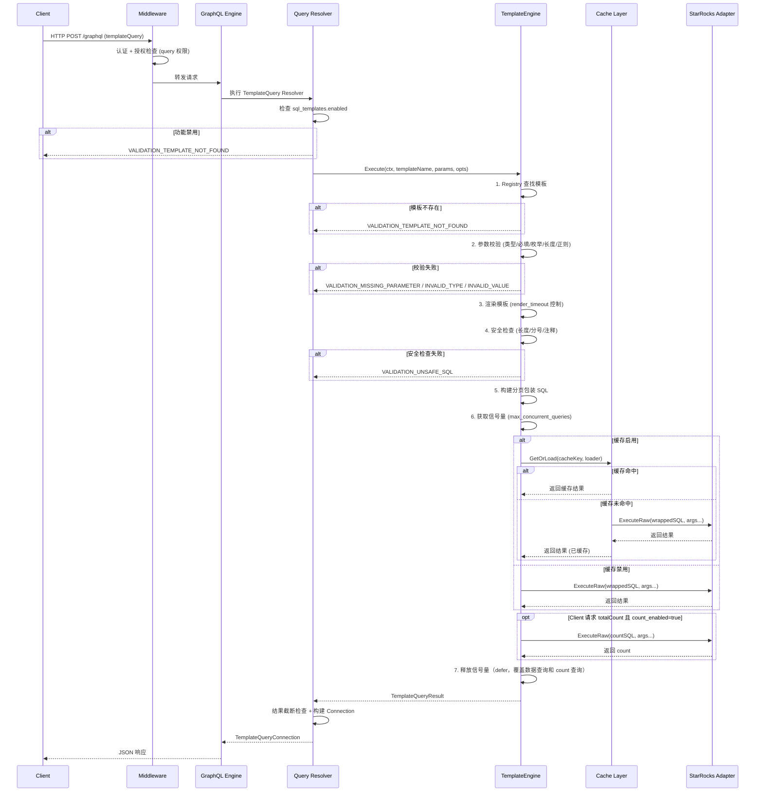
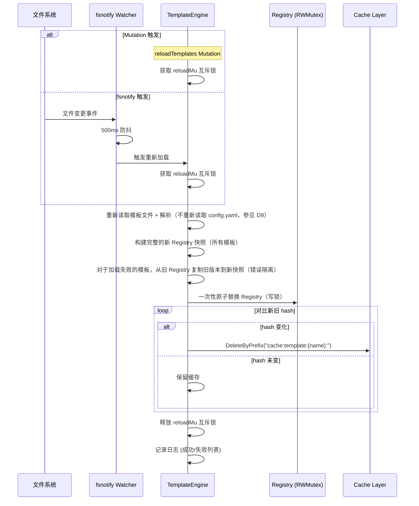

# 技术设计文档：SQL 模板查询引擎

## 概述

本设计文档描述 mountainKing GraphQL API 服务新增 SQL 模板查询引擎（Template_Engine）的技术架构。该引擎作为 StarRocks 数据源的扩展查询方式，通过预定义的 Go `text/template` 模板文件，将业务参数渲染为完整的 SQL 语句，经由 StarRocks 执行后返回动态 JSON 结果。

核心设计目标：
- 通过 `RawExecutor` 接口与 StarRocks Adapter 交互，实现接口隔离
- 与现有单表 `starrocks` 查询并行工作，共享同一个 StarRocks 连接池
- 完善的 SQL 注入防护（多层安全函数 + 词法扫描器）
- 复用现有 Cache Layer、可观测性、审计日志等基础设施
- 信号量并发控制，防止复杂报表查询饿死共享连接池

技术栈新增：
| 组件　　　　　| 技术选型　　　　　　　　| 理由　　　　　　　　　　　　 |
| ---------------| -------------------------| ------------------------------|
| 模板引擎　　　| Go `text/template`　　　| 标准库，零外部依赖，沙箱安全 |
| 文件监听　　　| fsnotify　　　　　　　　| 复用现有 HotReloader 依赖　　|
| 并发控制　　　| 信号量（channel-based） | 轻量级，无外部依赖　　　　　 |
| 哈希比较　　　| crypto/sha256　　　　　 | 标准库，用于模板变更检测　　 |
| 缓存 Key 哈希 | cespare/xxhash/v2　　　 | 复用现有依赖　　　　　　　　 |

## 架构

### 整体架构集成

```
┌─────────────────────────────────────────────────────────────┐
│                      GraphQL Layer                           │
│                                                              │
│  starrocks(table, filters...)    templateQuery(name, params) │
│       │                                │                     │
│  queryResolver.Starrocks()    queryResolver.TemplateQuery()  │
│       │                                │                     │
│       │                      ┌─────────▼──────────┐         │
│       │                      │   TemplateEngine    │         │
│       │                      │  ┌───────────────┐  │         │
│       │                      │  │ Registry      │  │         │
│       │                      │  │ ParamValidator │  │         │
│       │                      │  │ SQLSanitizer  │  │         │
│       │                      │  │ Semaphore(10) │  │         │
│       │                      │  └───────────────┘  │         │
│       │                      └─────────┬──────────┘         │
│       │                                │ RawExecutor         │
│       ▼                                ▼                     │
│  ┌────────────────────────────────────────────────────────┐  │
│  │                  StarRocks Adapter                      │  │
│  │  Execute(QueryRequest)      ExecuteRaw(sql, args...)    │  │
│  │  [DataSource interface]     [RawExecutor interface]     │  │
│  │       │                           │                     │  │
│  │       ▼                           ▼                     │  │
│  │  ┌────────────────────────────────────────┐             │  │
│  │  │         *sql.DB 连接池 (共享)           │             │  │
│  │  └────────────────────────────────────────┘             │  │
│  └────────────────────────────────────────────────────────┘  │
└─────────────────────────────────────────────────────────────┘
```

### 模板查询请求处理流程



### 模板热加载流程



### 项目目录结构（新增部分）

```
internal/
  template/                        # SQL 模板引擎核心包
    engine.go                      # TemplateEngine 主结构体与 Execute 方法
    registry.go                    # TemplateRegistry 模板注册表（RWMutex 保护）
    loader.go                      # 模板文件加载、解析、校验
    renderer.go                    # 模板渲染（render_timeout 控制）
    validator.go                   # 参数校验（类型/必填/枚举/长度/正则）
    sanitizer.go                   # SQL 安全检查（词法扫描器 + 注释移除）
    funcmap.go                     # 自定义模板函数（safeString/quote/safeInt 等）
    pagination.go                  # 分页包装器（LIMIT/OFFSET/ORDER BY/字段选择）
    cache.go                       # 缓存 key 生成与缓存集成逻辑
    watcher.go                     # fsnotify 文件监听 + 热加载
    metrics.go                     # Prometheus 指标注册
    types.go                       # 公共类型定义（RawExecutor 接口、配置结构体等）
  graphql/
    schema/
      template.graphql             # 模板查询 GraphQL Schema 定义
    resolver/
      template.resolvers.go        # templateQuery / templateList / reloadTemplates Resolver
  config/
    config.go                      # 新增 SQLTemplatesConfig 结构体
  errors/
    types.go                       # 新增模板相关错误码常量
  audit/
    audit.go                       # LogEntry 新增 ExtraFields 可扩展字段
templates/                         # 模板文件目录（可配置）
  _shared/                         # 共享模板片段目录
    time_filter.sql.tmpl
  fleet/
    fleet_report.sql.tmpl
  driver/
    driver_score.sql.tmpl
```

## 组件与接口

### 1. RawExecutor 接口

定义在 `internal/template/types.go` 中，由 StarRocks Adapter 实现。这是 Template_Engine 与 Adapter 之间的唯一交互接口，确保模板引擎无法调用白名单查询等其他方法。

```go
// RawExecutor 定义原始 SQL 执行能力。
// Template_Engine 仅通过此接口与 StarRocks Adapter 交互，
// 实现接口隔离——模板引擎无法访问 Execute、HealthCheck 等方法。
type RawExecutor interface {
    // ExecuteRaw 执行原始 SQL 语句并返回结果。
    // 复用 Adapter 的 *sql.DB 连接池，不经过 SQLQueryBuilder 和白名单校验。
    // query: 渲染后的 SQL 语句（已通过安全检查）
    // args: SQL 参数（用于 LIMIT/OFFSET 等参数化值）
    ExecuteRaw(ctx context.Context, query string, args ...interface{}) (*datasource.QueryResult, error)
}
```

StarRocks Adapter 实现：

```go
// adapter.go 新增方法

// ExecuteRaw 实现 template.RawExecutor 接口。
// 复用现有 *sql.DB 连接池和 scanRows 函数执行任意 SQL。
// 不经过 SQLQueryBuilder 和白名单校验。
func (a *Adapter) ExecuteRaw(ctx context.Context, query string, args ...interface{}) (*datasource.QueryResult, error) {
    a.mu.RLock()
    db := a.db
    a.mu.RUnlock()

    if db == nil {
        return nil, apierrors.DatasourceError(
            apierrors.ErrDatasourceUnavailable,
            fmt.Sprintf("starrocks adapter %q is not connected", a.name),
        )
    }

    rows, err := db.QueryContext(ctx, query, args...)
    if err != nil {
        return nil, apierrors.DatasourceError(
            apierrors.ErrDatasourceTemplateQueryError,
            fmt.Sprintf("template query failed: %v", err),
        )
    }
    defer rows.Close()

    data, err := scanRows(rows)
    if err != nil {
        return nil, apierrors.DatasourceError(
            apierrors.ErrDatasourceTemplateQueryError,
            fmt.Sprintf("template query scan failed: %v", err),
        )
    }

    return &datasource.QueryResult{Data: data}, nil
}
```

> **接口隔离验证：** `TemplateEngine` 结构体持有 `RawExecutor` 接口引用而非 `*starrocks.Adapter`。编译时即可保证模板引擎无法调用 `Execute`、`HealthCheck` 等 `DataSource` 接口方法。

### 2. 配置结构

在 `internal/config/config.go` 中新增 `SQLTemplatesConfig`，嵌入根 `Config` 结构体。

```go
// Config 根配置新增字段
type Config struct {
    // ... 现有字段 ...
    SQLTemplates SQLTemplatesConfig `mapstructure:"sql_templates"`
}

// SQLTemplatesConfig SQL 模板引擎配置
type SQLTemplatesConfig struct {
    Enabled             bool                  `mapstructure:"enabled"`
    DatasourceName      string                `mapstructure:"datasource_name"` // 关联的 StarRocks 数据源名称
    BaseDir             string                `mapstructure:"base_dir"`
    SharedDir           string                `mapstructure:"shared_dir"`
    RenderTimeout       time.Duration         `mapstructure:"render_timeout"`
    MaxRenderedSQLLen   int                   `mapstructure:"max_rendered_sql_length"`
    MaxConcurrentQueries int                  `mapstructure:"max_concurrent_queries"`
    Templates           []TemplateConfig      `mapstructure:"templates"`
}

// TemplateConfig 单个模板的配置
type TemplateConfig struct {
    Name         string                `mapstructure:"name"`
    File         string                `mapstructure:"file"`
    Description  string                `mapstructure:"description"`
    CacheEnabled *bool                 `mapstructure:"cache_enabled"` // nil = true (默认启用)
    CacheTTL     *time.Duration        `mapstructure:"cache_ttl"`    // nil = 使用数据源默认 TTL
    CountEnabled *bool                 `mapstructure:"count_enabled"` // nil = true (默认启用)
    Parameters   []TemplateParamConfig `mapstructure:"parameters"`
}

// TemplateParamConfig 模板参数 Schema 配置
type TemplateParamConfig struct {
    Name      string   `mapstructure:"name"`
    Type      string   `mapstructure:"type"`      // string, int, float, boolean, string[]
    Required  bool     `mapstructure:"required"`
    Default   *string  `mapstructure:"default"`
    Enum      []string `mapstructure:"enum"`
    MaxLength *int     `mapstructure:"max_length"` // string 类型，默认 1024
    MaxItems  *int     `mapstructure:"max_items"`  // string[] 类型，默认 1000
    Pattern   *string  `mapstructure:"pattern"`    // 正则约束（RE2 语法）
}
```

默认值设置（在 `setDefaults` 中新增）：

```go
// sql_templates defaults
v.SetDefault("sql_templates.enabled", false)
v.SetDefault("sql_templates.datasource_name", "")  // 必须显式配置，无默认值
v.SetDefault("sql_templates.base_dir", "./templates")
v.SetDefault("sql_templates.render_timeout", 5*time.Second)
v.SetDefault("sql_templates.max_rendered_sql_length", 65536)
v.SetDefault("sql_templates.max_concurrent_queries", 10)
```

> **shared_dir 默认值：** 当 `shared_dir` 未配置时，默认为 `base_dir` 下的 `_shared` 子目录。此逻辑在 `TemplateEngine.Init()` 中处理，而非 Viper 默认值（因为依赖 `base_dir` 的运行时值）。

### 3. 错误码定义

在 `internal/errors/types.go` 中新增模板相关错误码常量：

```go
// VALIDATION - Template validation errors.

// ErrValidationTemplateNotFound indicates the requested template name is not registered.
ErrValidationTemplateNotFound = "VALIDATION_TEMPLATE_NOT_FOUND"
// ErrValidationUnsafeSQL indicates the rendered SQL failed security checks.
ErrValidationUnsafeSQL = "VALIDATION_UNSAFE_SQL"
// ErrValidationMissingParameter indicates a required template parameter is missing.
ErrValidationMissingParameter = "VALIDATION_MISSING_PARAMETER"
// ErrValidationInvalidParameterType indicates a parameter type mismatch.
ErrValidationInvalidParameterType = "VALIDATION_INVALID_PARAMETER_TYPE"
// ErrValidationInvalidParameterValue indicates a parameter value constraint violation.
ErrValidationInvalidParameterValue = "VALIDATION_INVALID_PARAMETER_VALUE"

// DATASOURCE - Template query errors.

// ErrDatasourceTemplateQueryError indicates a StarRocks execution error for template SQL.
ErrDatasourceTemplateQueryError = "DATASOURCE_TEMPLATE_QUERY_ERROR"

// INTERNAL - Template engine errors.

// ErrInternalTemplateRenderError indicates a template rendering failure.
ErrInternalTemplateRenderError = "INTERNAL_TEMPLATE_RENDER_ERROR"
```

> **错误码分类：** 遵循现有 `{CATEGORY}_{ERROR_NAME}` 命名规范。`VALIDATION_*` 返回 HTTP 400，`DATASOURCE_*` 返回 HTTP 200（GraphQL errors 数组），`INTERNAL_*` 返回 HTTP 500。复用现有 `ErrValidationInvalidField`（需求 4.3）和 `ErrDatasourceTimeout`（需求 5.5）、`ErrAuthInsufficientPermission`（需求 5.7/10.8）。

### 4. TemplateEngine 核心结构

```go
// TemplateEngine 是 SQL 模板查询引擎的核心组件。
// 负责模板加载、参数校验、模板渲染、安全检查、分页包装、缓存集成和并发控制。
type TemplateEngine struct {
    registry       *TemplateRegistry       // 模板注册表（RWMutex 保护）
    config         config.SQLTemplatesConfig
    graphqlCfg     config.GraphQLConfig    // 用于 max_result_rows
    datasourceName string                  // StarRocks 数据源名称（从 Adapter.Name() 获取）
    executor       RawExecutor             // StarRocks Adapter（接口隔离）
    cacheLayer     *cache.CacheLayer       // 可选，nil 表示缓存禁用
    sanitizer      *sanitize.Sanitizer     // 复用现有脱敏组件
    auditLogger    *audit.AuditLogger      // 审计日志
    metrics        *TemplateMetrics        // Prometheus 指标
    tracer         trace.Tracer            // OpenTelemetry Tracer
    logger         *zap.Logger
    semaphore      chan struct{}            // 并发控制信号量
    reloadMu       sync.Mutex              // 热加载互斥锁（独立于 Registry 读写锁）
    lastReloadAt   time.Time               // 上次成功 Reload 的时间（用于冷却时间控制）
    lastReloadResult *ReloadResult          // 上次 Reload 结果（供 health check 或诊断查询使用）
    funcMap        template.FuncMap        // 自定义模板函数
}

// TemplateEngineConfig 创建 TemplateEngine 所需的依赖配置
type TemplateEngineConfig struct {
    Config         config.SQLTemplatesConfig
    GraphQLCfg     config.GraphQLConfig
    DatasourceName string                  // StarRocks 数据源名称（从 Adapter.Name() 获取，用于指标/审计/缓存 key）
    Executor       RawExecutor
    CacheLayer     *cache.CacheLayer       // nil = 缓存禁用
    Sanitizer      *sanitize.Sanitizer
    AuditLogger    *audit.AuditLogger
    Metrics        *TemplateMetrics
    Tracer         trace.Tracer
    Logger         *zap.Logger
}

// NewTemplateEngine 创建并初始化 TemplateEngine。
// 1. 构建自定义 FuncMap（safeString, quote, safeInt 等）
// 2. 初始化信号量（容量 = max_concurrent_queries）
// 3. 调用 loadAll() 加载所有模板
func NewTemplateEngine(cfg TemplateEngineConfig) (*TemplateEngine, error)

// Execute 执行模板查询的完整流程。
// 步骤：查找模板 → 参数校验 → 渲染 → 安全检查 → 分页包装 → 信号量 → 缓存/执行 → 返回
func (te *TemplateEngine) Execute(ctx context.Context, req *TemplateQueryRequest) (*TemplateQueryResult, error)

// TemplateQueryRequest 模板查询请求
type TemplateQueryRequest struct {
    TemplateName string
    Parameters   map[string]interface{}
    Fields       []string
    First        *int
    Offset       *int
    OrderBy      []TemplateOrderByParam
    NeedCount    bool                    // 由 Resolver 根据 GraphQL 字段选择设置
    SkipCache    bool                    // extensions.cache=false 时为 true
}

// TemplateOrderByParam 排序参数
type TemplateOrderByParam struct {
    Field     string
    Direction string // "ASC" 或 "DESC"
}

// TemplateQueryResult 模板查询结果
type TemplateQueryResult struct {
    Data       []map[string]interface{}
    TotalCount *int64                   // -1 表示 count_enabled=false
    Warnings   []string
}

// Reload 重新加载所有模板文件（Mutation 和 fsnotify 共用）。
// 注意：Reload 只重新读取模板文件和共享片段，不重新读取 config.yaml。
// 配置变更（如新增/删除模板条目、修改参数 Schema）需要重启服务（参见设计决策 D9）。
// 使用 reloadMu 互斥锁防止并发重新加载。
// 内置冷却时间控制：Mutation 触发的 Reload 有 10s 冷却时间（距上次成功 Reload 不足 10s 则直接返回上次结果），
// 防止恶意或有 bug 的客户端高频调用导致过度文件 I/O 和缓存失效。
// fsnotify 触发的 Reload 不受冷却时间限制（已有 500ms 防抖保护），确保文件变更能及时生效。
//
// 错误隔离策略：
// 1. 调用 loadAll() 构建新的模板快照
// 2. 对于加载失败的模板，从旧 Registry 复制旧版本到新快照（保留旧版本继续服务）
// 3. 一次性原子替换 Registry
// 4. 仅对 hash 变化的模板清除缓存
func (te *TemplateEngine) Reload(ctx context.Context) (*ReloadResult, error)

// ReloadResult 模板重新加载结果摘要
type ReloadResult struct {
    SuccessCount int
    Failures     []TemplateLoadFailure
    Duration     time.Duration
}

// ListTemplates 返回所有已注册模板的元信息。
func (te *TemplateEngine) ListTemplates(first *int, offset *int) []*TemplateInfo

// TemplateInfo 模板元信息（内部类型，由 Resolver 转换为 generated.TemplateInfo）
type TemplateInfo struct {
    Name         string
    Description  string
    CountEnabled bool
    Parameters   []ParamSchemaInfo
}

// ParamSchemaInfo 参数 Schema 元信息
type ParamSchemaInfo struct {
    Name         string
    Type         string
    Required     bool
    DefaultValue *string
}

// Close 释放资源（停止 fsnotify watcher）。
func (te *TemplateEngine) Close() error
```

### 5. TemplateRegistry 模板注册表

```go
// TemplateRegistry 管理所有已注册模板的元信息和编译后的模板对象。
// 使用 sync.RWMutex 保护，支持并发读取和原子更新。
type TemplateRegistry struct {
    mu        sync.RWMutex
    templates map[string]*RegisteredTemplate // name → template
    hashes    map[string]string              // name → SHA-256 hex hash
}

// RegisteredTemplate 已注册的模板
type RegisteredTemplate struct {
    Name         string
    Description  string
    Config       config.TemplateConfig
    Template     *template.Template          // 编译后的 Go template
    ParamSchemas []ParamSchema               // 参数 Schema（含预编译正则）
    CacheEnabled bool
    CacheTTL     *time.Duration
    CountEnabled bool
}

// ParamSchema 参数校验 Schema（运行时结构，含预编译正则）
type ParamSchema struct {
    Name      string
    Type      string           // "string", "int", "float", "boolean", "string[]"
    Required  bool
    Default   interface{}      // 类型化的默认值（string/int/float/bool/[]string）
    Enum      []string
    MaxLength int              // 默认 1024
    MaxItems  int              // 默认 1000
    Pattern   *regexp.Regexp   // 预编译正则（nil = 无约束）
}

// Get 根据名称获取已注册模板（读锁）
func (r *TemplateRegistry) Get(name string) (*RegisteredTemplate, bool)

// GetAll 返回所有已注册模板的快照（读锁）
func (r *TemplateRegistry) GetAll() []*RegisteredTemplate

// Update 原子替换整个注册表内容（写锁）
// 用于热加载时的原子更新，确保查询不会看到中间状态
func (r *TemplateRegistry) Update(templates map[string]*RegisteredTemplate, hashes map[string]string)

// GetHash 获取模板的 SHA-256 hash（读锁）
func (r *TemplateRegistry) GetHash(name string) (string, bool)
```

> **原子更新策略：** 热加载时先在 reloadMu 保护下构建完整的新 Registry 快照（新 map），然后通过 `Update()` 方法在写锁保护下一次性替换整个 map 引用。正在执行的查询持有读锁，使用旧 map 引用完成查询，不会看到中间状态。

### 6. 模板加载器（Loader）

```go
// loadAll 加载所有模板文件和共享片段。
// 流程：
// 1. 加载 shared_dir 下所有 .sql.tmpl 文件作为共享片段
// 2. 遍历配置中的 templates 列表：
//    a. 校验模板名称格式（^[a-zA-Z0-9_-]{1,64}$）
//    b. 检查名称唯一性
//    c. 读取模板文件（相对于 base_dir）
//    d. 校验文件大小（≤ 1MB）和 UTF-8 编码
//    e. 使用 text/template 解析（含共享片段和自定义 FuncMap）
//       关键：必须设置 Option("missingkey=error")，确保模板中引用未定义参数时返回错误
//       而非静默输出零值（Go text/template 默认行为是输出空字符串）
//    f. 预编译参数 Schema 中的 pattern 正则
//    g. 计算文件内容 SHA-256 hash
// 3. 记录成功/失败日志
// 任何单个模板的加载失败不影响其他模板和服务启动。
func (te *TemplateEngine) loadAll() (*loadResult, error)

// loadResult 加载结果
type loadResult struct {
    Registered map[string]*RegisteredTemplate
    Hashes     map[string]string
    Failures   []TemplateLoadFailure
}

// TemplateLoadFailure 模板加载失败详情
type TemplateLoadFailure struct {
    Name  string
    Error string
}
```

模板名称校验正则：

```go
var templateNameRe = regexp.MustCompile(`^[a-zA-Z0-9_-]{1,64}$`)
```

文件大小限制常量：

```go
const maxTemplateFileSize = 1 << 20 // 1MB
```

### 7. 模板渲染器（Renderer）

```go
// render 渲染模板并执行安全检查。
// 1. 构建渲染上下文：{Params: validatedParams}
// 2. 在 render_timeout 内执行 template.Execute()
// 3. Trim 结果，验证非空
// 4. 检查长度 ≤ max_rendered_sql_length
// 5. 调用 sanitizeSQL() 执行安全检查
// 返回渲染后的 SQL 字符串。
func (te *TemplateEngine) render(ctx context.Context, tmpl *RegisteredTemplate, params map[string]interface{}) (string, error)

// renderContext 模板渲染上下文
type renderContext struct {
    Params map[string]interface{} // 模板中通过 {{.Params.xxx}} 访问
}
```

> **渲染超时实现：** 使用 `context.WithTimeout(ctx, render_timeout)` 创建子 context，在独立 goroutine 中执行 `template.Execute()`，通过 select 监听 context 取消。超时返回 `INTERNAL_TEMPLATE_RENDER_ERROR`。

> **Goroutine 泄漏风险：** Go 的 `text/template.Execute()` 是同步阻塞的，不接受 context 取消。如果模板渲染因复杂逻辑卡住，超时后 goroutine 会继续运行直到完成。缓解策略：1) `render_timeout` 默认 5s 足以覆盖绝大多数模板；2) 模板文件大小限制 1MB 限制了模板复杂度；3) 添加 `template_render_goroutine_leaks_total` Gauge 指标监控泄漏的 goroutine 数量；4) 文档中警告模板作者避免在模板中使用复杂循环。

### 8. 参数校验器（Validator）

```go
// validateParams 根据 ParamSchema 校验参数。
// 流程：
// 1. 遍历 Schema 中的每个参数定义
// 2. 检查必填参数是否存在
// 3. 未提供的可选参数填充默认值
// 4. 类型校验（string/int/float/boolean/string[]）
// 5. 约束校验（enum/max_length/max_items/pattern）
// 返回类型化后的参数 map（用于模板渲染）。
func (te *TemplateEngine) validateParams(
    params map[string]interface{},
    schemas []ParamSchema,
) (map[string]interface{}, error)
```

类型转换规则（GraphQL JSON 标量传入的参数类型）：

| Schema Type | JSON 输入类型 | Go 目标类型 | 转换说明 |
|-------------|-------------|------------|---------|
| `string` | string | string | 直接使用 |
| `int` | float64 (JSON number) | int64 | 检查无小数部分 |
| `float` | float64 | float64 | 直接使用 |
| `boolean` | bool | bool | 直接使用 |
| `string[]` | []interface{} | []string | 逐元素转换为 string |

> **默认值类型化：** 配置中的 `default` 字段为 string 类型。加载时根据参数 `type` 将其解析为对应 Go 类型存入 `ParamSchema.Default`。例如 `type: int, default: "100"` → `Default = int64(100)`。

### 9. SQL 安全函数（FuncMap）

所有安全函数定义在 `internal/template/funcmap.go` 中，通过 `template.FuncMap` 注册。

```go
// buildFuncMap 构建自定义模板函数映射
func buildFuncMap() template.FuncMap {
    return template.FuncMap{
        // 安全函数
        "safeString":     safeString,     // SQL 字符串转义（不加引号）
        "quote":          quote,          // safeString + 单引号包裹
        "safeInt":        safeInt,        // 整数验证
        "safeFloat":      safeFloat,      // 浮点数验证
        "safeIdentifier": safeIdentifier, // SQL 标识符校验 + 反引号包裹
        "safeInList":     safeInList,     // 字符串数组 → IN 子句值
        "safeLike":       safeLike,       // LIKE 通配符转义

        // 工具函数
        "join":      join,      // 字符串数组 → 逗号分隔
        "default":   defaultFn, // 零值时返回默认值
        "upper":     upper,     // 转大写
        "lower":     lower,     // 转小写
        "trimSpace": trimSpace, // 去除首尾空白
    }
}
```

关键安全函数实现规范：

```go
// safeString 对字符串执行 SQL 转义：
// 1. 移除 NULL 字节 (\0)
// 2. 转义反斜杠 \ → \\（StarRocks 默认启用反斜杠转义）
// 3. 转义单引号 ' → ''
// 注意：先转义反斜杠再转义单引号，顺序不可颠倒。
func safeString(v interface{}) (string, error)

// quote = safeString + 单引号包裹
// 输入 "O'Brien" → 输出 "'O''Brien'"
func quote(v interface{}) (string, error)

// safeInt 验证输入为有效整数，返回字符串表示。
// 支持 int, int64, float64（无小数部分）, string（可解析为整数）。
func safeInt(v interface{}) (string, error)

// safeFloat 验证输入为有效浮点数，返回字符串表示。
// 拒绝 NaN 和 ±Inf。
func safeFloat(v interface{}) (string, error)

// safeIdentifier 验证 SQL 标识符并用反引号包裹。
// 允许字符：[a-zA-Z0-9_.]
// 点号处理：按 . 拆分（最多 2 段），分别校验每段 1-64 字符并反引号包裹。
// "abc" → "`abc`"，"a.b" → "`a`.`b`"
func safeIdentifier(v interface{}) (string, error)

// safeInList 将字符串切片转为 IN 子句值列表。
// 每个元素独立经过 safeString 转义后用单引号包裹。
// 空切片返回错误（IN () 在 StarRocks 中无效）。
// ["a", "b's"] → "'a','b''s'"
func safeInList(v interface{}) (string, error)

// safeLike 转义 LIKE 通配符。
// % → \%，_ → \_，\ → \\
// 注意：先转义反斜杠，再转义 % 和 _。
// 重要：模板 SQL 中使用 safeLike 时必须配合 ESCAPE '\\' 子句，否则转义不生效。
// 示例：WHERE name LIKE CONCAT('%', {{.Params.keyword | safeLike}}, '%') ESCAPE '\\'
func safeLike(v interface{}) (string, error)
```

### 10. SQL 安全检查器（Sanitizer）

```go
// sanitizeSQL 对渲染后的 SQL 执行安全检查。
// 使用线性扫描（O(n)）的词法扫描器，追踪字符串字面量和引号标识符边界。
//
// 扫描器状态机：
// - NORMAL: 正常状态，检测分号、注释起始符、引号起始符
// - IN_SINGLE_QUOTE: 在单引号字符串内，处理转义引号 '' 和反斜杠转义 \'
// - IN_DOUBLE_QUOTE: 在双引号标识符内（StarRocks 支持 "identifier" 语法）
// - IN_BACKTICK: 在反引号标识符内（StarRocks 支持 `identifier` 语法，safeIdentifier 生成此格式）
// - IN_LINE_COMMENT: 在 -- 单行注释内，直到换行符
// - IN_BLOCK_COMMENT: 在 /* */ 块注释内
// - IN_HINT: 在 /*+ */ Optimizer Hint 内（保留不移除）
//
// 处理流程：
// 1. 线性扫描 SQL，识别并移除非 Hint 的注释
// 2. 检测字符串/标识符外的分号（多语句注入）
// 3. 检测未闭合的字符串/标识符（返回 VALIDATION_UNSAFE_SQL 错误）
// 4. 返回清理后的 SQL 或 VALIDATION_UNSAFE_SQL 错误
func sanitizeSQL(sql string) (string, error)
```

扫描器状态转换：

```
NORMAL:
  遇到 '  → IN_SINGLE_QUOTE
  遇到 "  → IN_DOUBLE_QUOTE
  遇到 `  → IN_BACKTICK
  遇到 -- → IN_LINE_COMMENT（记录位置，后续移除）
  遇到 /* → 检查下一字符是否为 +
    是 → IN_HINT（保留）
    否 → IN_BLOCK_COMMENT（记录位置，后续移除）
  遇到 ;  → 返回 VALIDATION_UNSAFE_SQL 错误

IN_SINGLE_QUOTE:
  遇到 '' → 跳过（转义引号）
  遇到 \' → 跳过（反斜杠转义引号）
  遇到 '  → NORMAL
  遇到 EOF → 返回 VALIDATION_UNSAFE_SQL 错误（未闭合字符串）

IN_DOUBLE_QUOTE:
  遇到 "" → 跳过（转义双引号）
  遇到 "  → NORMAL
  遇到 EOF → 返回 VALIDATION_UNSAFE_SQL 错误（未闭合标识符）

IN_BACKTICK:
  遇到 `` → 跳过（转义反引号）
  遇到 `  → NORMAL
  遇到 EOF → 返回 VALIDATION_UNSAFE_SQL 错误（未闭合标识符）

IN_LINE_COMMENT:
  遇到 \n → NORMAL（移除注释内容）

IN_BLOCK_COMMENT:
  遇到 */ → NORMAL（移除注释内容）

IN_HINT:
  遇到 */ → NORMAL（保留 Hint 内容）
```

> **双引号/反引号支持：** StarRocks 支持双引号标识符（`"my column"`）和反引号标识符（`` `my column` ``）。`safeIdentifier` 函数生成反引号输出（如 `` `col_name` ``），如果标识符内包含分号等特殊字符，不追踪这些引号边界会导致误报。扫描器必须正确处理这三种引号类型，确保引号内的分号不触发多语句检测。同时检测未闭合的引号，防止攻击者利用未闭合引号绕过后续检查。

### 11. 分页包装器（Pagination Wrapper）

```go
// wrapWithPagination 在渲染后的 SQL 外层包裹分页结构。
// 生成格式：SELECT [fields|*] FROM (rendered_sql) AS __tq_wrapper__ [ORDER BY ...] LIMIT ? OFFSET ?
//
// 参数：
// - renderedSQL: 渲染后的原始 SQL
// - fields: 字段选择列表（每个字段经 safeIdentifier 校验）
// - orderBy: 排序条件（字段名经 safeIdentifier 校验）
// - first: LIMIT 值（nil 时使用 graphql.max_result_rows）
// - offset: OFFSET 值（nil 时为 0）
//
// Over-fetch 策略：实际 LIMIT 设为 first+1（多取一行），用于准确判断 hasNextPage。
// Resolver 层在返回前截断到 first 行。当 first 为 nil 时使用 max_result_rows，同样 +1。
//
// 注意：子查询别名使用 __tq_wrapper__ 而非简单的 t，避免与模板 SQL 内部别名冲突。
//
// 返回包装后的 SQL 和参数化的 args（LIMIT/OFFSET 值）。
func (te *TemplateEngine) wrapWithPagination(
    renderedSQL string,
    fields []string,
    orderBy []TemplateOrderByParam,
    first *int,
    offset *int,
) (string, []interface{}, error)

// wrapWithCount 生成 COUNT 查询。
// 格式：SELECT COUNT(*) AS total_count FROM (rendered_sql) AS __tq_cnt__
// 使用显式别名 total_count 确保列名可预测，不依赖 StarRocks 对未命名聚合表达式的默认列名行为。
func wrapWithCount(renderedSQL string) string
```

> **LIMIT/OFFSET 参数化：** 分页值通过 `?` 占位符传递给 `ExecuteRaw`，不拼接到 SQL 字符串中，防止注入。

> **默认 LIMIT 强制：** 当 Client 未指定 `first` 时，使用 `graphql.max_result_rows`（默认 10000）作为 LIMIT 值，防止无限制返回。

### 12. 缓存集成

```go
// generateCacheKey 生成模板查询的缓存 key。
// 格式：cache:template:{template_name}:{xxhash64(canonical_string)}
// canonical_string 的构建规则（确保确定性）：
//   1. params: 按 key 字母序排序，每对 key=value 用 & 分隔
//   2. fields: 按字母序排序后用 , 分隔
//   3. first: 整数字符串（nil 时为 "nil"）
//   4. offset: 整数字符串（nil 时为 "nil"）
//   5. orderBy: 保持原始顺序（排序顺序有语义），每项格式为 "field:direction"，用 , 分隔
//   各部分之间用 | 分隔
// 不使用 Rendered_SQL 作为 key 输入（避免模板空白差异导致缓存未命中）。
func generateCacheKey(
    templateName string,
    params map[string]interface{},
    fields []string,
    first *int,
    offset *int,
    orderBy []TemplateOrderByParam,
) string

// generateCountCacheKey 生成 totalCount 查询的独立缓存 key。
// 格式：cache:template:{template_name}:{xxhash64(sorted_params)}:count
// 注意：count key 仅基于 templateName + params，不包含 fields/first/offset/orderBy，
// 因为 COUNT(*) 结果不依赖分页和字段选择参数。这避免了相同模板+参数但不同分页的请求
// 产生不同的 count 缓存 key，减少不必要的 COUNT 查询。
func generateCountCacheKey(templateName string, params map[string]interface{}) string
```

缓存集成流程（在 `Execute` 方法中）：

```
1. 检查模板级 cache_enabled 配置
2. 检查请求级 SkipCache 标志（extensions.cache=false）
3. 生成缓存 key
4. 调用 CacheLayer.GetOrLoad(key, datasource, loader)
   - loader 函数内执行 ExecuteRaw
5. 如果请求 totalCount：
   a. 生成 count 缓存 key（仅基于 templateName + validatedParams，不含分页参数）
   b. 独立调用 CacheLayer.GetOrLoad(countKey, datasource, countLoader)
6. 缓存 TTL 优先级：模板级 cache_ttl > 数据源级 per_datasource TTL > 全局 default_ttl
```

> **缓存 key 中包含 fields：** 不同 `fields` 参数的请求生成不同缓存 key，防止字段选择错误命中。例如 `fields: ["a", "b"]` 和 `fields: ["a", "b", "c"]` 的缓存 key 不同。

> **缓存序列化：** `CacheLayer.GetOrLoad` 的 loader 函数返回 `[]byte`，CacheLayer 内部会对该 `[]byte` 再做一次 gob 编码后存储。为避免双重 gob 编码的性能开销，`executeWithCache` 的 loader 函数直接使用 `encoding/json` 将 `[]map[string]interface{}` 序列化为 `[]byte` 返回给 CacheLayer（JSON 序列化后的 `[]byte` 被 CacheLayer 视为不透明数据，再经 gob 包装存储）。缓存命中时，CacheLayer 返回 gob 解码后的 `[]byte`，模板引擎再用 `encoding/json` 反序列化还原为 `[]map[string]interface{}`。选择 JSON 而非 gob 作为内层序列化格式的原因：1) JSON 对 `map[string]interface{}` 的序列化/反序列化更自然，无需预注册类型；2) 避免 gob 嵌套 gob 的调试困难。

> **缓存 TTL 传递：** 模板级 `cache_ttl` 在 CacheLayer 创建之前预计算，合并到 `CacheLayerConfig.TTLConfig` 中一次性传入 `NewCacheLayer`。初始化顺序调整为：1) 解析配置文件，提取所有模板的 `cache_ttl`；2) 将模板 TTL 以虚拟 datasource 名称 `template:{name}` 合并到 `CacheLayerConfig.TTLConfig` map 中；3) 调用 `NewCacheLayer(cfg)` 创建 CacheLayer；4) 创建 TemplateEngine 时传入已初始化的 CacheLayer。示例：`ttlConfig["template:fleet_report"] = 300s`。这样 `CacheLayer.ttlForDatasource("template:fleet_report")` 即可返回正确的 TTL。未配置 `cache_ttl` 的模板使用 `defaultTTL`。此方案无需修改现有 CacheLayer 代码，避免了运行时修改 `ttlConfig` map 导致的数据竞争（`ttlConfig` 在 `ttlForDatasource` 中被并发读取，无锁保护）。

### 13. 可观测性集成

#### Prometheus 指标

```go
// TemplateMetrics 模板查询相关的 Prometheus 指标
type TemplateMetrics struct {
    QueryDuration      *prometheus.HistogramVec // graphql_template_query_duration_seconds
    QueriesTotal       *prometheus.CounterVec   // graphql_template_queries_total
    RenderDuration     *prometheus.HistogramVec // graphql_template_render_duration_seconds
    SemaphoreWait      *prometheus.HistogramVec // graphql_template_semaphore_wait_seconds
    CacheHitsTotal     *prometheus.CounterVec   // graphql_template_cache_hits_total
    RenderGoroutineLeaks prometheus.Gauge       // graphql_template_render_goroutine_leaks
}

// NewTemplateMetrics 注册模板查询指标到现有的 Prometheus Registry
func NewTemplateMetrics(registry *prometheus.Registry, customLabels prometheus.Labels) *TemplateMetrics {
    m := &TemplateMetrics{
        QueryDuration: prometheus.NewHistogramVec(prometheus.HistogramOpts{
            Name:        "graphql_template_query_duration_seconds",
            Help:        "Histogram of template query processing duration in seconds.",
            Buckets:     []float64{0.01, 0.025, 0.05, 0.1, 0.2, 0.5, 1, 2.5, 5, 10, 30},
            ConstLabels: customLabels,
        }, []string{"template_name", "datasource"}),

        QueriesTotal: prometheus.NewCounterVec(prometheus.CounterOpts{
            Name:        "graphql_template_queries_total",
            Help:        "Total number of template queries.",
            ConstLabels: customLabels,
        }, []string{"template_name", "status"}),

        RenderDuration: prometheus.NewHistogramVec(prometheus.HistogramOpts{
            Name:        "graphql_template_render_duration_seconds",
            Help:        "Histogram of template rendering duration in seconds.",
            Buckets:     []float64{0.001, 0.005, 0.01, 0.025, 0.05, 0.1, 0.5, 1, 5},
            ConstLabels: customLabels,
        }, []string{"template_name"}),

        SemaphoreWait: prometheus.NewHistogramVec(prometheus.HistogramOpts{
            Name:        "graphql_template_semaphore_wait_seconds",
            Help:        "Histogram of time spent waiting for template query semaphore.",
            Buckets:     []float64{0.001, 0.005, 0.01, 0.05, 0.1, 0.5, 1, 5, 10, 30},
            ConstLabels: customLabels,
        }, []string{"template_name"}),

        CacheHitsTotal: prometheus.NewCounterVec(prometheus.CounterOpts{
            Name:        "graphql_template_cache_hits_total",
            Help:        "Total number of template query cache hits and misses.",
            ConstLabels: customLabels,
        }, []string{"template_name", "result"}), // result: "hit" or "miss"

        RenderGoroutineLeaks: prometheus.NewGauge(prometheus.GaugeOpts{
            Name:        "graphql_template_render_goroutine_leaks",
            Help:        "Number of template render goroutines that outlived their timeout.",
            ConstLabels: customLabels,
        }),
    }

    registry.MustRegister(m.QueryDuration, m.QueriesTotal, m.RenderDuration,
        m.SemaphoreWait, m.CacheHitsTotal, m.RenderGoroutineLeaks)
    return m
}
```

> **指标桶设计：** `QueryDuration` 桶范围扩展到 30s（对齐 `query_timeout` 默认值），`RenderDuration` 桶范围到 5s（对齐 `render_timeout` 默认值）。

#### OpenTelemetry Tracing

在 `Execute` 方法中创建子 Span：

```go
ctx, span := te.tracer.Start(ctx, fmt.Sprintf("Template Query %s", req.TemplateName),
    trace.WithAttributes(
        attribute.String("template.name", req.TemplateName),
        attribute.String("db.system", "starrocks"),
        attribute.String("db.statement", te.sanitizer.Sanitize(renderedSQL)),
    ),
)
defer span.End()
```

#### 审计日志

`audit.LogEntry` 新增 `ExtraFields` 可扩展字段：

```go
type LogEntry struct {
    Principal    string
    Time         time.Time
    Operation    string    // "query" 或 "mutation"
    Datasource   string
    Success      bool
    ExtraFields  map[string]string // 新增：可扩展的额外字段（模板查询时填充 "template_name"）
}
```

`Log` 方法中输出 `ExtraFields`：

```go
func (a *AuditLogger) Log(entry LogEntry) {
    // ... 现有逻辑 ...
    fields := []zap.Field{
        zap.String("principal", entry.Principal),
        zap.Time("operation_time", entry.Time),
        zap.String("operation", entry.Operation),
        zap.String("datasource", entry.Datasource),
        zap.String("result", result),
    }
    for k, v := range entry.ExtraFields {
        fields = append(fields, zap.String(k, v))
    }
    a.logger.Info("audit", fields...)
}
```

> **可扩展性：** 使用 `ExtraFields map[string]string` 而非直接添加 `TemplateName string` 字段。这样未来新增功能（如其他类型的查询引擎）需要审计上下文时，无需再次修改 `LogEntry` 结构体。模板查询时设置 `ExtraFields: map[string]string{"template_name": req.TemplateName}`。

#### 结构化日志

每次模板查询记录：

```go
te.logger.Info("template query executed",
    zap.String("template_name", req.TemplateName),
    zap.String("params_summary", sanitizedParamsSummary),
    zap.Duration("render_duration", renderDuration),
    zap.Duration("query_duration", queryDuration),
    zap.Int("result_rows", len(result.Data)),
)
```

渲染后的 SQL 记录（脱敏后）：

```go
te.logger.Debug("rendered SQL",
    zap.String("template_name", req.TemplateName),
    zap.String("sql", te.sanitizer.Sanitize(renderedSQL)),
)
```

### 14. 热加载（Watcher）

```go
// TemplateWatcher 监听模板文件变更并触发重新加载。
// 复用 fsnotify 库，监听 base_dir 和 shared_dir 目录变化。
type TemplateWatcher struct {
    engine   *TemplateEngine
    watcher  *fsnotify.Watcher
    debounce time.Duration // 500ms 防抖
    logger   *zap.Logger
    stopCh   chan struct{}
}

// NewTemplateWatcher 创建文件监听器。
// 监听 base_dir 和 shared_dir 两个目录。
// 注意：fsnotify 不递归监听子目录，NewTemplateWatcher 需要遍历 base_dir 下的
// 所有子目录并逐个添加到 watcher（使用 filepath.WalkDir）。
// 同时监听 fsnotify.Create 事件，当新子目录被创建时动态添加到 watcher。
func NewTemplateWatcher(engine *TemplateEngine, baseDir, sharedDir string, logger *zap.Logger) (*TemplateWatcher, error)

// Start 启动文件监听 goroutine。
// 使用 500ms 防抖合并快速连续的文件变更事件。
// 新子目录创建时自动添加到 watcher 监听列表。
func (tw *TemplateWatcher) Start() error

// Stop 停止文件监听。
func (tw *TemplateWatcher) Stop()
```

> **防抖机制：** 与现有 `HotReloader` 一致，使用 500ms 防抖窗口合并快速连续的文件变更事件（如编辑器保存时的多次写入）。防抖到期后调用 `engine.Reload()`。

> **互斥锁设计：** `reloadMu`（`sync.Mutex`）保护重新加载操作本身，防止 Mutation 和 fsnotify 并发触发。`Registry.mu`（`sync.RWMutex`）保护注册表读写，查询使用读锁，更新使用写锁。两把锁独立，`reloadMu` 的持有时间覆盖整个加载过程（读文件 + 解析 + 更新 Registry + 清缓存），`Registry.mu` 写锁仅在最终替换 map 时短暂持有。

### 15. GraphQL Schema 定义

文件：`internal/graphql/schema/template.graphql`

```graphql
"""模板查询排序条件"""
input TemplateOrderBy {
  field: String!
  direction: SortDirection!
}

"""模板查询结果（使用 offset 分页，不使用 Relay cursor）"""
type TemplateQueryConnection {
  nodes: [JSON!]!
  pageInfo: PageInfo!
  totalCount: Int!
}

"""模板元信息"""
type TemplateInfo {
  name: String!
  description: String!
  countEnabled: Boolean!
  parameters: [TemplateParameterInfo!]!
}

"""模板参数元信息"""
type TemplateParameterInfo {
  name: String!
  type: String!
  required: Boolean!
  defaultValue: String
}

"""模板重新加载结果"""
type ReloadTemplatesResult {
  successCount: Int!
  failures: [TemplateLoadFailure!]!
  duration: String!
}

"""模板加载失败详情"""
type TemplateLoadFailure {
  name: String!
  error: String!
}

extend type Query {
  """执行 SQL 模板查询"""
  templateQuery(
    templateName: String!
    parameters: JSON
    fields: [String!]
    first: Int
    offset: Int
    orderBy: [TemplateOrderBy!]
  ): TemplateQueryConnection!

  """列出所有已注册的模板"""
  templateList(first: Int, offset: Int): [TemplateInfo!]!
}

extend type Mutation {
  """重新加载 SQL 模板（需要 mutation 权限）"""
  reloadTemplates: ReloadTemplatesResult!
}
```

> **gqlgen 代码生成：** 新增 `template.graphql` 后运行 `go generate ./...` 或 `go run github.com/99designs/gqlgen generate`，gqlgen 会自动在 `generated/` 下生成对应的 Go 类型和 Resolver 接口。Resolver 实现放在 `internal/graphql/resolver/template.resolvers.go`。

### 16. GraphQL Resolver 实现

文件：`internal/graphql/resolver/template.resolvers.go`

```go
// TemplateQuery 是 templateQuery 字段的 Resolver。
func (r *queryResolver) TemplateQuery(
    ctx context.Context,
    templateName string,
    parameters *scalar.JSON,
    fields []string,
    first *int,
    offset *int,
    orderBy []*generated.TemplateOrderBy,
) (*generated.TemplateQueryConnection, error) {
    // 1. 检查 TemplateEngine 是否初始化（sql_templates.enabled）
    if r.TemplateEngine == nil {
        return nil, apierrors.ValidationError(
            apierrors.ErrValidationTemplateNotFound,
            fmt.Sprintf("template %q not found", templateName),
        )
    }

    // 2. 授权检查：复用现有 middleware 授权模式。
    // 数据源级别的 query 权限由 auth middleware 统一处理（与 Starrocks/Prometheus resolver 一致），
    // 此处不做 resolver 层授权检查，保持架构一致性。
    // 注意：reloadTemplates Mutation 的 mutation 权限同样由 auth middleware 处理。

    // 3. 构建 TemplateQueryRequest
    req := &template.TemplateQueryRequest{
        TemplateName: templateName,
        Parameters:   convertJSONToMap(parameters),
        Fields:       fields,
        First:        first,
        Offset:       offset,
        OrderBy:      convertOrderBy(orderBy),
        NeedCount:    fieldRequested(ctx, "totalCount"),
        SkipCache:    skipCacheRequested(ctx),
    }

    // 4. 执行模板查询
    result, err := r.TemplateEngine.Execute(ctx, req)
    if err != nil {
        return nil, err
    }

    // 5. 结果截断检查（over-fetch 截断 + max_result_rows 截断）
    maxRows := r.GraphQLConfig.MaxResultRows
    data := result.Data
    originalLen := len(data) // 截断前保存原始长度，用于 hasNextPage 计算

    // Over-fetch 截断：wrapWithPagination 请求了 first+1 行，此处截断回 first
    if first != nil && len(data) > *first {
        data = data[:*first]
    }

    var warnings []string
    warnings = append(warnings, result.Warnings...)
    if maxRows > 0 && len(data) > maxRows {
        warnings = append(warnings, fmt.Sprintf(
            "Result set truncated: returned %d rows out of %d (max_result_rows=%d)",
            maxRows, len(data), maxRows,
        ))
        data = data[:maxRows]
    }

    // 6. 构建 TemplateQueryConnection
    conn := buildTemplateQueryConnection(data, originalLen, result.TotalCount, offset, first)
    setExtensionWarnings(ctx, warnings)
    return conn, nil
}

// TemplateList 是 templateList 字段的 Resolver。
func (r *queryResolver) TemplateList(
    ctx context.Context,
    first *int,
    offset *int,
) ([]*generated.TemplateInfo, error) {
    if r.TemplateEngine == nil {
        return []*generated.TemplateInfo{}, nil
    }
    return r.TemplateEngine.ListTemplates(first, offset), nil
}

// ReloadTemplates 是 reloadTemplates Mutation 的 Resolver。
func (r *mutationResolver) ReloadTemplates(ctx context.Context) (*generated.ReloadTemplatesResult, error) {
    if r.TemplateEngine == nil {
        return &generated.ReloadTemplatesResult{
            SuccessCount: 0,
            Duration:     "0s",
        }, nil
    }

    // 授权检查：需要 mutation 权限（与 clearCache 一致）
    // 由 auth middleware 处理

    result, err := r.TemplateEngine.Reload(ctx)
    if err != nil {
        return nil, err
    }
    return convertReloadResult(result), nil
}
```

Resolver 依赖注入（修改 `resolver.go`）：

```go
type Resolver struct {
    DSManager      *datasource.DataSourceManager
    GraphQLConfig  config.GraphQLConfig
    CacheClearer   CacheClearer
    TemplateEngine *template.TemplateEngine // 新增：nil 表示功能禁用
}
```

> **授权模式一致性：** 不在 Resolver 中新增 `Authorizer` 字段。模板查询的数据源级别权限检查（query 权限）和 `reloadTemplates` 的 mutation 权限检查均由现有 auth middleware 统一处理，与 `Starrocks`、`PrometheusInstant`、`PrometheusRange` 等现有 Resolver 保持一致。如果未来需要更细粒度的模板级别权限控制（如限制特定用户只能访问特定模板），可在 TemplateEngine 内部实现，不改变 Resolver 层的授权模式。

> **已知限制 — 数据源级别授权：** 当前架构中，API Key 的 `permissions.datasources` 限制在 Resolver 层未强制执行（现有 Starrocks/Prometheus Resolver 同样如此）。auth middleware 完成认证后将 `AuthIdentity` 放入 context，但 Resolver 不检查 `identity.Datasources` 是否包含目标数据源。此限制影响所有 Resolver，非模板引擎特有问题。建议在未来迭代中添加统一的 GraphQL 层授权 directive 或 middleware，对所有数据源查询强制执行 `permissions.datasources` 检查。

### 17. 服务初始化集成

在 `cmd/server/main.go` 中新增 TemplateEngine 初始化步骤。注意初始化顺序的关键约束：模板 TTL 必须在 CacheLayer 创建之前合并到 `TTLConfig`，避免运行时修改 `ttlConfig` map 导致数据竞争。

#### 初始化顺序总览

```
1. LoadConfig()                          — 解析 config.yaml
2. NewMetricsCollector()                 — 创建指标收集器
3. 合并模板 TTL 到 CacheLayerConfig     — ★ 新增步骤，必须在 NewCacheLayer 之前
4. NewCacheLayer()                       — 创建缓存层（TTLConfig 已包含模板 TTL）
5. DataSourceManager.Init()              — 初始化数据源（含 StarRocks Adapter）
6. NewTemplateEngine()                   — 创建模板引擎（依赖 Adapter + CacheLayer）
7. NewTemplateWatcher().Start()          — 启动文件监听
8. NewResolver()                         — 创建 GraphQL Resolver（注入 TemplateEngine）
```

#### 步骤 3：合并模板 TTL（在 CacheLayer 创建前）

```go
// 在构建 CacheLayerConfig 时，合并模板级缓存 TTL
cacheLayerCfg := cache.CacheLayerConfig{
    Backend:    cacheBackend,
    TTLConfig:  buildTTLConfig(cfg.Cache), // 现有数据源 TTL
    DefaultTTL: cfg.Cache.DefaultTTL,
    JitterPct:  cfg.Cache.TTLJitterPercent,
    EmptyTTL:   cfg.Cache.EmptyResultTTL,
    Logger:     logger,
}

// ★ 合并模板级 TTL 到 TTLConfig（在 NewCacheLayer 之前）
if cfg.SQLTemplates.Enabled {
    for _, tmplCfg := range cfg.SQLTemplates.Templates {
        if tmplCfg.CacheTTL != nil {
            cacheLayerCfg.TTLConfig["template:"+tmplCfg.Name] = *tmplCfg.CacheTTL
        }
    }
}

cacheLayer := cache.NewCacheLayer(cacheLayerCfg)
```

#### 步骤 6-8：创建 TemplateEngine 和 Resolver

```go
// 在 StarRocks Adapter 初始化之后
var templateEngine *template.TemplateEngine
if cfg.SQLTemplates.Enabled {
    // 查找 StarRocks 数据源的 Adapter 实例
    srDS, err := dsManager.Get(cfg.SQLTemplates.DatasourceName)
    if err != nil {
        logger.Fatal("sql_templates enabled but configured datasource not available",
            zap.String("datasource_name", cfg.SQLTemplates.DatasourceName),
            zap.Error(err))
    }
    srAdapter, ok := srDS.(*starrocks.Adapter)
    if !ok {
        logger.Fatal("sql_templates requires a StarRocks datasource")
    }

    // 注册模板指标（含 custom_labels）
    templateMetrics := template.NewTemplateMetrics(metricsCollector.Registry(), metricsCollector.CustomLabels())
    // 注意：MetricsCollector.Registry() 已存在，仅需新增 CustomLabels() 公开 getter 方法：
    //   func (mc *MetricsCollector) CustomLabels() prometheus.Labels { return mc.customLabels }

    // 创建 TemplateEngine（CacheLayer 已在步骤 3-4 中包含模板 TTL）
    templateEngine, err = template.NewTemplateEngine(template.TemplateEngineConfig{
        Config:         cfg.SQLTemplates,
        GraphQLCfg:     cfg.GraphQL,
        DatasourceName: srAdapter.Name(), // 从 Adapter 获取数据源名称
        Executor:       srAdapter, // *starrocks.Adapter 实现 RawExecutor 接口
        CacheLayer:  cacheLayer, // 可能为 nil
        Sanitizer:   sanitizer,
        AuditLogger: auditLogger,
        Metrics:     templateMetrics,
        Tracer:      tracingProvider.Tracer(),
        Logger:      logger,
    })
    if err != nil {
        logger.Fatal("failed to init template engine", zap.Error(err))
    }

    // 启动文件监听
    templateWatcher, err := template.NewTemplateWatcher(
        templateEngine, cfg.SQLTemplates.BaseDir, resolveSharedDir(cfg.SQLTemplates), logger,
    )
    if err != nil {
        logger.Warn("failed to start template watcher", zap.Error(err))
    } else {
        if err := templateWatcher.Start(); err != nil {
            logger.Warn("template watcher start failed", zap.Error(err))
        }
        defer templateWatcher.Stop()
    }

    defer templateEngine.Close()
}

// 创建 Resolver 时注入 TemplateEngine
resolverRoot := &resolver.Resolver{
    DSManager:      dsManager,
    GraphQLConfig:  cfg.GraphQL,
    CacheClearer:   cacheLayer,
    TemplateEngine: templateEngine, // nil if disabled
}
```

### 18. 并发控制（信号量）

```go
// 信号量实现：使用 buffered channel
semaphore := make(chan struct{}, cfg.MaxConcurrentQueries)

// 获取信号量（在 Execute 方法中）
select {
case te.semaphore <- struct{}{}:
    defer func() { <-te.semaphore }()
case <-ctx.Done():
    return nil, apierrors.DatasourceError(
        apierrors.ErrDatasourceTimeout,
        "template query timed out waiting for semaphore",
    )
}
```

> **等待时间计入 query_timeout：** 信号量等待使用请求的 context（已包含 `server.request_timeout` 和 `query_timeout` 约束），超时自动取消。

> **信号量覆盖范围：** 信号量通过 `defer` 释放，覆盖数据查询和 totalCount 查询两个阶段。这意味着一个请求 totalCount 的模板查询会持有信号量执行最多 2 次 SQL。`max_concurrent_queries`（默认 10）实际可能产生最多 20 个并发 SQL 连接。建议配比：`max_concurrent_queries` ≤ `pool_size` × 40%（而非 50%），为单表查询和 count 查询预留足够连接。

> **信号量与连接池的关系：** `max_concurrent_queries`（默认 10）应小于 StarRocks 连接池 `pool_size`（默认 20），为单表查询预留连接。考虑到 totalCount 查询的额外连接消耗，建议配比：模板查询信号量 ≤ pool_size × 40%。

## Execute 方法完整流程伪代码

```go
func (te *TemplateEngine) Execute(ctx context.Context, req *TemplateQueryRequest) (*TemplateQueryResult, error) {
    start := time.Now()
    dsName := te.datasourceName // 从 Adapter.Name() 获取，非硬编码

    // 0. 审计日志（defer 确保成功和失败都记录，用于安全审计）
    var executeErr error
    defer func() {
        te.auditLogger.Log(audit.LogEntry{
            Principal:   extractPrincipal(ctx),
            Time:        time.Now(),
            Operation:   "query",
            Datasource:  dsName,
            Success:     executeErr == nil,
            ExtraFields: map[string]string{"template_name": req.TemplateName},
        })
    }()

    // 1. 查找模板
    tmpl, ok := te.registry.Get(req.TemplateName)
    if !ok {
        te.metrics.QueriesTotal.WithLabelValues(req.TemplateName, "error").Inc()
        executeErr = apierrors.ValidationError(ErrValidationTemplateNotFound, ...)
        return nil, executeErr
    }

    // 2. 参数校验
    validatedParams, err := te.validateParams(req.Parameters, tmpl.ParamSchemas)
    if err != nil {
        te.metrics.QueriesTotal.WithLabelValues(req.TemplateName, "error").Inc()
        executeErr = err
        return nil, executeErr
    }

    // 3. 创建 Tracing Span
    ctx, span := te.tracer.Start(ctx, "Template Query "+req.TemplateName, ...)
    defer span.End()

    // 4. 渲染模板（含 render_timeout）
    renderStart := time.Now()
    renderedSQL, err := te.render(ctx, tmpl, validatedParams)
    renderDuration := time.Since(renderStart)
    te.metrics.RenderDuration.WithLabelValues(req.TemplateName).Observe(renderDuration.Seconds())
    if err != nil {
        span.SetStatus(codes.Error, err.Error())
        te.metrics.QueriesTotal.WithLabelValues(req.TemplateName, "error").Inc()
        executeErr = err
        return nil, executeErr
    }

    // 5. 安全检查（sanitizeSQL）
    cleanSQL, err := sanitizeSQL(renderedSQL)
    if err != nil {
        te.metrics.QueriesTotal.WithLabelValues(req.TemplateName, "error").Inc()
        executeErr = err
        return nil, executeErr
    }

    // 6. 记录渲染后 SQL（脱敏）
    te.logger.Debug("rendered SQL", zap.String("sql", te.sanitizer.Sanitize(cleanSQL)))

    // 7. 构建分页包装 SQL
    wrappedSQL, args, err := te.wrapWithPagination(cleanSQL, req.Fields, req.OrderBy, req.First, req.Offset)
    if err != nil {
        return nil, err
    }

    // 8. 获取信号量
    // 注意：defer 释放确保信号量覆盖数据查询和 totalCount 查询两个阶段。
    // 一个请求 totalCount 的模板查询会持有信号量执行最多 2 次 SQL（参见并发控制章节说明）。
    semWaitStart := time.Now()
    select {
    case te.semaphore <- struct{}{}:
        defer func() { <-te.semaphore }()
    case <-ctx.Done():
        executeErr = apierrors.DatasourceError(ErrDatasourceTimeout, "semaphore wait timeout")
        return nil, executeErr
    }
    te.metrics.SemaphoreWait.WithLabelValues(req.TemplateName).Observe(time.Since(semWaitStart).Seconds())

    // 9. 执行查询（含缓存）
    var data []map[string]interface{}
    if te.shouldCache(tmpl, req.SkipCache) {
        cacheKey := generateCacheKey(req.TemplateName, validatedParams, req.Fields, req.First, req.Offset, req.OrderBy)
        // 通过 CacheLayer.GetOrLoad 执行
        data, err = te.executeWithCache(ctx, cacheKey, dsName, tmpl, wrappedSQL, args)
    } else {
        result, execErr := te.executor.ExecuteRaw(ctx, wrappedSQL, args...)
        if execErr != nil {
            err = execErr
        } else {
            data = result.Data
        }
    }
    if err != nil {
        span.SetStatus(codes.Error, err.Error())
        te.metrics.QueriesTotal.WithLabelValues(req.TemplateName, "error").Inc()
        executeErr = err
        return nil, executeErr
    }

    // 10. 执行 totalCount 查询（如需要）
    // 注意：使用 validatedParams（而非 req.Parameters）生成 count 缓存 key，
    // 确保与数据查询使用相同的类型化参数，避免 hash 不一致。
    var totalCount *int64
    var warnings []string
    if req.NeedCount {
        if tmpl.CountEnabled {
            tc, tcErr := te.executeCount(ctx, cleanSQL, dsName, tmpl, req.TemplateName, validatedParams, req.SkipCache)
            if tcErr != nil {
                span.SetStatus(codes.Error, tcErr.Error())
                te.metrics.QueriesTotal.WithLabelValues(req.TemplateName, "error").Inc()
                executeErr = tcErr
                return nil, executeErr
            }
            totalCount = &tc
        } else {
            minusOne := int64(-1)
            totalCount = &minusOne
            warnings = append(warnings, fmt.Sprintf(
                "totalCount disabled for template %q, returning -1", req.TemplateName))
        }
    }

    // 11. 记录指标和日志
    queryDuration := time.Since(start)
    te.metrics.QueryDuration.WithLabelValues(req.TemplateName, dsName).Observe(queryDuration.Seconds())
    te.metrics.QueriesTotal.WithLabelValues(req.TemplateName, "success").Inc()

    // 12. 审计日志已通过 defer 在步骤 0 中统一处理（成功和失败均记录）

    return &TemplateQueryResult{
        Data:       data,
        TotalCount: totalCount,
        Warnings:   warnings,
    }, nil
}
```

## 需求到组件的追溯矩阵

| 需求 | 组件/文件 | 关键方法/结构 |
|------|----------|-------------|
| 需求 1 (模板加载) | `template/loader.go`, `template/registry.go` | `loadAll()`, `TemplateRegistry` |
| 需求 2 (模板渲染) | `template/renderer.go`, `template/funcmap.go` | `render()`, `buildFuncMap()` |
| 需求 3 (GraphQL 集成) | `graphql/schema/template.graphql`, `resolver/template.resolvers.go` | `TemplateQuery()`, `TemplateList()` |
| 需求 4 (分页与字段选择) | `template/pagination.go` | `wrapWithPagination()`, `wrapWithCount()` |
| 需求 5 (查询执行) | `template/types.go`, `adapter/starrocks/adapter.go` | `RawExecutor`, `ExecuteRaw()` |
| 需求 6 (SQL 注入防护) | `template/funcmap.go`, `template/sanitizer.go` | `safeString()`, `sanitizeSQL()` |
| 需求 7 (参数校验) | `template/validator.go` | `validateParams()` |
| 需求 8 (缓存集成) | `template/cache.go` | `generateCacheKey()`, `executeWithCache()` |
| 需求 9 (可观测性) | `template/metrics.go`, `audit/audit.go` | `TemplateMetrics`, `LogEntry.ExtraFields` |
| 需求 10 (热加载) | `template/watcher.go`, `template/engine.go` | `TemplateWatcher`, `Reload()` |

## 设计决策记录

### D1: RawExecutor 接口定义位置

**决策：** `RawExecutor` 接口定义在 `internal/template/types.go` 中，而非 `internal/datasource/interface.go`。

**理由：** 遵循接口隔离原则。`RawExecutor` 是 Template_Engine 的需求，不是通用数据源能力。将其定义在消费方包中，避免污染通用 `DataSource` 接口。StarRocks Adapter 隐式实现该接口（Go 的鸭子类型），无需显式声明。

### D2: 信号量 vs 独立连接池

**决策：** 使用信号量限制并发，共享现有连接池。

**理由：** 独立连接池会增加 StarRocks 总连接数，且需要额外的连接管理逻辑。信号量方案更轻量，通过限制并发数间接保护连接池，同时允许模板查询和单表查询灵活共享连接。

### D3: 缓存 Key 不使用 Rendered SQL

**决策：** 缓存 key 基于 `(templateName, params, fields, pagination)` 而非 Rendered SQL。

**理由：** 模板文件中的空白字符差异（如换行、缩进）会导致相同参数生成不同的 Rendered SQL，从而缓存未命中。使用输入参数作为 key 输入更稳定。

### D4: totalCount 独立缓存

**决策：** totalCount 查询使用独立缓存 key（data key + ":count"），与数据查询分别缓存。

**理由：** 与现有 StarRocks 查询的 `QueryResult` 绑定 `Data + TotalCount` 的策略不同。模板查询的 totalCount 需要额外执行 COUNT SQL，独立缓存允许：1) 不请求 totalCount 时不执行 COUNT 查询；2) 数据查询和 COUNT 查询可独立命中缓存。

### D5: 热加载原子性策略

**决策：** 构建完整新 Registry 快照后一次性替换 map 引用。

**理由：** 相比逐个更新模板（需要处理中间状态），整体替换更简单且保证原子性。正在执行的查询持有读锁引用旧 map，不受影响。

### D6: 共享片段命名冲突处理

**决策：** 已注册模板名称优先，共享片段中的同名 `{{define}}` 被忽略并记录警告。

**理由：** 显式注册的模板是业务核心，优先级应高于共享片段。警告日志帮助运维发现命名冲突。

### D7: 渲染超时 goroutine 泄漏

**决策：** 接受 `text/template.Execute()` 不可取消的限制，通过文件大小限制 + 超时监控指标缓解。

**理由：** Go 标准库的 `text/template` 不支持 context 取消。替代方案（如使用 `html/template` 或自定义模板引擎）引入更大的复杂度。1MB 文件大小限制和 5s 默认超时在实践中足以覆盖绝大多数模板。

### D8: 缓存 TTL 预注册

**决策：** 在 CacheLayer 创建之前预计算所有模板的 TTL，合并到 `CacheLayerConfig.TTLConfig` 中一次性传入 `NewCacheLayer`。

**理由：** 现有 CacheLayer.ttlConfig 是普通 `map[string]time.Duration`，在 `ttlForDatasource()` 中被并发读取（通过 singleflight 回调），无锁保护。运行时通过 `RegisterTTL` 方法写入同一个 map 会导致数据竞争。将 TTL 预计算合并到初始化阶段，通过调整初始化顺序（解析配置 → 合并 TTL → NewCacheLayer → NewTemplateEngine）实现零改动现有 CacheLayer 代码。

### D9: 热加载不重新读取 config.yaml

**决策：** `Reload` 方法只重新读取模板文件（`.sql.tmpl`）和共享片段，不重新读取 `config.yaml`。新增/删除模板条目、修改参数 Schema 等配置变更需要重启服务。

**理由：** 1) 配置变更涉及参数 Schema 重新编译（正则预编译、默认值类型化）、缓存 TTL 重新注册等复杂操作，运行时热更新风险较高；2) 模板文件变更是高频操作（SQL 调优），配置变更是低频操作（新增模板），两者的更新频率差异大；3) 现有 HotReloader 仅支持配置文件热加载，不支持结构性变更（如新增数据源）。未来如需支持配置热加载，可通过扩展现有 HotReloader 的回调机制实现。

### D10: Resolver 层不做授权检查

**决策：** 模板查询的授权检查由现有 auth middleware 统一处理，Resolver 层不新增 `Authorizer` 依赖。

**理由：** 现有的 `Starrocks`、`PrometheusInstant`、`PrometheusRange` Resolver 均不做 Resolver 层授权检查，授权由 middleware 统一处理。在模板查询 Resolver 中引入新的授权模式会破坏架构一致性，增加维护成本。

### D11: 缓存内层使用 JSON 而非 gob 序列化

**决策：** `executeWithCache` 的 loader 函数使用 `encoding/json`（而非 `encoding/gob`）将查询结果序列化为 `[]byte` 返回给 CacheLayer。

**理由：** CacheLayer 的 `GetOrLoad` 内部会对 loader 返回的 `[]byte` 再做一次 gob 编码后存储。如果 loader 也使用 gob 编码，会导致双重 gob 序列化（`gobEncode(gobEncode(data))`），对大结果集有明显的 CPU 和内存开销。使用 JSON 作为内层序列化格式：1) 避免 gob 嵌套 gob 的性能问题；2) JSON 对 `map[string]interface{}` 的序列化更自然，无需预注册类型；3) 调试时缓存内容可读性更好。

> **JSON 序列化类型注意事项：** StarRocks `scanRows` 返回的 `map[string]interface{}` 中可能包含 `time.Time` 类型值。`encoding/json` 将 `time.Time` 序列化为 RFC 3339 字符串，反序列化时还原为 `string` 而非 `time.Time`。由于模板查询结果最终以 GraphQL `JSON` 标量返回（本身就是 JSON 格式），此行为不影响功能正确性——客户端收到的始终是 JSON 字符串。但在 property test 中应验证：对于包含 `time.Time` 值的结果集，JSON 序列化往返后值的字符串表示一致（即 `json.Marshal → json.Unmarshal` 后 `time_value.(string)` 与原始 `time.Time.Format(time.RFC3339Nano)` 一致）。同理，`int64` 大数值（>2^53）经 JSON 往返后可能丢失精度（JSON number 为 float64），但 StarRocks 的 BIGINT 范围内（≤2^63-1）在实际业务中极少超过 2^53，此风险可接受。

### D12: ExecuteRaw 不集成熔断器

**决策：** `ExecuteRaw` 直接调用 `db.QueryContext`，不经过现有的熔断器（CircuitBreaker）。

**理由：** 1) 现有熔断器封装在 `DataSourceManager.ExecuteWithRetry` 中，作用于 `DataSource.Execute` 调用链。`ExecuteRaw` 是独立的接口方法，不经过 `DataSourceManager`；2) 模板查询已有信号量限制并发（`max_concurrent_queries`）和超时控制（`server.request_timeout` + `query_timeout`），这两层保护在实践中足以防止连接池耗尽和请求堆积；3) 如果 StarRocks 不可用，`db.QueryContext` 会快速返回连接错误，信号量会释放，不会导致请求无限堆积。未来如需为模板查询添加熔断器，可在 `TemplateEngine` 内部包装 `RawExecutor` 调用，无需修改 Adapter。

### D13: 与现有 HotReloader 的交互

**决策：** 模板引擎的热加载（`Reload`）与现有 `HotReloader`（config.yaml 热加载）完全独立，互不影响。

**理由：** 1) `HotReloader` 监听 `config.yaml` 变更并重新加载配置，但不触发 TemplateEngine 的 `Reload`（因为 D9 决定 Reload 不重新读取 config.yaml）；2) 如果 `HotReloader` 将 `sql_templates.enabled` 从 `true` 改为 `false`，已初始化的 `TemplateEngine` 仍然运行——这是已知限制，`sql_templates.enabled` 的变更需要重启服务；3) 如果 `HotReloader` 修改了 `sql_templates.templates` 列表（新增/删除模板），这些变更不会生效，同样需要重启。此行为与现有 `HotReloader` 对数据源配置变更的处理一致（新增/删除数据源也需要重启）。

### D14: hasNextPage 使用 Over-Fetch 策略

**决策：** `wrapWithPagination` 实际请求 `first+1` 行（over-fetch），Resolver 层截断回 `first` 行，通过多出的那一行准确判断 `hasNextPage`。

**理由：** 原方案 `hasNextPage = originalLen >= first` 无法区分"恰好 first 行"和"超过 first 行"两种情况。Over-fetch 是 offset 分页中判断 hasNextPage 的标准做法，额外多取一行的开销可忽略不计。注意：over-fetch 的 +1 不影响缓存 key（缓存 key 基于客户端传入的 `first` 值，不包含内部的 +1 调整）。

## 辅助函数定义

### Resolver 辅助函数

```go
// convertJSONToMap 将 GraphQL JSON 标量转换为 map[string]interface{}
func convertJSONToMap(j *scalar.JSON) map[string]interface{} {
    if j == nil {
        return nil
    }
    m, ok := (*j).(map[string]interface{})
    if !ok {
        return nil
    }
    return m
}

// convertOrderBy 将 GraphQL TemplateOrderBy 转换为内部类型
func convertOrderBy(orderBy []*generated.TemplateOrderBy) []template.TemplateOrderByParam {
    if len(orderBy) == 0 {
        return nil
    }
    result := make([]template.TemplateOrderByParam, 0, len(orderBy))
    for _, o := range orderBy {
        if o == nil {
            continue
        }
        result = append(result, template.TemplateOrderByParam{
            Field:     o.Field,
            Direction: o.Direction.String(),
        })
    }
    return result
}

// skipCacheRequested 检查 GraphQL 请求扩展参数中是否设置 extensions.cache=false
func skipCacheRequested(ctx context.Context) bool {
    oc := graphql.GetOperationContext(ctx)
    if oc == nil || oc.Extensions == nil {
        return false
    }
    v, ok := oc.Extensions["cache"]
    if !ok {
        return false
    }
    b, ok := v.(bool)
    return ok && !b
}

// extractPrincipal 从 context 中提取认证主体标识
func extractPrincipal(ctx context.Context) string {
    identity, _ := ctx.Value(ctxkeys.CtxKeyAuthIdentity).(*middleware.AuthIdentity)
    if identity == nil {
        return "anonymous"
    }
    return identity.Subject
}

// fieldRequested 检查 GraphQL 查询中是否请求了指定字段。
// 使用 gqlgen 的 graphql.CollectFieldsCtx 收集当前选择集中的字段名。
func fieldRequested(ctx context.Context, fieldName string) bool {
    fields := graphql.CollectFieldsCtx(ctx, nil)
    for _, f := range fields {
        if f.Name == fieldName {
            return true
        }
    }
    return false
}

// buildTemplateQueryConnection 构建 TemplateQueryConnection 响应
// originalLen: 截断前的原始数据长度，用于正确计算 hasNextPage
func buildTemplateQueryConnection(
    data []map[string]interface{},
    originalLen int,
    totalCount *int64,
    offset *int,
    first *int,
) *generated.TemplateQueryConnection {
    nodes := make([]scalar.JSON, 0, len(data))
    for _, row := range data {
        nodes = append(nodes, scalar.JSON(row))
    }

    startIdx := 0
    if offset != nil {
        startIdx = *offset
    }

    // 使用截断前的原始长度计算 hasNextPage，避免 max_result_rows 截断导致误判
    // 注意：wrapWithPagination 请求 first+1 行（over-fetch），如果返回行数 > first 则有下一页
    hasNextPage := first != nil && originalLen > *first
    tc := 0
    if totalCount != nil {
        tc = int(*totalCount)
    }

    return &generated.TemplateQueryConnection{
        Nodes: nodes,
        PageInfo: &generated.PageInfo{
            HasNextPage:     hasNextPage,
            HasPreviousPage: startIdx > 0,
        },
        TotalCount: tc,
    }
}

// convertReloadResult 将内部 ReloadResult 转换为 GraphQL 类型
func convertReloadResult(r *template.ReloadResult) *generated.ReloadTemplatesResult {
    failures := make([]*generated.TemplateLoadFailure, 0, len(r.Failures))
    for _, f := range r.Failures {
        failures = append(failures, &generated.TemplateLoadFailure{
            Name:  f.Name,
            Error: f.Error,
        })
    }
    return &generated.ReloadTemplatesResult{
        SuccessCount: r.SuccessCount,
        Failures:     failures,
        Duration:     r.Duration.String(),
    }
}
```

### TemplateEngine 内部辅助方法

```go
// shouldCache 判断是否应使用缓存
func (te *TemplateEngine) shouldCache(tmpl *RegisteredTemplate, skipCache bool) bool {
    return te.cacheLayer != nil && tmpl.CacheEnabled && !skipCache
}

// executeWithCache 通过 CacheLayer 执行查询（含 JSON 序列化/反序列化）
func (te *TemplateEngine) executeWithCache(
    ctx context.Context,
    cacheKey, dsName string,
    tmpl *RegisteredTemplate,
    wrappedSQL string,
    args []interface{},
) ([]map[string]interface{}, error) {
    // CacheLayer.GetOrLoad 的 loader 返回 []byte，CacheLayer 内部再做 gob 包装存储。
    // 为避免双重 gob 编码开销，loader 使用 encoding/json 序列化结果。
    // 缓存命中时：CacheLayer 返回 gob 解码后的 []byte → json.Unmarshal → []map[string]interface{}
    loaderCalled := false
    cached, err := te.cacheLayer.GetOrLoad(ctx, cacheKey, "template:"+tmpl.Name, func() ([]byte, error) {
        loaderCalled = true
        result, execErr := te.executor.ExecuteRaw(ctx, wrappedSQL, args...)
        if execErr != nil {
            return nil, execErr
        }
        return json.Marshal(result.Data)
    })
    if err != nil {
        return nil, err
    }
    // 记录缓存命中/未命中指标（使用 loaderCalled 标志避免双重计数）
    // 注意：CacheLayer 内部使用 singleflight 去重，当多个 goroutine 同时请求相同 key 时，
    // 只有一个 goroutine 执行 loader（记录 miss），其余 goroutine 等待结果返回后
    // loaderCalled 仍为 false（记录 hit）。这导致高并发下 miss 计数可能偏低、hit 偏高，
    // 但不影响功能正确性，且符合"从调用者视角看是否命中缓存"的语义。
    if loaderCalled {
        te.metrics.CacheHitsTotal.WithLabelValues(tmpl.Name, "miss").Inc()
    } else {
        te.metrics.CacheHitsTotal.WithLabelValues(tmpl.Name, "hit").Inc()
    }
    if cached == nil {
        return nil, nil
    }
    var rows []map[string]interface{}
    if err := json.Unmarshal(cached, &rows); err != nil {
        return nil, fmt.Errorf("cache deserialization failed: %w", err)
    }
    return rows, nil
}

// executeCount 执行 totalCount 查询（含独立缓存）
// 注意：使用 validatedParams 生成缓存 key，确保与数据查询的参数来源一致。
func (te *TemplateEngine) executeCount(
    ctx context.Context,
    cleanSQL, dsName string,
    tmpl *RegisteredTemplate,
    templateName string,
    validatedParams map[string]interface{},
    skipCache bool,
) (int64, error) {
    countSQL := wrapWithCount(cleanSQL)
    // 如果缓存启用，使用独立的 count 缓存 key（仅基于 templateName + params）
    if te.shouldCache(tmpl, skipCache) {
        countCacheKey := generateCountCacheKey(templateName, validatedParams)
        // 通过 CacheLayer 缓存 count 结果
        cached, err := te.cacheLayer.GetOrLoad(ctx, countCacheKey, "template:"+tmpl.Name, func() ([]byte, error) {
            result, execErr := te.executor.ExecuteRaw(ctx, countSQL)
            if execErr != nil {
                return nil, execErr
            }
            if len(result.Data) > 0 {
                // 使用显式别名 total_count（由 wrapWithCount 生成）
                if cnt, ok := result.Data[0]["total_count"]; ok {
                    return json.Marshal(toInt64(cnt))
                }
            }
            return json.Marshal(int64(0))
        })
        if err != nil {
            return 0, err
        }
        var count int64
        if err := json.Unmarshal(cached, &count); err != nil {
            return 0, fmt.Errorf("count cache deserialization failed: %w", err)
        }
        return count, nil
    }
    // 无缓存直接执行
    result, err := te.executor.ExecuteRaw(ctx, countSQL)
    if err != nil {
        return 0, err
    }
    if len(result.Data) > 0 {
        // 使用显式别名 total_count（由 wrapWithCount 生成）
        if cnt, ok := result.Data[0]["total_count"]; ok {
            return toInt64(cnt), nil
        }
    }
    return 0, nil
}

// DatasourceName 返回关联的 StarRocks 数据源名称
func (te *TemplateEngine) DatasourceName() string {
    return te.datasourceName
}
```

## 配置校验规则

在 `internal/config/validation.go` 中新增 sql_templates 段的校验：

```go
// validateSQLTemplates 校验 sql_templates 配置
func validateSQLTemplates(cfg *SQLTemplatesConfig) []string {
    var errs []string
    if !cfg.Enabled {
        return nil // 禁用时跳过校验
    }

    // base_dir 必须非空
    if cfg.BaseDir == "" {
        errs = append(errs, "sql_templates.base_dir must not be empty")
    }

    // datasource_name 必须非空
    if cfg.DatasourceName == "" {
        errs = append(errs, "sql_templates.datasource_name must not be empty when enabled")
    }

    // render_timeout 必须 > 0
    if cfg.RenderTimeout <= 0 {
        errs = append(errs, "sql_templates.render_timeout must be positive")
    }

    // max_rendered_sql_length 必须 > 0
    if cfg.MaxRenderedSQLLen <= 0 {
        errs = append(errs, "sql_templates.max_rendered_sql_length must be positive")
    }

    // max_concurrent_queries 必须 > 0
    if cfg.MaxConcurrentQueries <= 0 {
        errs = append(errs, "sql_templates.max_concurrent_queries must be positive")
    }

    // 模板名称格式和唯一性校验
    templateNameRe := regexp.MustCompile(`^[a-zA-Z0-9_-]{1,64}$`)
    seen := make(map[string]bool)
    for i, t := range cfg.Templates {
        if !templateNameRe.MatchString(t.Name) {
            errs = append(errs, fmt.Sprintf("sql_templates.templates[%d].name %q: invalid format", i, t.Name))
        }
        if seen[t.Name] {
            errs = append(errs, fmt.Sprintf("sql_templates.templates[%d].name %q: duplicate", i, t.Name))
        }
        seen[t.Name] = true

        if t.File == "" {
            errs = append(errs, fmt.Sprintf("sql_templates.templates[%d].file must not be empty", i))
        }

        // 参数 Schema 校验
        for j, p := range t.Parameters {
            validTypes := map[string]bool{"string": true, "int": true, "float": true, "boolean": true, "string[]": true}
            if !validTypes[p.Type] {
                errs = append(errs, fmt.Sprintf("sql_templates.templates[%d].parameters[%d].type %q: unsupported", i, j, p.Type))
            }
            if p.Pattern != nil {
                if _, err := regexp.Compile(*p.Pattern); err != nil {
                    errs = append(errs, fmt.Sprintf("sql_templates.templates[%d].parameters[%d].pattern: invalid regex: %v", i, j, err))
                }
            }
        }
    }

    return errs
}
```

## 优雅关闭集成

TemplateEngine 的关闭顺序在现有优雅关闭流程中的位置：

```
1. HTTP Server 停止接受新连接
2. 等待 in-flight 请求完成（max_wait_time）
3. TemplateWatcher.Stop()          ← 新增：停止文件监听
4. TemplateEngine.Close()          ← 新增：释放模板引擎资源
5. TracingProvider.Shutdown()      （刷新 Trace 数据）
6. MetricsCollector 刷新
7. DataSourceManager.CloseAll()    （关闭所有数据源连接池）
8. AuditLogger.Close()
9. Logger.Sync()
```

> **顺序说明：** TemplateWatcher 和 TemplateEngine 在 TracingProvider 之前关闭，确保关闭期间的日志和 Trace 仍可正常记录。在 DataSourceManager 之前关闭，因为 TemplateEngine 依赖 StarRocks 连接池。

## 测试策略

### 单元测试

| 组件 | 测试文件 | 关键测试场景 |
|------|---------|------------|
| funcmap.go | funcmap_test.go | safeString 转义正确性（含反斜杠）、safeInt/safeFloat 类型验证、safeIdentifier 段数限制、safeInList 空数组拒绝 |
| validator.go | validator_test.go | 必填参数缺失、类型不匹配、枚举约束、max_length/max_items、正则约束、默认值填充 |
| sanitizer.go | sanitizer_test.go | 多语句检测、注释移除、SQL Hint 保留、单引号字符串内分号不误报、双引号标识符内分号不误报、反引号标识符内分号不误报、未闭合引号检测 |
| pagination.go | pagination_test.go | 字段选择 SQL 生成、ORDER BY 生成、LIMIT/OFFSET 参数化、默认 LIMIT |
| registry.go | registry_test.go | 并发读取安全、原子更新、hash 比较 |
| loader.go | loader_test.go | 名称格式校验、文件大小限制、UTF-8 校验、共享片段加载、名称冲突处理 |
| cache.go | cache_test.go | 缓存 key 确定性、fields 包含在 key 中、count 独立缓存 key（仅含 templateName+params）、JSON 序列化/反序列化正确性（含 time.Time 往返一致性验证） |

### Property-Based Testing（对应需求文档 P1-P66）

使用 `pgregory.net/rapid` 框架：

| 测试文件 | 覆盖属性 | 策略 |
|---------|---------|------|
| funcmap_property_test.go | P28-P37 | 随机生成字符串/数组，验证转义后不含未转义特殊字符 |
| validator_property_test.go | P41-P48 | 随机生成参数值，验证校验结果与 Schema 约束一致 |
| sanitizer_property_test.go | P38-P40, P67-P69 | 随机生成含分号/注释/Hint 的 SQL，验证检测正确性；额外覆盖双引号/反引号标识符内分号不误报、未闭合引号检测 |
| cache_property_test.go | P49-P55 | 随机生成查询参数，验证缓存 key 确定性和区分性 |
| registry_property_test.go | P1-P7, P61-P66 | 并发读写模拟，验证原子性和一致性 |
| renderer_property_test.go | P8-P12 | 随机生成参数组合，验证渲染结果非空/长度限制/超时/确定性 |
| resolver_property_test.go | P13-P16 | 验证 templateList 完整性/countEnabled 一致性/禁用行为 |
| pagination_property_test.go | P17-P23 | 随机生成分页参数，验证 LIMIT/OFFSET 参数化/默认值/并发限制 |
| execution_property_test.go | P24-P27 | 验证结果截断+警告/超时保护/权限检查/接口隔离 |
| metrics_property_test.go | P56-P60 | 验证每次查询后指标递增/Span 创建/审计日志记录（含失败场景审计）/信号量等待时间记录/缓存命中率统计 |

### 集成测试

- 使用 `MockRawExecutor` 模拟 StarRocks 返回结果
- 端到端测试：GraphQL 请求 → Resolver → TemplateEngine → MockExecutor → 响应验证
- 缓存集成测试：验证缓存命中/未命中行为
- 热加载测试：修改模板文件 → 验证 Reload 结果 → 验证缓存清除
